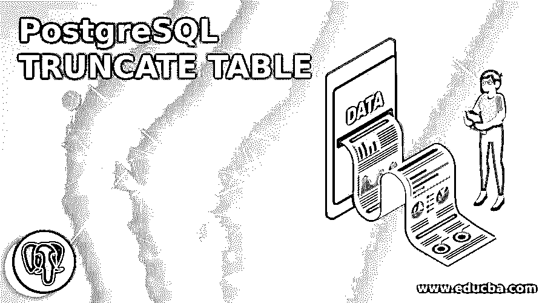
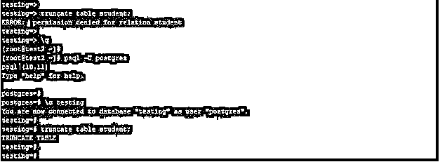
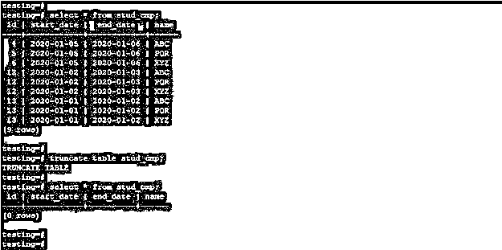
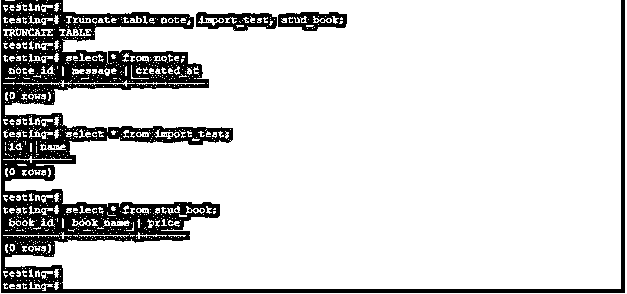
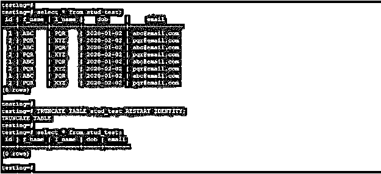
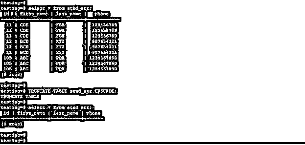
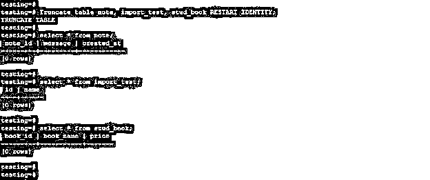

# PostgreSQL 截断表

> 原文：<https://www.educba.com/postgresql-truncate-table/>

## PostgreSQL 截断表简介

PostgreSQL truncate table 用于从表中删除所有数据，基本上，我们使用 delete 语句从表中删除数据，但对于大型表，我们使用 truncate 命令从表中删除整个数据。Truncate 命令是从表中删除整个记录，它也比 delete 命令快，delete 命令从表中删除单个以及整个数据，但是 truncate 是从表中删除所有记录。Truncate 不用于从表中删除单个记录。

### 句法

下面是 truncate table 语句的语法:

<small>Hadoop、数据科学、统计学&其他</small>

**截断单个表格:**

`Truncate table table_name (Table name which we have used with truncate command);`

**截断单个表格并重置与表格列相关联的序列:**

`Truncate table table_name (Table name which we have used with truncate command) Restart identity;`

**在角度命令中截断多个表格:**

`Truncate table table_name1, table_name2, table_name3, …, table_nameN (Table name which we have used with truncate command);`

**使用外键引用从** **表中删除所有数据:**

`Truncate table table_name (Table name which we have used with truncate command) CASCADE;`

**使用所有参数截断表格:**

`Truncate table table_name (Table name which we have used to remove all records) [Restart identity or continue identity] [Cascade or Restrict]`

#### 参数

下面是 truncate table 语句的参数描述语法:

**Truncate:**PostgreSQL 中的这条语句用来从表中删除所有记录。

**表名:**表名定义为我们已经从中删除了所有行的表的名称。我们可以使用单个表和多个表来删除表中的数据。

**重启标识:**在 truncate table 命令中定义，使用该参数，我们可以自动重启 truncate 命令中使用的表的列序列。

**Continue identity:** 它在 truncate 命令中定义，以表明它不改变表列所拥有的序列值。这是表格的默认值。

**Cascade:** 它被定义为截断所有在另一个表上有外键引用的表。此外，删除由于级联而添加的所有组表。

**Restrict:** 它是在我们不需要删除外键引用的表时定义的。

### PostgreSQL 中的 TRUNCATE TABLE 是如何工作的？

下面是 PostgreSQL 中 truncate table 语句的工作方式。

要截断表，我们需要拥有截断表的用户权限。如果我们没有 truncate table 的特权，那么我们就不能截断该表。如果我们没有 truncate table 的权限，那么它将发出“错误:对 relation_name 的权限被拒绝”的错误。

下面的例子显示了我们需要 truncate table 的权限来截断 PostgreSQL 中的表。

**代码:**

`truncate table student;
psql -U postgres
\c testing
truncate table student;`

**输出:**

**解释:**在上面的例子中，tran_test 用户没有截断表的权限，所以它会发出一个错误，并且不会截断表。但是用户 Postgres 拥有足够的截断表的权限，使用 Postgres 用户我们已经截断了学生的表名。PostgreSQL 中的 Truncate 语句将在我们执行 truncate 操作的表上获取访问排他锁。基本上，我们没有在包含来自其他表的外键引用的表上使用 truncate table 语句，因为它将截断所有具有外键引用的表。在 PostgreSQL 中，Truncate table 语句不与 on delete 触发器一起使用，但我们使用了 Truncate 触发器。truncate table 语句在 MVCC 体系结构中是不安全的。截断后，表中的所有记录都被删除，对于并发事务，它将显示为空。

truncate table 语句在 PostgreSQL 中是事务安全的。Truncate table 是 rollback 语句，如果我们在 truncate table 命令后没有使用 commit 语句。执行 Truncate table 语句的操作与执行不带 where 子句的 delete 语句的操作相同。如果我们使用了 where 子句，delete 语句将删除指定的行。Truncate table 可以更快地删除表中的所有记录。我们可以在一个命令中截断单个以及多个表。基本上 truncate table 不扫描记录来截断表，它将删除表中的所有行而不扫描。Truncate table 语句是为了从表中回收存储，我们没有必要对截断的表执行 vacuum。

### 实现 PostgreSQL 截断表的示例

下面是提到的例子:

#### 1.截断单个表格

以下示例显示了 PostgreSQL 中截断的单个表。我们有一个截断的 stud_cmp 表。

**代码:**

`select * from stud_cmp;
truncate table stud_cmp;
select * from stud_cmp;`

**输出:**

#### 2.截断多个表

以下示例显示了在 PostgreSQL 中截断多个表。我们已经截断了 note、import _ testand 和 stud_book 表。

**代码:**

Truncate table note，import_test，stud _ book

`select * from note;
select * from import_test;
select * from stud_book;`

**输出:**

#### 3.使用重新启动标识截断单个表

以下示例显示了在 PostgreSQL 中使用 restart identity 截断单个表。我们有一个截断的 stud_test 表。

**代码:**

`select * from stud_test;
TRUNCATE TABLE stud_test RESTART IDENTITY;
select * from stud_test;`

**输出:**

#### 4.使用级联截断单个表

以下示例显示了在 PostgreSQL 中使用 cascade 截断单个表。我们有一个截断的 stud_str 表。

**代码:**

`select * from stud_str;
TRUNCATE TABLE stud_str RESTART IDENTITY;
select * from stud_str;`

**输出:**

#### 5.使用重新启动标识截断多个表

以下示例显示了在 PostgreSQL 中使用 restart identity 截断多个表。我们已经截断了 note、import_test 和 stud_book 表。

**代码:**

`Truncate table note, import_test, stud_bookRESTART IDENTITY;
select * from note;
select * from import_test;
select * from stud_book;`

**输出:**

### 推荐文章

这是一个 PostgreSQL 截断表的指南。这里我们讨论一个介绍 PostgreSQL 截断表，语法，它是如何工作的编程例子。您也可以浏览我们的其他相关文章，了解更多信息——

1.  [PostgreSQL 授权](https://www.educba.com/postgresql-grant/)
2.  [PostgreSQL Trunc()](https://www.educba.com/postgresql-trunc/)
3.  [PostgreSQL 表](https://www.educba.com/postgresql-table/)
4.  [PostgreSQL 日志](https://www.educba.com/postgresql-log/)