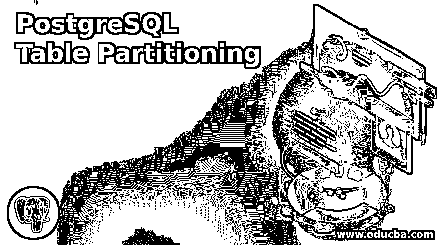
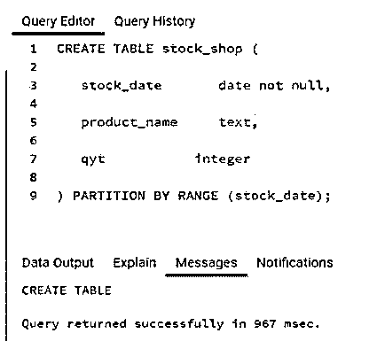
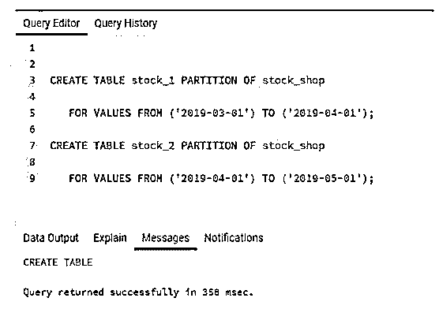
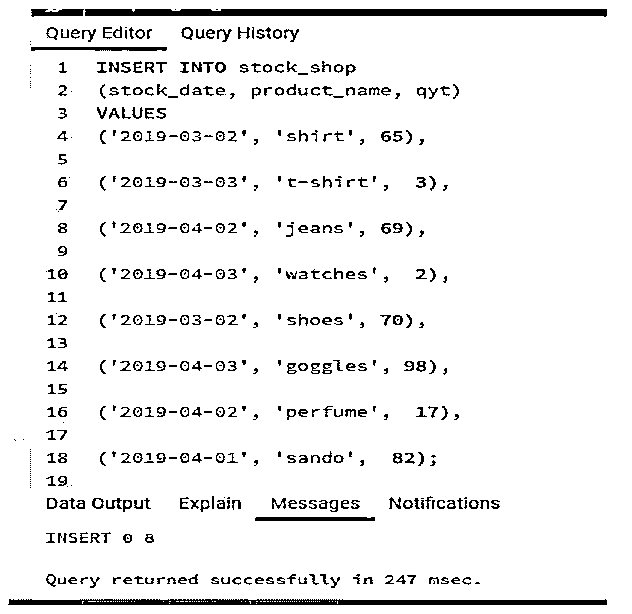
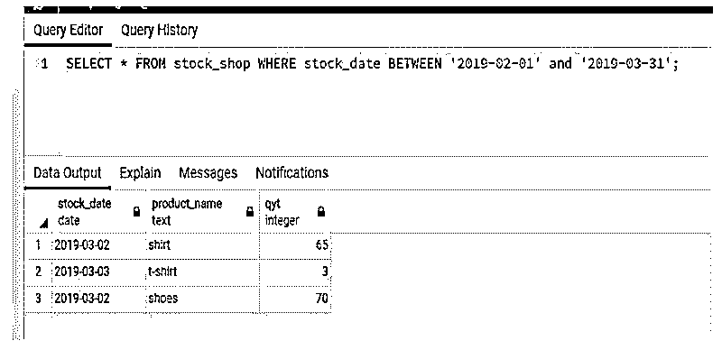

# PostgreSQL 表分区

> 原文：<https://www.educba.com/postgresql-table-partitioning/>

## PostgreSQL 表分区简介

PostgreSQL 表分区意味着我们有一个最大的 PostgreSQL 表，这个表被分割成不同的表。分区也可以是外部表。PostgreSQL 允许我们将表划分为不同的范围，我们需要确保不同分区内的值不会重叠。有必要定义应该添加到每个分区的键值列表。此外，用于创建不同分区或分割表的列集应该与父表相似。分区可以通过不同的方法来执行，例如范围分区或列表分区。

**语法:**

<small>Hadoop、数据科学、统计学&其他</small>

下面给出了语法:

`CREATE TABLE parent
(
Id int,
col_a varchar,
col_b varchar
);
CREATE TABLE range1() inherits (parent);
CREATE TABLE range2() inherits (parent);
CREATE TABLE range3() inherits (parent);`

**说明:**

*   我们划分成不同分区的主表被认为是分区表。
*   每个分区都有分区键，分区键是表达式或列的列表。

### PostgreSQL 中的表分区是如何工作的？

PostgreSQL 表分区定义了如何将表分成不同的部分，称为分区。应该非常小心地创建分区，因为这可能会影响各种查询的执行性能。PostgreSQL 不允许我们将常规或普通表转换为分区表。此外，我们不能将分区表转换成常规表。如果父表中存在约束，那么 PostgreSQL 不允许我们删除分区表列上的 NOT NULL 约束。

通过清楚地列出每个分区中显示的键值来对表进行分区。每当我们将数据插入分区表时，记录就会根据分区的键插入到其中一个分区中。每个分区都有自己的边界，这限制了数据插入，并且只允许分区拥有边界内的数据。分区表没有任何直接数据。

PostgreSQL 支持以下类型的分区:

*   **范围划分:** PostgreSQL 允许我们将主表划分为不同的范围，该范围由一组列或一个键列定义，需要确保不同范围中的值不会重叠。
*   **列表分区:**在列表分区的情况下，主表被分成由不同键值创建的不同分区。

### PostgreSQL 表分区示例

下面是提到的例子:

让我们创建一个名为“stock_shop”的表。

#### 示例#1

使用定义了 PARTITION BY RANGE 子句的 PostgreSQL CREATE TABLE 语句创建 stock_shop 表。stock_shop 表将有三列。

*   **stock_date:** 其数据类型为日期，且约束条件不为空。
*   **产品名称:**其数据类型为文本。
*   **qyt:** 其数据类型为整数。

**代码:**

`CREATE TABLE stock_shop (
stock_date       date not null,
product_name     text,
qyt           integer
) PARTITION BY RANGE (stock_date);`

**输出:**

在上面的示例中，我们创建了一个 stock_shop 表，其中 stock_date 列按范围进行了分区。这将使用 stock_date 范围对所有记录进行排序。

#### 实施例 2

现在使用这个查询创建了 stock_shop 表的分区。

**代码:**

`CREATE TABLE stock_1 PARTITION OF stock_shop   FOR VALUES FROM ('2019-03-01') TO ('2019-04-01');
CREATE TABLE stock_2 PARTITION OF stock_shop   FOR VALUES FROM ('2019-04-01') TO ('2019-05-01');`

**输出:**

在本例中，我们根据 stock_date 列的范围创建了两个分区。

我们已经创建了两个分区，命名为“股票 _1”和“股票 _2”。

*   **分区“股票 _1”:**股票 _ 1 将具有存储在日期范围(' 2019-03-01 ')到(' 2019-04-01 ')内的值。
*   **分区“股票 _2”:**股票 _ 2 将具有存储在日期范围(' 2019-04-01 ')到(' 2019-05-01 ')内的值。

#### 实施例 3

在 Stock_shop 表中插入一些数据。

现在，我们将使用下面的 INSERT INTO SQL 语句在 stock_shop 表中插入一些记录值。

**代码:**

`INSERT INTO stock_shop
(stock_date, product_name, qyt)
VALUES
('2019-03-02', 'shirt', 65),
('2019-03-03', 't-shirt',  3),
('2019-04-02', 'jeans', 69),
('2019-04-03', 'watches',  2),
('2019-03-02', 'shoes', 70),
('2019-04-03', 'goggles', 98),
('2019-04-02', 'perfume',  17),
('2019-04-01', 'sando',  82);`

**输出:**

#### 实施例 4

显示表格的内容。

使用下面的 SQL 语句和快照来说明名为“stock_shop”的表的内容。

**代码:**

`SELECT * FROM stock_shop WHERE stock_date BETWEEN '2019-02-01' and '2019-03-31';`

**输出:**

现在我们可以看到，在名为' stock_shop '的表中，有一些 2019-02-01 和 2019-03-31 之间的记录，只有 2019-02-01 和 2019-03-31 日期范围之间的三行可用。

### 推荐文章

这是一个 PostgreSQL 表分区的指南。这里我们讨论 PostgreSQL 表分区的介绍，它如何与查询示例一起工作。您也可以看看以下文章，了解更多信息–

1.  [PostgreSQL 物化视图](https://www.educba.com/postgresql-materialized-views/)
2.  [PostgreSQL 唯一索引](https://www.educba.com/postgresql-unique-index/)
3.  PostgreSQL 中的[数组](https://www.educba.com/array-in-postgresql/)
4.  [PostgreSQL 重新索引](https://www.educba.com/postgresql-reindex/)