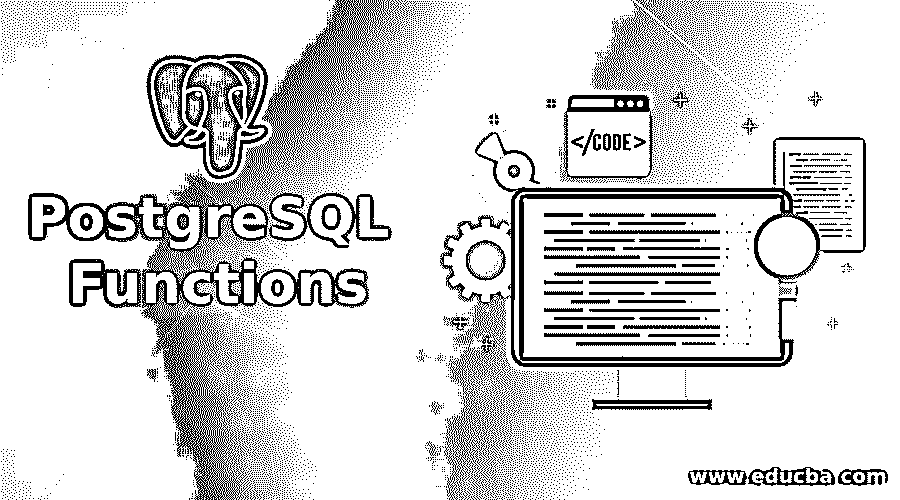
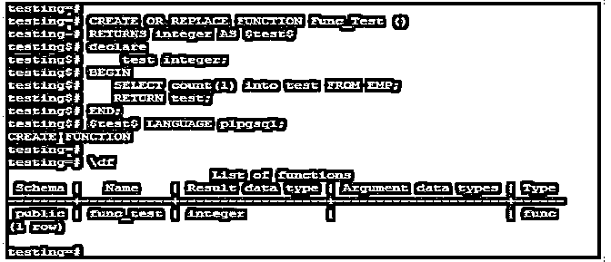
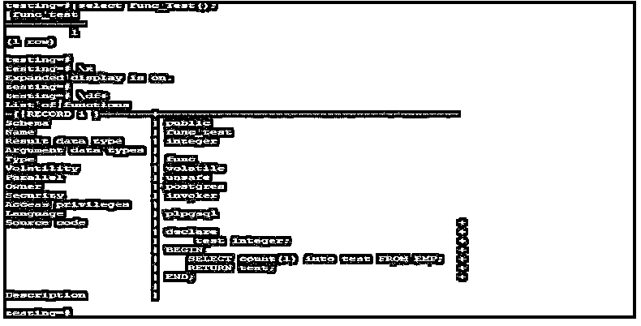
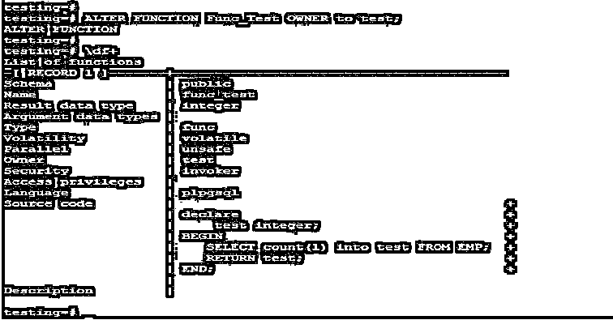
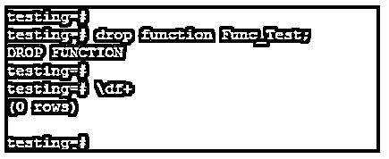

# PostgreSQL 函数

> 原文：<https://www.educba.com/postgresql-functions/>

## PostgreSQL 函数简介

PostgreSQL 函数在 PostgreSQL 中也称为存储过程；PostgreSQL 存储过程或函数在 SQL 语句中设置。创建用于创建新函数的语句；我们可以用许多语言创建 PostgreSQL 函数，如 C、python、SQL 和 PL/pgsql。在 PostgreSQL 11 版函数将作为 PostgreSQL 数据库中的过程之前，函数在 PostgreSQL 中是必不可少的。它的函数名将是唯一的，这意味着它不会与数据库中已经创建的其他函数名相同。

**语法:**

<small>Hadoop、数据科学、统计学&其他</small>

下面给出了语法:

`CREATE [OR REPLACE (Replace the function if already exist)] FUNCTION
name (Name of function) ( [ [ argmode (Mode of argument)] [ argname(Name of argument) ] argtype (Type of argument)[ { DEFAULT | = } default_expr (Default expression of function) ] [, ...] ] )
[RETURNS rettype (Return type of functions)
| RETURNS TABLE (Table name which we have used to return from function)(column_name (Name of column) column_type (Data type of column)[, ...] ) ] {LANGUAGE lang_name (Language name which was used to create function)
| WINDOW (Window function)
| IMMUTABLE | STABLE | VOLATILE (Attribute of function)
| COST execution_cost (Execution costs)
| ROWS result_rows (No of rows returned from function)
| SET configuration_parameter (Specified configuration parameter) {TO value | = value | FROM CURRENT}
| AS 'definition' (Definition of function)
} ...
[WITH (attribute [, ...] ) ] (Display optional function information)`

**下面是上述语法的参数描述:**

*   **创建:**创建一个新函数。
*   **函数名称:**我们正在创建的函数的名称。函数名应该是唯一的。
*   **替换:**替换数据库中已经存在的函数名。
*   **Argmode:** 我们在函数中使用的参数模式，函数的默认参数模式是 in。
*   **Argname:** 我们用来创建函数的参数的名称。
*   **Argtype:** 我们用来创建函数的参数类型。
*   **Default:** Default 表示如果我们没有给定任何参数，它将采用默认值。
*   **Rettype:** 定义为函数的返回类型。返回类型可以是任何组合、基本或表列。
*   **表:**表名我们从函数中返回的列。
*   **列名:**这定义了我们在返回表语法中返回的列名。
*   **列类型:**这定义了我们在返回表语法中返回的列的数据类型。
*   **语言名称:**这被定义为我们用来创建函数的语言的名称。语言可以是 python，pl/pgsql 或者 c。
*   **Window** :这定义了我们正在创建一个窗口函数，而不是普通的函数。
*   **执行成本:**该参数定义为执行该功能所需的总时间；它显示正数。
*   **成本:**成本参数定义了函数的执行成本。
*   **Rows:** Rows 参数定义为函数返回的总行数。
*   **结果行:**从函数返回的行的结果。
*   **配置参数:**定义为一个不同值的配置参数集。
*   **定义**:该参数定义了一个函数的定义。
*   **属性:**这将显示一个函数的额外信息。

### PostgreSQL 函数是如何工作的？

*   PostgreSQL 函数在 PostgreSQL 中也称为存储过程或存储函数。
*   PostgreSQL 存储过程或函数在 SQL 语句或 PL/SQL 语句中设置。
*   它的名称将是唯一的，这意味着它不会与数据库中已创建的其他函数名称相同。
*   Create 语句用于在函数中创建新函数；此外，我们可以在创建新函数时使用 replace 关键字替换现有函数。
*   我们用 C、python、SQL 和 PL/pgsql 等多种语言创建了一个新函数。这种语言是用来创造新功能的。
*   在 11 版函数之前，在区分 PostgreSQL 11 版函数和过程之后，充当 PostgreSQL 过程是必不可少的。
*   它只不过是一组存储在数据库服务器上并在使用 SQL 接口后调用的 SQL 语句。
*   它用于在一个函数中执行多个查询，并返回与函数中写入的结果相同的结果。
*   我们可以使用“\df”来检查数据库中的所有函数。该命令用于显示数据库中的所有函数。
*   我们可以用不同的语言实现它。如果我们在函数创建时没有定义语言，它将选择默认语言。
*   它使用一个接口来定义函数的参数和返回类型，正如我们在函数的语法中所述。

### PostgreSQL 函数的示例

下面是创建、修改和删除函数的示例:

#### 示例 1:创建 PostgreSQL 函数

下面是创建新功能的例子。T3】

**代码:**

`CREATE OR REPLACE FUNCTION Func_Test ()
RETURNS integer AS $test$
declare
test integer;
BEGIN
SELECT count (1) into test FROM EMP;
RETURN test;
END;
$test$ LANGUAGE plpgsql;
\df`

**输出:**

在上面的例子中，我们创建了一个名为 Func_Test 的函数。我们已经使用 pl/pgsql 语言创建了一个新函数。

我们有来自 EMP 表的计数记录。我们可以通过使用下面的命令调用或执行 Func_Test 如下。

**代码:**

`select Func_Test();
\df+`

**输出:**

#### 示例 2:修改 PostgreSQL 函数

我们正在将 Func_Test 函数的所有者从 postgres 更改为 test user。

**代码:**

`ALTER FUNCTION Func_Test OWNER to test;
\df+`

**输出:**

#### 示例 3:删除 PostgreSQL 函数

我们可以使用 drop 命令进行删除。我们正在删除 Func_Test 函数。

**代码:**

`drop function Func_Test;
\df+`

**输出:**

### 结论

PostgreSQL 函数或存储过程只不过是存储在数据库服务器上的一组 SQL 语句，在使用 SQL 接口后被调用。Create 语句用于在其中创建一个新函数。我们可以用任何语言实现这个功能，比如 C、Python 和 pl/pgsql。

### 推荐文章

这是一个 PostgreSQL 函数的指南。在这里，我们讨论 PostgreSQL 函数的介绍，以及它是如何工作的和相应的例子。您也可以看看以下文章，了解更多信息–

1.  [PostgreSQL 唯一约束](https://www.educba.com/postgresql-unique-constraint/)
2.  [PostgreSQL 滞后()](https://www.educba.com/postgresql-lag/)
3.  [PostgreSQL 日志的 9 大参数](https://www.educba.com/postgresql-log/)
4.  [PostgreSQL 集群|示例](https://www.educba.com/postgresql-cluster/)
5.  [PostgreSQL While 循环指南](https://www.educba.com/postgresql-while-loop/)
6.  [PostgreSQL 自动增量|类型和方法](https://www.educba.com/postgresql-auto-increment/)
7.  [PostgreSQL Trunc() |如何工作？](https://www.educba.com/postgresql-trunc/)