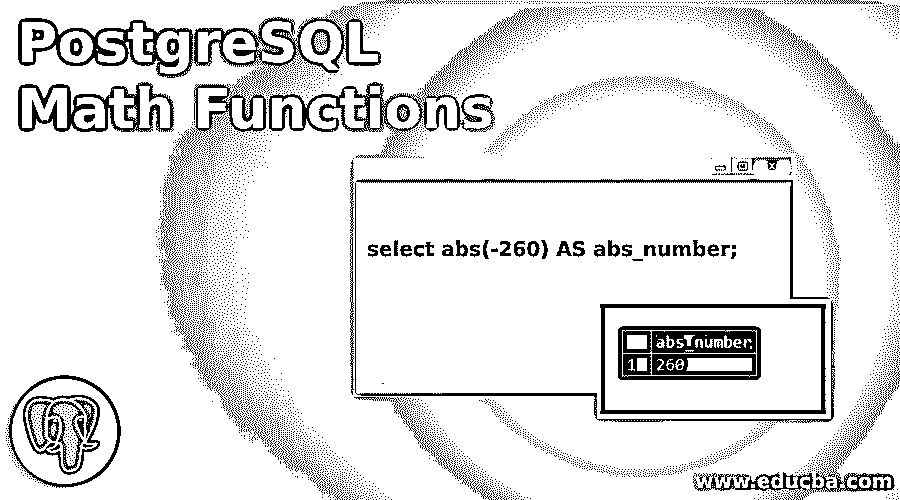
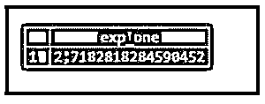
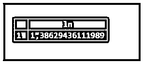
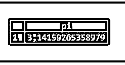
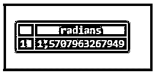
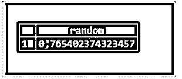
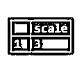
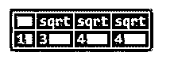

# PostgreSQL 数学函数

> 原文：<https://www.educba.com/postgresql-math-functions/>

## PostgreSQL 数学函数简介

以下文章提供了 PostgreSQL 数学函数的概述。PostgreSQL 为我们提供了各种数学函数来操作这些值。数学函数返回运算结果的数值。它将输入值(数字)作为输入，作为数学函数的参数。这些函数也用于获取常量值，如 PI(3.14)。一个数学函数可以有多种形式，并以不同的参数作为输入。

### 不同的 PostgreSQL 数学函数

下面给出了不同的功能:

<small>Hadoop、数据科学、统计学&其他</small>

#### 1.abs(数字)

结果，我们将得到一个指定数字的绝对值。

举例说明下面的 SQL 语句和快照来理解上面的函数。

**代码:**

`select abs(-260) AS abs_number;`

**输出:**

#### **2。** asin(数字)

结果，我们将得到一个指定数字的反正弦。

举例说明下面的 SQL 语句和快照来理解上面的函数。

**代码:**

`SELECT asin(1), asin(0), asin(-1), asin(sin(1)) AS inverse_sine_result;`

**输出:**

***

*** 

#### 3.阿坦(数字)

结果，我们会得到一个指定数字的反正切。

举例说明下面的 SQL 语句和快照来理解上面的函数。

**代码:**

`select atan(tan(1)) AS inverse_tan_result;`

**输出:**

#### 4.cbrt(数字)

结果，我们将得到指定数字的立方根。

举例说明下面的 SQL 语句和快照来理解上面的函数。

**代码:**

`SELECT cbrt(27.0) AS "twenty seven's cube root";`

**输出:**

#### 5.cos(数字)

结果，我们将得到指定数字的余弦值。

举例说明下面的 SQL 语句和快照来理解上面的函数。

**代码:**

`SELECT cos(pi()) AS cos_of_pi, cos(0) AS cos_of_zero;`

**输出:**

#### 6.成本(数字)

返回指定数字的余切值。

举例说明下面的 SQL 语句和快照来理解上面的函数。

**代码:**

`SELECT cot(1) as cot_of_one, cot(-1) as cot_of_neg_one;`

**输出:**

#### 7.上限(数字)

结果，我们将得到不小于指定数的最小整数。

举例说明下面的 SQL 语句和快照来理解上面的函数。

**代码:**

`SELECT ceil(-41.2);`

**输出:**

#### 8.度(弧度)

结果，我们将从弧度 rad 得到度数。

举例说明下面的 SQL 语句和快照来理解上面的函数。

**代码:**

`SELECT degrees(acos(-1)) AS hlf_circle, degrees(pi() * 2) AS fl_circle;`

**输出:**

#### 9.指数(数字)

因此，我们将获得指定数字的科学记数法中的指数值。

举例说明下面的 SQL 语句和快照来理解上面的函数。

**代码:**

`SELECT exp(1.0) AS exp_one;`

**输出:**

#### 10.楼层(编号)

因此，我们将得到一个数的舍入到最接近的值，该值小于或等于指定的数。

举例说明下面的 SQL 语句和快照来理解上面的函数。

**代码:**

`select floor(-43.7);`

**输出:**

#### 11\. isfinite()

举例说明下面的 SQL 语句和快照来理解上面的函数。

**代码:**

`SELECT isfinite('now'::timestamp) AS now_is_finite_time, isfinite('infinity'::timestamp) AS infinity_time;`

**输出:**

#### 12.ln(数字)

因此，我们将获得指定数字的自然对数。

举例说明下面的 SQL 语句和快照来理解上面的函数。

**代码:**

`SELECT ln(4);`

**输出:**

#### 13.对数(基数，数字)

因此，我们将得到指定数字以指定底数为底的对数。

举例说明下面的 SQL 语句和快照来理解上面的函数。

**代码:**

`select LOG(3, 81);`

**输出:**

#### 14.MOD(数字 1，数字 2)

因此，我们将第一个数字除以第二个数字，并返回余数。

举例说明下面的 SQL 语句和快照来理解上面的函数。

**代码:**

`select MOD(20,8);`

**输出:**

#### 15.圆周率()

因此，我们将得到常数π为(3.14159)。

举例说明下面的 SQL 语句和快照来理解上面的函数。

**代码:**

`select PI();`

**输出:**

#### 16.电源(1 号、2 号)

因此，我们将对第一个数字进行第二次幂运算。

举例说明下面的 SQL 语句和快照来理解上面的函数。

**代码:**

`select POWER(4, 2);`

**输出:**

#### 17\. radians(deg)

因此，我们将获得相当于指定 deg 度的弧度值。

举例说明下面的 SQL 语句和快照来理解上面的函数。

**代码:**

`select RADIANS(90);`

**输出:**

#### 18.随机()

结果，我们会得到一个随机数。

举例说明下面的 SQL 语句和快照来理解上面的函数。

**代码:**

`SELECT random();`

**输出:**

#### 19.舍入(数字)

因此，我们将得到一个舍入到最接近的整数值的数字。

举例说明下面的 SQL 语句和快照来理解上面的函数。

**代码:**

`SELECT round(2.0) AS "two",
round(2.5) AS "two point five",
round(2.6) AS "two point six",
round(2.7) AS "two point seven";`

**输出:**

#### 20.标度(数字)

结果我们会得到小数部分的小数位数。

举例说明下面的 SQL 语句和快照来理解上面的函数。

**代码:**

`SELECT SCALE(2.321);`

**输出:**

#### 21.sqrt(数字)

结果，我们将得到一个指定数字的平方根。

举例说明下面的 SQL 语句和快照来理解上面的函数。

**代码:**

`SELECT sqrt(9.0), sqrt(16.0), sqrt(pow(4.0, 2));`

**输出:**

### 结论

从上面的文章中，您已经了解了如何使用 PostgreSQL 数学函数以及 PostgreSQL 数学函数是如何工作的。此外，我们还添加了一些 PostgreSQL 数学函数的示例来详细理解它们。

### 推荐文章

这是一个 PostgreSQL 数学函数的指南。这里我们讨论 PostgreSQL 数学函数的介绍，以及不同的函数和各自的例子。您也可以看看以下文章，了解更多信息–

1.  [PostgreSQL 限制](https://www.educba.com/postgresql-limit/)
2.  [PostgreSQL ROLLUP](https://www.educba.com/postgresql-rollup/)
3.  [PostgreSQL 别名](https://www.educba.com/postgresql-alias/)
4.  [PostgreSQL 偏移量](https://www.educba.com/postgresql-offset/)