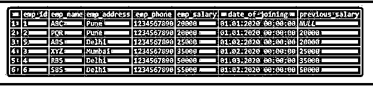
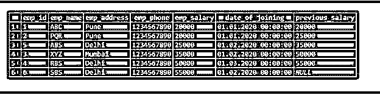
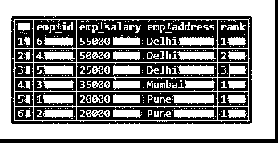
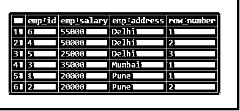
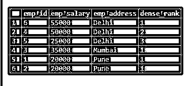
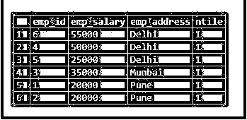
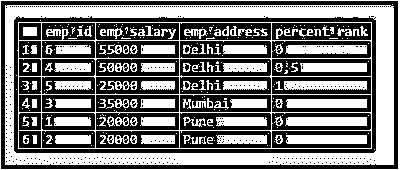
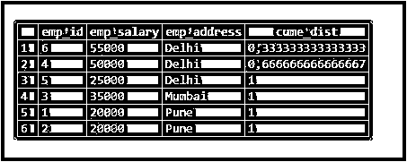
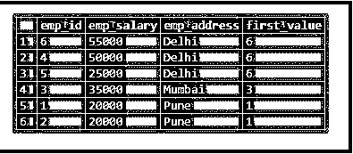
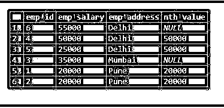

# PostgreSQL 窗口函数

> 原文：<https://www.educba.com/postgresql-window-functions/>

## PostgreSQL 窗口函数介绍

PostgreSQL 窗口函数用于比较对比数据，它是 PostgreSQL 中分析和各种用例的关键。PostgreSQL 中的 window 函数用于比较当前行之间的值，以及表中所有值中与当前行相关的值。PostgreSQL 窗口函数是 SQL 标准的一部分，在实际中用于查找任何已执行操作的首次用户登录操作。我们在 order by 子句中使用了窗口函数来区分数据是升序还是降序。

### PostgreSQL 中可用的窗口函数

下面是可用的窗口功能如下:

<small>Hadoop、数据科学、统计学&其他</small>

*   行号()
*   排名()
*   Dens rank()
*   百分比等级()
*   库梅区()
*   Ntile()
*   滞后()
*   铅()
*   第一个值()
*   最后一个值()
*   第 n 个值()

我们逐一讨论上述功能，如下。我们已经用雇员表描述了 PostgreSQL 窗口函数的一个例子。下面是员工表数据描述如下。

雇员表示例描述 PostgreSQL 中雇员表的示例

#### 1.滞后()

PostgreSQL lag()函数是一个函数，该函数将某行放在当前行之前，作为输出或查询的指定偏移量。

下面是 PostgreSQL 中 lag()函数的语法如下。

**代码:**

`LAG(expression[,[, default_value]]) OVER ([PARTITION BY  partition_expression... ] ORDER BYsort_expression [ASC | DESC], ...)`

下面是 PostgreSQL 中 lag()函数的例子。

**代码:**

`SELECT *,LAG (emp_salary,1) OVER (ORDER BY emp_salary ASC) AS previous_salary FROM Employee;`

**输出:**

#### 2.铅()

前导函数用于比较当前行之间记录的值和当前行之后记录的值。

下面是 PostgreSQL 中 lead()函数的语法如下。

**代码:**

`LEAD (expression[,offset [, default_value]]) OVER ( [PARTITION BY partition_expression (Partition column name), ... ] ORDER BY sort_expression [ASC | DESC], ...)`

下面是 PostgreSQL 中 lead()函数的例子如下。

**代码:**

`SELECT *,LEAD (emp_salary,1) OVER (ORDER BY emp_salary ASC) AS previous_salary FROM Employee;`

**输出:**

#### 3.排名()

等级窗口函数用于定义 PostgreSQL 中已定义列的等级。在 PostgreSQL 中，rank 函数对于定义秩是非常有用和重要的。

下面是 PostgreSQL 中 rank()函数的语法如下。

**代码:**

`SELECT column_name1, column_name2, column_nameN, rank() OVER (PARTITION BY column_name ORDER BY column_name DESC) FROM table_name;`

下面是 PostgreSQL 中 rank()函数的例子如下。

**代码:**

`SELECT emp_id, emp_salary, emp_address, rank() OVER (PARTITION BY emp_address ORDER BY emp_salary DESC) FROM employee;`

**输出:**

#### 4.Row_number()

Row_number 函数在 PostgreSQL 中定义列的行号是非常有用和重要的。

下面是 PostgreSQL 中行号()函数的语法如下。

**代码:**

`SELECT column_name1, column_name2, column_nameN, row_number () OVER (PARTITION BY column_name ORDER BY column_name DESC) FROM table_name;`

下面是 PostgreSQL 中行号()函数的例子如下。

**代码:**

`SELECT emp_id, emp_salary, emp_address, row_number() OVER (PARTITION BY emp_address ORDER BY emp_salary DESC) FROM employee;`

**输出:**

#### 5.稠密秩()

稠密秩函数在 PostgreSQL 中定义列的秩是非常有用和重要的。

下面是 PostgreSQL 中 Dense rank()函数的语法如下。

**代码:**

`SELECT column_name1, column_name2, column_nameN, dense_rank () OVER (PARTITION BY column_name ORDER BY column_name DESC) FROM table_name;`

下面是 PostgreSQL 中的 Dense rank()函数的例子如下。

**代码:**

`SELECT emp_id, emp_salary, emp_address, **Dense_rank** () OVER (PARTITION BY emp_address ORDER BY emp_salary DESC) FROM employee;`

**输出:**

#### 6.Ntile()

Ntile 函数在 PostgreSQL 中非常有用和重要。

下面是 PostgreSQL 中 ntile()函数的语法如下。

**代码:**

`SELECT column_name1, column_name2, column_nameN, ntile (Argument) OVER (PARTITION BY column_name ORDER BY column_name DESC) FROM table_name;`

下面是 PostgreSQL 中 **ntile** ()函数的例子如下。

**代码:**

`SELECT emp_id, emp_salary, emp_address, **ntile**(1) OVER (PARTITION BY emp_address ORDER BY emp_salary DESC) FROM employee;`

**输出:**

#### 7.百分比咆哮()

百分比秩函数在 PostgreSQL 中非常有用和重要。

下面是 PostgreSQL 中 percent rank()函数的语法。

**代码:**

`SELECT column_name1, column_name2, column_nameN, percent_rank () OVER (PARTITION BY column_name ORDER BY column_name ASC) FROM table_name;`

**代码:**

`SELECT emp_id, emp_salary, emp_address, percent_rank() OVER (PARTITION BY emp_address ORDER BY emp_salary DESC) FROM employee;`

**输出:**

#### 8.库梅区()

Cume dist 函数在 PostgreSQL 中非常有用和重要。

**代码:**

`SELECT column_name1, column_name2, column_nameN, cume_dist () OVER (PARTITION BY column_name ORDER BY column_name ASC) FROM table_name;`

**代码:**

`SELECT emp_id, emp_salary, emp_address, cume_dist() OVER (PARTITION BY emp_address ORDER BY emp_salary DESC) FROM employee;`

**输出:**

#### 9.第一个值()

第一个值函数在 PostgreSQL 中非常有用和重要。

**代码:**

`SELECT column_name1, column_name2, column_nameN, first_value (value) OVER (PARTITION BY column_name ORDER BY column_name ASC) FROM table_name;`

**代码:**

`SELECT emp_id, emp_salary, emp_address, first_value(emp_id) OVER (PARTITION BY emp_address ORDER BY emp_salary DESC) FROM employee;`

**输出:**

#### 10.最后一个值()

最后一个值函数在 PostgreSQL 中非常有用和重要。

**代码:**

`SELECT column_name1, column_name2, column_nameN, last_value (value) OVER (PARTITION BY column_name ORDER BY column_name ASC) FROM table_name;`

**代码:**

`SELECT emp_id, emp_salary, emp_address, last_value(emp_id) OVER (PARTITION BY emp_address ORDER BY emp_salary DESC) FROM employee;`

**输出:**

#### 11.第 n 个值()

最后一个值函数在 PostgreSQL 中非常有用和重要。

**代码:**

`SELECT column_name1, column_name2, column_nameN, nth_value (column_name, value) OVER (PARTITION BY column_name ORDER BY column_name ASC) FROM table_name;`

**代码:**

`SELECT emp_id, emp_salary, emp_address, nth_value(emp_salary, 2) OVER (PARTITION BY emp_address ORDER BY emp_salary DESC) FROM employee;`

**输出:**

### 结论

PostgreSQL 窗口函数用于比较对比数据，它是 PostgreSQL 中分析和各种用例的关键。PostgreSQL 中的 window 函数用于比较当前行之间的值，以及表中所有值中与当前行相关的值。

### 推荐文章

这是一个 PostgreSQL 窗口函数的指南。为了更好地理解，我们在这里讨论 PostgreSQL 窗口函数的介绍和相应的例子。您也可以浏览我们的其他相关文章，了解更多信息——

1.  [什么是 PostgreSQL？](https://www.educba.com/what-is-postgresql/)
2.  [SQL Server vs PostgreSQL](https://www.educba.com/sql-server-vs-postgresql/)
3.  [Oracle vs PostgreSQL](https://www.educba.com/oracle-vs-postgresql/)
4.  [PostgreSQL 查询指南](https://www.educba.com/postgresql-queries/)
5.  [PostgreSQL REGEXP _ MATCHES()](https://www.educba.com/postgresql-regexp_matches/)
6.  [SQL REGEXP |运算符列表](https://www.educba.com/sql-regexp/)