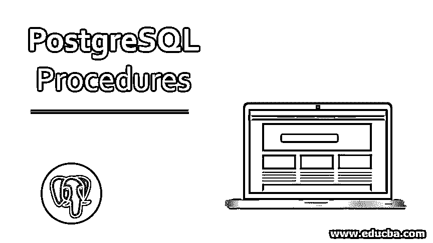
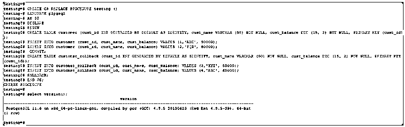
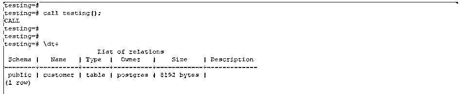
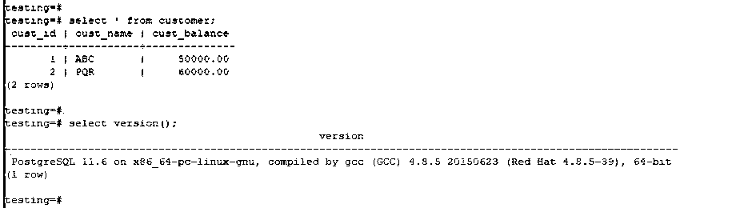
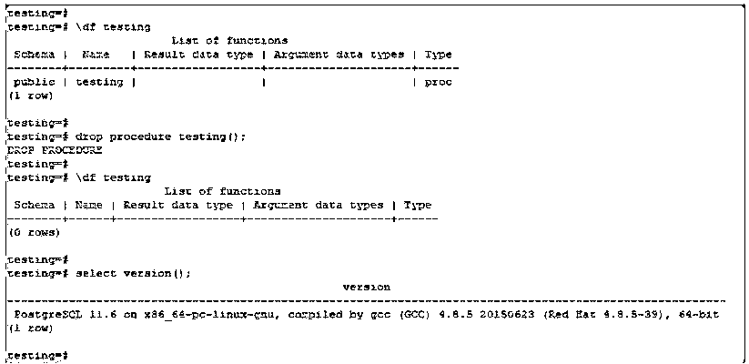

# PostgreSQL 过程

> 原文：<https://www.educba.com/postgresql-procedures/>

## PostgreSQL 过程介绍

PostgreSQL 过程及其功能被添加到 PostgreSQL 11 中。它提供了 PostgreSQL 11 中程序的所有功能。在 PostgreSQL 过程发明之前，我们使用的是 PostgreSQL 函数。在函数中，我们不能运行事务。在函数体内，我们既不提交事务，也不打开新的事务。它将从功能上克服这一缺点；现在我们在过程代码中运行事务。使用 PostgreSQL 存储过程，我们可以创建自己的自定义函数，并在应用程序中作为不同数据库工作流的一部分重用它们。创建新过程时，我们需要指定 create procedure 语句。

### 句法

下面是在 PostgreSQL 中创建过程的语法:

<small>Hadoop、数据科学、统计学&其他</small>

`CREATE [OR REPLACE] PROCEDURE procedure_name
( [ [ mode_of_argument ] [argument_name] argument_type [ { DEFAULT | } default_expression ] [……………. ,]]}
{ LANGUAGE language_name | TRANSFORM { FOR TYPE type_name } [ …..,] | [ EXTERNAL ] SECURITY INVOKER | [ EXTERNAL ] SECURITY DEFINER
| SET config_parameter { TO value | = value | FROM CURRENT } | AS ‘definition’
| AS ‘object_file’, ‘link_symbol’
}`

**语法描述:**

*   首先，指定定义创建或替换旧过程的创建过程。如果用户可以定义过程，那么他们必须对该语言具有最低使用权限。
*   如果在创建新过程时定义了模式名，则在该指定模式中创建该模式名；否则，它将在当前模式中创建。
*   要更改旧过程的定义，可以使用 CREATE 或 REPLACE PROCEDURE，但是使用这种方法，我们不能更改参数或它们的过程类型。
*   创建该过程的用户将是该过程的所有者。要创建新过程，用户必须拥有参数类型的创建权限和使用权限。
*   当我们对现有过程发出创建和替换过程语句时，该过程的所有权和权限保持不变；它不会改变。

#### PostgreSQL 过程语法参数

*   **论证方式:**与论证方式。它目前支持 IN 和 INOUT 参数模式。
*   **参数名称:**参数的名称。
*   **参数类型:**参数类型可以是过程参数的数据类型。
*   **默认表达式:**如果没有指定具体参数，表达式用作默认值。
*   **语言名称:**我们实现该过程的语言名称。
*   **配置参数:**值、定义等配置参数的集合。
*   **Value:** 创建一个过程语句，该语句将在对过程应用值后执行。
*   **定义:**程序的定义。
*   **目标文件:**目标文件是包含编译后的 C 程序的共享库。
*   **链接符号:**程序链接符号。

### PostgreSQL 过程的工作方式

它将允许像其他数据库(ORACLE、MYSQL 和 MSSQL)一样编写程序。过程和函数的工作方式几乎一样，但是不同的是函数返回值，而过程不返回值。

使用以下命令显示 PostgreSQL 数据库中已创建过程的列表:

`Postgres# \df`

事务控制允许在 PostgreSQL 过程中提交和回滚。但是 11 版本之前的 PostgreSQL 函数不允许在函数内部提交和回滚；这是 PostgreSQL 过程和 PostgreSQL 函数的主要区别。我们可以使用“call”语句执行 PostgreSQL 过程。我们可以使用 alter 和 drop 语句来修改和删除过程。工作本质上是一组以特定顺序或序列执行的命令。它被允许跨所有交易进行操作。

它有两个块段。

*   申报
*   身体

声明部分是最佳的或者不需要定义，但是主体部分需要在 PostgreSQL 过程中定义。正文列总是以分号(；)在 END 关键字之后。PostgreSQL 过程块在过程的开头和结尾有一个最佳标签($$)。

### 实现 PostgreSQL 过程的示例

以下是创建新程序的示例，如下所示:

#### 示例 1–创建程序

**代码:**

`CREATE OR REPLACE PROCEDURE testing ()
LANGUAGE plpgsql
AS $$
DECLARE
BEGIN
CREATE TABLE customer (cust_id INT GENERATED BY DEFAULT AS IDENTITY, cust_name VARCHAR (50) NOT NULL, cust_balance DEC (15, 2) NOT NULL, PRIMARY KEY (cust_id));
INSERT INTO customer (cust_id, cust_name, cust_balance) VALUES (1,'ABC', 50000);
INSERT INTO customer (cust_id, cust_name, cust_balance) VALUES (2,'PQR', 60000);
COMMIT;
CREATE TABLE customer_rollback (cust_id INT GENERATED BY DEFAULT AS IDENTITY, cust_name VARCHAR (50) NOT NULL, cust_balance DEC (15, 2) NOT NULL, PRIMARY KEY (cust_id));
INSERT INTO customer_rollback (cust_id, cust_name, cust_balance) VALUES (3,'XYZ', 50000);
INSERT INTO customer_rollback (cust_id, cust_name, cust_balance) VALUES (4,'ABC', 60000);
ROLLBACK;
END $$;`

 `**输出:**

*   在上面的示例中，存储过程的名称是 testing。我们在 pl/pgsql 中使用了存储过程语言。
*   事务控制还提供了另一种语言，如 PL/TCL、PL/Python 和 PL/Perl 等。

上述控制语言的语法如下:

1.PL/Python
T0
T1】

2.PL/Tcl
T0
T1】

3.PL/Perl
T0
T1】

*   如果我们想在块体的 EXIT 语句中指定，或者如果我们想限定在这个块中声明的变量名，我们就使用块标签。
*   它声明了 section，在这里我们声明了 body 部分中使用的所有变量。
*   我们也可以使用 alter 语句来改变这个过程。

#### 示例 2–变量声明

**代码:**

`DECLARE
Id  INTEGER: = 1;
name VARCHAR (50):= 'ABC';
city VARCHAR (50) := 'NewYork';
amount  NUMERIC(11, 2) := 20000.5;
BEGIN`

**输出:**

*   声明部分是我们声明主体部分中使用的所有变量的地方。声明部分的每条语句都以分号结束。
*   PostgreSQL 过程主体部分是我们放置实际代码的地方。主体部分中的每条语句也以分号结束。

#### 示例 3–调用 PostgreSQL 过程

为了执行，我们需要使用 call 语句调用相同的内容。

**语法:**

`# Call procedure_name();`

**代码:**

`Postgres# call testing();`

**输出:**

#### 代码:

`select * from customer;`

#### 示例 4–PostgreSQL 中的删除过程

我们可以使用下面的命令删除该过程。

**语法:**

`# drop procedure procedure_name();`

**代码:**

`Postgres# drop procedure testing();`

**输出:**

### 结论

它是在版本 11 中引入的。这是版本 11 中重要且值得拥有的特性之一。在将数据库从其他数据库迁移到 PostgreSQL 时，这个特性非常方便。在此过程中使用事务控制语言来提交和回滚事务。

### 推荐文章

这是一个 PostgreSQL 程序的指南。这里我们讨论 PostgreSQL 过程的介绍、工作和不同的例子。您也可以看看以下文章，了解更多信息–

1.  [甲骨文程序](https://www.educba.com/oracle-procedures/)
2.  [在甲骨文之间](https://www.educba.com/between-in-oracle/)
3.  [甲骨文触发器](https://www.educba.com/oracle-triggers/)
4.  [Oracle 中的自然连接](https://www.educba.com/natural-join-in-oracle/)`