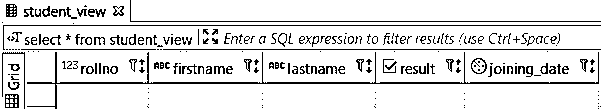
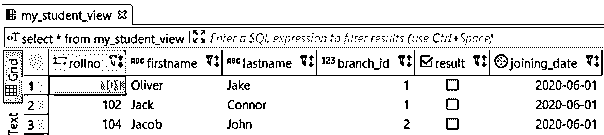
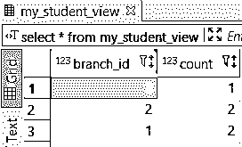
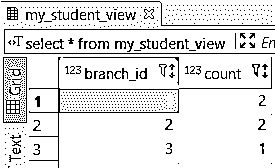
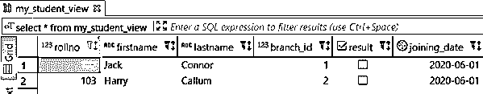
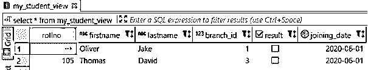
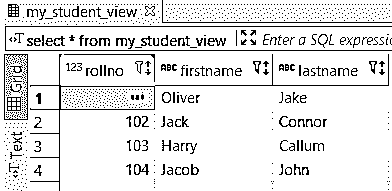
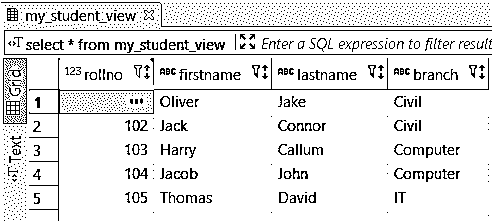

# PostgreSQL 视图

> 原文：<https://www.educba.com/postgresql-views/>

## PostgreSQL 视图简介

在这些文章中，我们将了解 PostgreSQL 视图。视图基本上是一个带有名称的查询；因此，视图对于包装常用的复杂查询很有用；我们可以使用名为 query 的视图来表示数据库表中的数据，我们可以使用一个或多个称为基表的表来定义视图，视图是一个逻辑表，它表示来自一个或多个表的数据。

在视图的帮助下，查询的复杂性可以得到简化，因为用户可以使用 SELECT 命令查询视图。像表一样，我们可以使用视图向用户添加权限，该视图存储我们只需要授权用户访问的数据。

<small>Hadoop、数据科学、统计学&其他</small>

### 如何创建 PostgreSQL 视图？

让我们看看如何创建视图:

**语法**:

`CREATE [OR REPLACE][TEMP OR TEMPORARY] [RECURSIVE] VIEW view_name [(column_name [, ...])] [ WITH (view_options_name [= view_options_value] [, ... ])]`

**说明**:如果同名视图已经存在，则替换。视图名称必须唯一。它不应与同一模式中的任何其他视图、序列、表、外部表或索引相同。

*   **TEMP / TEMPORARY:** 如果视图是作为临时视图创建的，那么它会在会话结束时自动删除。
*   **递归:**创建递归视图。
*   **名称**:要显示的视图名称
*   **列名:**用户可以定义视图的列名列表。查询中只考虑已定义的列，其他列
*   **WITH:**(view _ options _ name[= view _ options _ value]…)我们可以为视图指定可选参数。

### 创建 PostgreSQL 视图

我们可以使用各种方法创建 PostgreSQL 视图:

**考虑下面的表来理解 PostgreSQL 视图:**

为了理解考虑以下“学生”和“分支”表结构的示例

*   **学生**:姓名，分支 id，结果，加入日期
*   **分支** **:** 分支 _id，分支

#### 1.WHERE 子句

**代码:**

`CREATE VIEW student_view
AS SELECT rollno, firstname, lastname, result, joining_date
FROM student
WHERE branch_id = 4;`

它将创建一个视图“student _view ”,获取学生表的记录(对于 rollno、firstname、lastname、result、joining_date 列),如果这些记录包含 branch_id 列的值 4。

**代码:**

`select * from student_view`

**输出:**

#### 2.与和或

**代码**:

`CREATE VIEW my_student_view
AS SELECT *
FROM student
WHERE(branch_id = 1 AND result = false)
OR(branch_id = 2 AND firstname='Jacob');`

*   它将创建一个视图“my_student_view ”,获取所有学生表列的记录
*   如果 branch_id 为 1，并且结果为 false。
*   或者 branch_id 为 2，名字为‘Jacob’。

**代码:**

`select * from student_view`

**输出:**

#### 3.分组依据

**代码:**

`CREATE VIEW my_student_view
AS SELECT branch_id, count (*)
FROM student
GROUP BY branch_id;`

它将创建一个视图“my_student_view ”,该视图将根据 branch_id 和存储的 branch_id 以及学生表中每个分支(branch_id)的几个学生对所有记录进行分组。

**代码:**

`select * from student_view`

**输出:**

#### 4.以...排序

**代码:**

`CREATE VIEW my_student_view
AS SELECT branch_id, count (*)
FROM student
GROUP BY branch_id
order by branch_id;`

它将创建 my_student_view 的一个视图，从 student 表中获取根据 branch_id 分组并根据 branch_id 和每个部门的学生表数量(branch_id)排序的所有记录。

**代码:**

`select * from student_view`

**输出:**

#### 5.介于和之间

**代码:**

`CREATE VIEW my_student_view AS
SELECT * FROM student
WHERE firstname BETWEEN 'G' AND 'K'
AND rollno IN (101,102,103,105);`

它将创建一个视图“my_student_view ”,获取雇员表的所有记录；如果学生的名字列以从“G”到“K”的任何字符开头，并且 rollno 是以下 101、102、103、105 中的任何一个

**代码:**

`select * from student_view`

**输出:**

#### 6.喜欢

**代码:**

`CREATE VIEW my_student_view
AS SELECT *
FROM student
WHERE firstname NOT LIKE 'J%' AND lastname NOT LIKE
'C%';`

它将创建一个视图 my_student_view，获取学生表的所有记录。如果学生的名字不是以“J”开头，并且学生的姓氏不是以“C”开头。

**代码:**

`select * from student_view`

**输出:**

#### 7.子查询

**代码:**

`CREATE VIEW my_student_view
AS SELECT rollno,firstname,lastname
FROM student
WHERE branch_id IN(
SELECT branch_id
FROM Branch
WHERE branch_id IN (1,2)
);`

它将创建一个视图 my_student_view，获取学生表中 rollno，firstname，lastname 的所有记录。子查询从分支表中检索那些分支 id，这些分支 id 是 1 和 2 中的任何一个。

**代码:**

`select * from student_view`

**输出:**

#### 8.加入

**代码:**

`CREATE VIEW my_student_view
AS SELECT s.rollno, s.firstname, s.lastname, b.branch
FROM student s, branch b
WHERE s.branch_id = b.branch_id;`

它将创建一个 my_student_view 视图以及一个 JOIN 语句。这里的 JOIN 语句从 student 表中检索 rollno，firstname，lastname，如果 student 表的 branch_id 和分支的 branch_id 相同，则从 branch 表中检索 branch _ id。

**代码:**

`select * from student_view`

**输出:**

### 如何修改 PostgreSQL 视图？

ALTER VIEW 语句修改现有视图的定义。

**1。使用设置默认值**进行更改

`ALTER VIEW [ IF EXISTS] views_name ALTER [ COLUMN ] column_name SET DEFAULT expression`

**2。用 DROP 改变**

`ALTER VIEW [ IF EXISTS] views_name ALTER [ COLUMN ] column_name DROP DEFAULT`

**3。随所有者变更**

`ALTER VIEW [ IF EXISTS] views_name OWNER TO new_view_owner`

**4。带重命名的更改**

`ALTER VIEW [ IF EXISTS] views_name RENAME TO new_view_name`

**5。使用设置模式进行更改**

`ALTER VIEW [ IF EXISTS] views_name SET SCHEMA new_view_schema`

**6。用 SET** 改变

`ALTER VIEW [ IF EXISTS] views_name SET ( view_options_name [= view_options_value] ... )`

**7。带复位的变更**

`ALTER VIEW [ IF EXISTS ] views_name RESET ( view_options_name ... )`

**解释**:

*   **视图 _ 名称:**视图的名称
*   **如果存在:**如果视图不存在，不要抛出错误。
*   **设置/删除默认值:**设置或删除某列的默认值。
*   **new_view_owner:** 定义视图的新所有者的用户名。
*   **new_** **view_name:** 视图的新名称。
*   **new_** **view_schema:** 视图的新模式。
*   **视图选项名称** **:** 定义要设置的视图选项/
*   **视图选项值**:定义相关视图选项的新值。

将视图 ABC 重命名为 XYZ。

`ALTER VIEW test_view RENAME TO testview;`

### 如何删除 PostgreSQL 视图？

*   要删除视图，我们必须使用 DROP VIEW 语句。
*   要删除视图，用户必须拥有每个视图的删除权限。

**语法:**

`DROP VIEW [IF EXISTS] view_name [, view_name] ...
[ CASCADE | RESTRICT]`

**说明:**

*   **如果存在:**如果视图不存在，不要抛出错误。
*   **view_name:** 要删除的视图的名称(可选模式限定的)。
*   **CASCADE:** 它会自动删除所有视图相关的对象。
*   **限制:**如果存在任何依赖对象，则不允许删除视图。

以下命令将删除名为“postgresql_view”的视图:

`DROP VIEW 'postgresql_view';`

### 结论

我们希望您已经理解了 PostgreSQL 视图的概念。还学习了如何创建、修改和删除 PostgreSQL 视图。

### 推荐文章

这是一个 PostgreSQL 视图指南。在这里，我们讨论了语法，还学习了如何创建、修改和删除 PostgreSQL 视图。您也可以浏览我们的其他相关文章，了解更多信息——

1.  [PostgreSQL 数据类型](https://www.educba.com/postgresql-data-types/)
2.  [PostgreSQL WHERE 子句](https://www.educba.com/postgresql-where-clause/)
3.  [关系数据库](https://www.educba.com/relational-database/)
4.  [什么是 PostgreSQL？](https://www.educba.com/what-is-postgresql/)
5.  [学习 PostgreSQL FETCH 的例子](https://www.educba.com/postgresql-fetch/)
6.  [如何在 PostgreSQL 中处理序列？](https://www.educba.com/sequence-in-postgresql/)