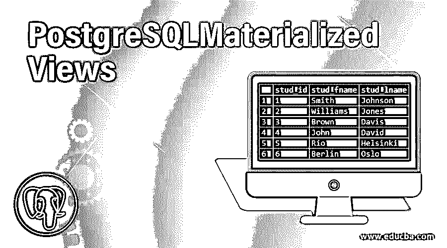
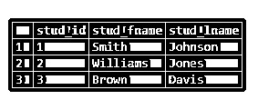
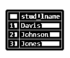
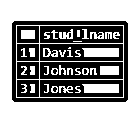
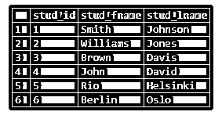
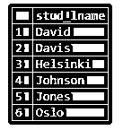

# PostgreSQL 实体化视图

> 原文：<https://www.educba.com/postgresql-materialized-views/>

## PostgreSQL 实体化视图简介

视图实际上是一个虚拟表，用于表示表中的记录。为了允许用户物理存储查询返回的结果，并允许我们定期更新表记录，我们使用 PostgreSQL 物化视图。我们可以更新视图，将复杂查询的结果记录存储在缓存中，稍后，我们可以使用该视图定期刷新结果记录。每当我们需要快速访问数据时，我们通常更喜欢使用商业智能应用程序和数据仓库。

### PostgreSQL 物化视图是如何工作的？

*   这实际上存储了复杂查询的结果记录。当我们有一个昂贵的操作时，这提供了对记录的快速访问。
*   创建视图后，我们可以定期刷新数据。
*   此外，我们可以在不再需要时删除视图。
*   要从物化视图中查询数据，我们必须首先用数据装载它。
*   我们可以使用并发选项，然后每当我们必须执行插入和更新操作时，PostgreSQL 就会检查不同的版本并更新唯一的差异。

### 如何创建 PostgreSQL 物化视图？

要创建 PostgreSQL 实体化视图，我们可以使用 CREATE MATERIALIZED VIEW 语句。考虑以下语法来理解相同的创建:

<small>Hadoop、数据科学、统计学&其他</small>

**语法**

`CREATE MATERIALIZED VIEW view_name
AS
query
WITH [NO] DATA;`

**解释**

*   **视图名称:**定义视图的名称；我们用 CREATE MATERIALIZED VIEW 子句指定它。
*   **查询:**这个用在 AS 关键字后面。这定义了从表中获取记录的语句。
*   **带【否】数据:**【否】关键字可选。如果没有定义，那么在创建时，只有数据被加载到相同的。如果我们定义时没有数据，视图将变得不可读。

### 实现 PostgreSQL 物化视图的示例

我们将使用 CREATE TABLE 语句创建一个名为“student”的表，如下所示:

#### 示例#1

**代码:**

`create table student
(
stud_id serial PRIMARY KEY,
stud_fname VARCHAR(80) NOT NULL,
stud_lname VARCHAR(80) NOT NULL
);`

现在，我们将使用 INSERT INTO 语句向 student 表中插入一些数据，如下所示:

**代码:**

`INSERT INTO student(stud_fname,stud_lname)
VALUES
('Smith','Johnson'),
('Williams','Jones'),
('Brown','Davis');`

通过使用下面的 SQL 语句和快照来说明上面的 INSERT 语句的结果。

**代码:**

`select * from student;`

**输出:**

#### 实施例 2

现在，我们将使用以下语句创建一个名为' studlname_view '的 PostgreSQL 实例化视图。

**代码:**

`CREATE MATERIALIZED VIEW studlname_view
as
select stud_lname
from student
group by stud_lname order by stud_lname;`

使用下面的 SQL 语句和快照说明上面的 CREATE MATERIALIZED VIEW 语句的结果。

**代码:**

`select * from studlname_view;`

**输出:**

### 如何刷新 PostgreSQL 物化视图？

有两种方法可以创建物化视图。让我们来理解他们。考虑以下语法来理解相同的刷新:

#### 1.刷新实体化视图 view _ name

当我们使用上述语法刷新 PostgreSQL 实例化视图中的数据时，整个表被 PostgreSQL 锁定，因此我们无法查询数据。因此，我们可以使用并发选项来避免这种情况。

#### 2.并发刷新实体化视图 view _ name

当我们定义并发选项时，PostgreSQL 会创建一个临时视图。而每当我们必须执行插入和更新操作时，PostgreSQL 就会检查不同的版本并更新唯一的差异。

**例子**

在上一节中，我们已经创建了一个名为' studlname_view '的 PostgreSQL 实体化视图。通过使用以下 SQL 语句和快照来说明“studlname_view”的结果。

**代码#1**

`select * from studlname_view;`

**输出:**

现在，我们将向 student 表中插入一些数据，然后我们将验证“studlname_view”视图的结果。

`INSERT INTO student(stud_fname,stud_lname)
VALUES
('John','David'),
('Rio','Helsinki'),
('Berlin','Oslo');`

通过使用下面的 SQL 语句和快照来说明上面的 INSERT 语句的结果。

**代码#2**

`select * from student;`

**输出:**

现在，我们将使用以下语句刷新名为' studlname_view '的 PostgreSQL 实例化视图。

#### 3.刷新实体化视图 studlname _ view

通过使用以下 SQL 语句和快照来说明“studlname_view”的结果。

**代码#3**

`select * from studlname_view;`

**输出:**

### 如何删除 PostgreSQL 物化视图？

要删除物化视图，我们必须使用与处理表或视图类似的语法。考虑以下语法来理解相同内容的删除:

`DROP MATERIALIZED VIEW view_name;`

**或**

`DROP MATERIALIZED VIEW studlname_view;`

因此，它将使用上面的 drop 语句删除视图。

### 结论

我们希望通过以上文章，您已经了解了如何创建 PostgreSQL 物化视图，PostgreSQL 物化视图如何工作，以及如何刷新或删除 PostgreSQL 物化视图。此外，我们还添加了几个示例来详细了解它。

### 推荐文章

这是一个 PostgreSQL 物化视图的指南。这里我们讨论 PostgreSQL 的介绍，包括适当的语法、工作和相应的例子。您也可以浏览我们的其他相关文章，了解更多信息——

1.  [PostgreSQL 查询](https://www.educba.com/postgresql-queries/)
2.  [PostgreSQL IF 语句](https://www.educba.com/postgresql-if-statement/)
3.  [PostgreSQL 回合](https://www.educba.com/postgresql-round/)
4.  [PostgreSQL 自然连接](https://www.educba.com/postgresql-natural-join/)