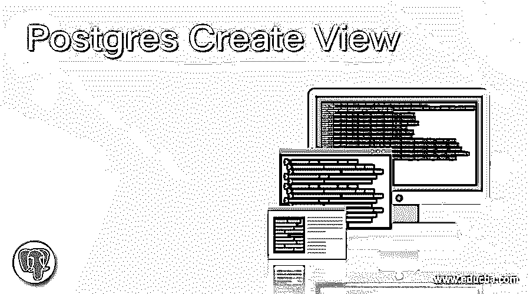
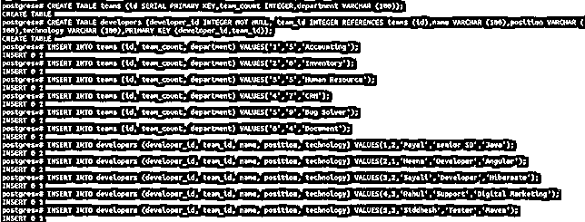
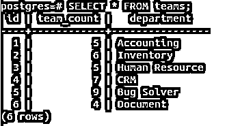
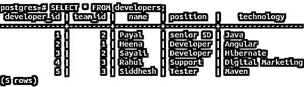
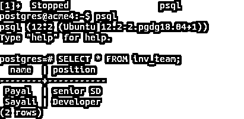
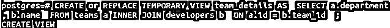
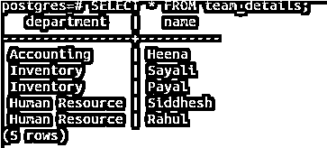
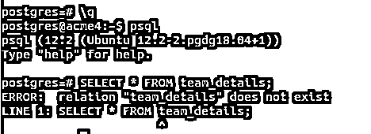
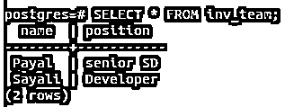
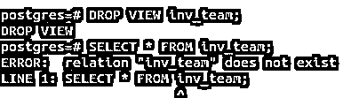

# Postgres 创建视图

> 原文：<https://www.educba.com/postgres-create-view/>

## Postgres 创建视图简介

视图是伪表，实际上并没有被物化。视图记录实际上并不消耗物理数据库中的任何内存。视图是在某些现有的临时或永久表的基础上创建的。这些列是在视图创建时从现有表中组合或指定的，视图创建又称为基表。基于临时表创建的视图被认为是临时的，一旦与之关联的会话关闭，这些视图就会被删除。每当引用一个视图时，都会在内部对基表运行一个查询来检索视图的记录。

在本文中，我们将学习如何创建视图、更改或替换它们以及从视图中获取记录，最后学习如何使用 DROP 命令删除视图。PostgreSQL 中所有的权限分配和所有权规则以及视图操作都是相同的，并且保持不变。另外，您应该注意，视图上不允许任何更新、插入和删除操作。但是，我们可以在视图上内部编写触发器，每当视图上发生相应的更改时，我们就可以编写更改基表的查询。视图可以从一个或多个基表中创建，并且可以包含一个或多个列。我们可以像检索表一样从视图中检索记录。我们将从学习在 PostgreSQL 中创建视图的语法开始。

<small>Hadoop、数据科学、统计学&其他</small>

**语法:**

`CREATE [ OR REPLACE ] [ TEMP | TEMPORARY ] VIEW nameOfView [ ( nameOfColumn [, ...] ) ] [ WITH ( view_option_name [= view_option_value] [, ... ] ) ] AS querySpecifyingRecords`

**参数:**

*   **TEMPORARY** 或**TEMP**–如果您想将目标视图声明为临时视图，这是可以在查询中使用的可选语句。默认情况下，视图本质上是永久的。仅在使用临时基表创建视图的情况下。即使查询中没有提到，视图也被认为是临时的。否则，除非在查询中指定，否则它们本质上是永久的。
*   **视图名称**–用于指定您想要创建的目标视图的名称。
*   **name of column**–这些是可选的列名，可以指定用于准备视图，该视图将包含按指定命名的列。如果没有指定，那么它们将从 querySpecifyingRecords 查询中推导出来，而 query specifying records 查询又引用基表。
*   **view _ option _ name**–我们可以在使用该语法创建视图时提供任何可选参数。目前，只有一种类型的参数可用于传递命名的 security_barrier，它有助于在启用时为视图提供行级安全性。
*   **query specifying records**–这可以是选择查询或帮助指定要在视图中插入的行和列的值。

### Postgres 创建视图示例

要创建视图，我们需要有基表。让我们通过在 psql 提示符下键入命令\dt 来进行检查。可以看到，在我的 postgres 数据库中只存在一个名为 educba 的表。让我们创建两个名为 teams 和 developers 的表，并在这两个表中插入一些值。

`CREATE TABLE teams (
id SERIAL PRIMARY KEY,
team_count INTEGER,
department VARCHAR (100)
);`

现在，我们将为开发人员创建一个表，作为引用表或子表。团队和开发人员的表之间会有一对多的关系。team_id 将是我们的引用键，它将引用团队表的 id。

`CREATE TABLE developers (
developer_id INTEGER NOT NULL,
team_id INTEGER REFERENCES teams (id),
name VARCHAR (100),
position VARCHAR (100),
technology VARCHAR (100),
PRIMARY KEY (developer_id,team_id)
);`

`INSERT INTO teams (id, team_count, department) VALUES('1','5','Accounting');
INSERT INTO teams (id, team_count, department) VALUES('2','6','Inventory');
INSERT INTO teams (id, team_count, department) VALUES('3','5','Human Resource');
INSERT INTO teams (id, team_count, department) VALUES('4','7','CRM');
INSERT INTO teams (id, team_count, department) VALUES('5','9','Bug Solver');
INSERT INTO teams (id, team_count, department) VALUES('6','4','Document');
INSERT INTO developers (developer_id, team_id, name, position, technology) VALUES(1,2,'Payal','senior SD','Java');
INSERT INTO developers (developer_id, team_id, name, position, technology) VALUES(2,1,'Heena','Developer','Angular');
INSERT INTO developers (developer_id, team_id, name, position, technology) VALUES(3,2,'Sayali','Developer','Hibernate');
INSERT INTO developers (developer_id, team_id, name, position, technology) VALUES(4,3,'Rahul','Support','Digital Marketing');
INSERT INTO developers (developer_id, team_id, name, position, technology) VALUES(5,3,'Siddhesh','Tester','Maven');`

如下所示-

现在，让我们使用查询语句检查表 teams 和 developers 的内容

`SELECT * FROM teams;`

`SELECT * FROM developers;`

首先，我们将创建一个简单的视图，该视图将从一个表中检索记录，该表中只有带有名称和位置列的开发人员的记录，这些记录的团队是“Inventory ”,意味着其团队 id 是 2。为此，我们的查询语句如下

`CREATE VIEW inv_team AS SELECT name,position FROM developers WHERE team_id = 2;`

这将导致以下输出。为了验证视图的内容，让我们通过启动查询来检查它们

`SELECT * FROM inv_team;`

**注意:**我关闭了会话，再次打开 psql 提示符并启动了 select 查询，该查询检索到了正确的记录，这意味着我们创建的视图是永久性的，因为我们没有在创建视图查询中指定 TEMP 或 TEMPORARY。

现在，我们将创建一个临时视图，其中包含开发人员及其团队部门的名称。这意味着将有两个基表。让我们从框架或查询语句开始。

`CREATE or REPLACE TEMPORARY VIEW team_details AS SELECT a.department, b.name FROM teams a INNER JOIN developers b ON a.id = b.team_id;`

这将产生以下输出–

让我们使用查询来检查它的内容

`SELECT * FROM team_details;`

现在，由于这是一个临时视图，让我们关闭会话，并检查在开始一个新会话后是否得到相同的输出。

可以看出，team_details 视图不再存在，因为创建临时表的会话已关闭，因此视图已被删除。

现在，让我们在这个新会话中检查 inv_team view 的内容。

`SELECT * FROM inv_team;`

要删除此视图，我们需要使用 DROP VIEW 命令，如下所示

`DROP VIEW inv_team;`

并使用上面给出输出的 SELECT 语句检查其内容

因此，该视图将被永久删除。

### 结论

可以在一个或多个具有一个或多个列的基表上创建视图，这些列在 PostgreSQL 中本质上可以是临时的或永久的。DROP VIEW 命令用于完全删除视图。

### 推荐文章

这是 Postgres 创建视图的指南。这里我们讨论 Postgres 创建视图的介绍，语法，参数，以及代码实现的例子。您也可以看看以下文章，了解更多信息–

1.  [PostgreSQL age()](https://www.educba.com/postgresql-age/)
2.  [PostgreSQL 集合](https://www.educba.com/postgresql-set/)
3.  [PostgreSQL 整数](https://www.educba.com/postgresql-integer/)
4.  [PostgreSQL 不在](https://www.educba.com/postgresql-not-in/)中