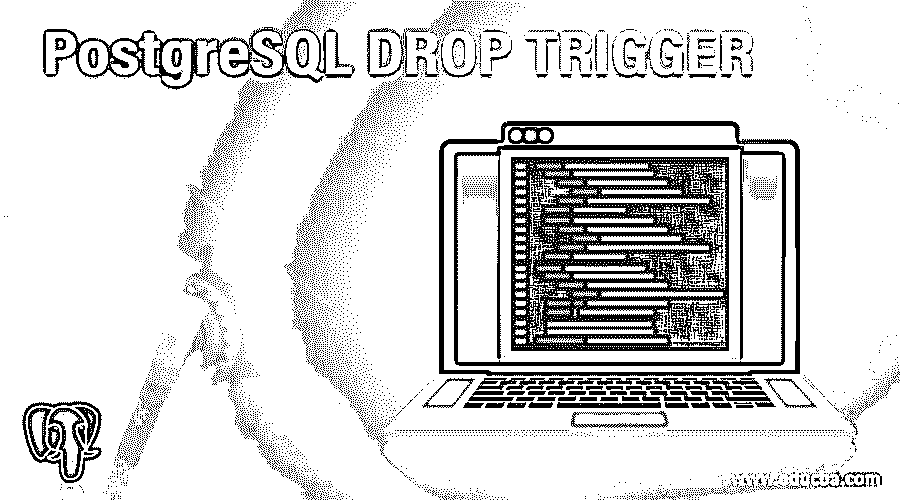
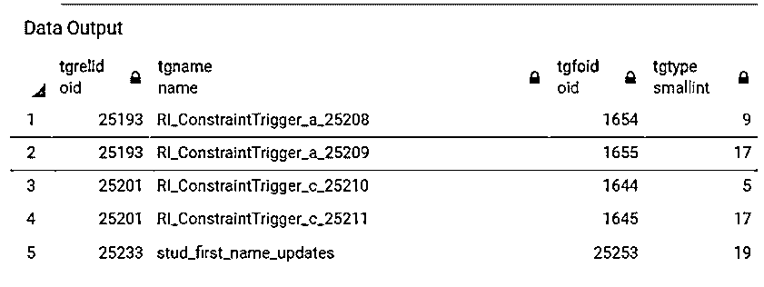
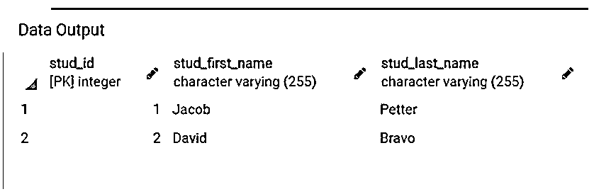
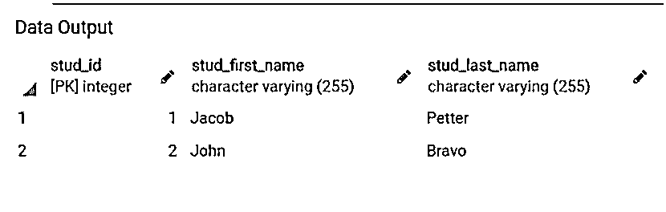
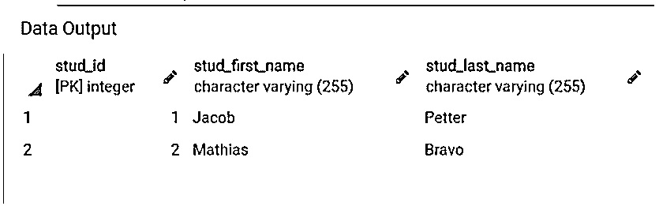
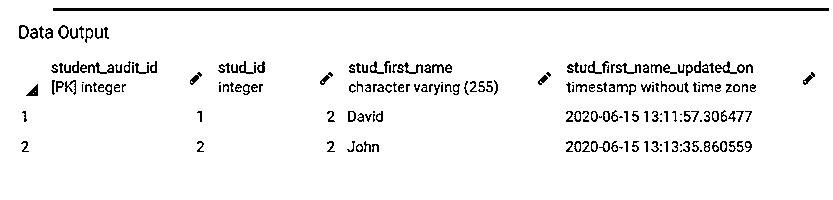
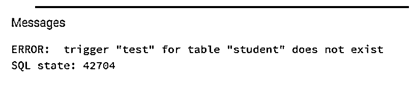

# PostgreSQL 删除触发器

> 原文：<https://www.educba.com/postgresql-drop-trigger/>

## PostgreSQL 删除触发器简介

以下文章概述了 PostgreSQL DROP TRIGGER。DROP trigger 用于删除数据库中存在的触发器。PostgreSQL 触发器函数与普通函数相同，但是当我们执行数据库操作(如插入、更新或删除)以及定义的事件发生时，它会被自动调用或执行。我们可以为每一行和每一条语句创建一个触发器，为每一行或所有操作执行一次。一旦创建了触发器，我们就可以从数据库中删除它。要从数据库中删除触发器，用户需要是数据库所有者。

**语法:**

<small>Hadoop、数据科学、统计学&其他</small>

`DROP TRIGGER [IF EXISTS] triggerName ON tableName [ CASCADE | RESTRICT ];`

**说明:**

*   **IF EXISTS:** 如果我们定义了 IF EXISTS 关键字，DROP 语句将检查触发器是否存在，即使触发器在数据库中不存在，它也不会抛出错误。
*   **TriggerName:** 定义用户想要移除的触发器的名称。
*   **TableName:** 它定义了我们在其上创建触发器的表的名称。
*   **CASCADE:** 如果我们已经定义了 CASCADE 关键字，那么 drop 语句将删除触发器上的所有依赖对象。
*   **RESTRICT:** 如果我们定义了 RESTRICT 关键字，那么如果对象依赖于触发器，drop 语句将限制触发器的移除。

### 在 PostgreSQL 中 DROP TRIGGER 是如何工作的？

*   要删除一个触发器，我们首先需要创建一个新的 PostgreSQL 触发器；我们需要遵循以下步骤:
    *   借助 CREATE FUNCTION 语句创建一个 PostgreSQL 触发器函数。
    *   借助 CREATE TRIGGER 语句将 PostgreSQL 触发器函数与数据库表绑定。
*   一旦创建了触发器，就可以使用 DROP trigger 语句删除触发器。
*   要从数据库中删除触发器，用户需要是数据库所有者。

### PostgreSQL 删除触发器示例

为了理解 DROP trigger 语句的示例，让我们创建两个部分。

#### 1.创建一个触发器并将其应用于表

考虑下面的例子，我们将创建一个名为“Student”和“Student_audit”的表。每当我们在 student 表中更新 Stud_first_name 时，我们就在“Student_audit”表中记录这些更改。

考虑下面的 CREATE TABLE 语句，它将创建一个名为“Student”的表。

**代码:**

`CREATE TABLE Student(
Stud_id serial PRIMARY KEY,
Stud_first_name varchar(255) NOT NULL,
Stud_last_name varchar(255) NOT NULL
);`

考虑下面的 CREATE TABLE 语句，它将创建一个名为“Student_audit”的表。

**代码:**

`CREATE TABLE Student_audit(
Student_audit_id serial PRIMARY KEY,
Stud_id INT NOT NULL,
Stud_first_name varchar(255) NOT NULL,
Stud_first_name_updated_on TIMESTAMP(6) NOT NULL
);`

现在，我们将创建一个名为“stud_first_name_update_logs”的函数，如下所示:

**代码:**

`CREATE FUNCTION public.stud_first_name_update_logs()
RETURNS trigger
LANGUAGE 'plpgsql'
COST 100
VOLATILE NOT LEAKPROOF
AS $BODY$BEGIN
IF NEW.Stud_first_name <> OLD.Stud_first_name THEN
INSERT INTO Student_audit(Stud_id, Stud_first_name, Stud_first_name_updated_on)
VALUES (OLD.Stud_id, OLD.Stud_first_name,now());
END IF;
RETURN NEW;
END;$BODY$;
ALTER FUNCTION public.stud_first_name_update_logs()
OWNER TO postgres;`

每当学生的名字发生变化时，上面的函数就会在 Student_audit 表中插入一个旧的学生名字，以及变化的时间、id 和名字。

现在，我们将创建名为“stud_first_name_updates”的 PostgreSQL 触发器，并将其绑定到 student 表。每当我们更新学生的名字时，会自动调用 PostgreSQL 触发器函数或执行更改日志记录。

**代码:**

`CREATE TRIGGER stud_first_name_updates
BEFORE UPDATE
ON student
FOR EACH ROW
EXECUTE PROCEDURE stud_first_name_update_logs();`

通过使用以下 SQL 语句和快照来说明上述语句的结果。

**代码:**

`SELECT * FROM pg_trigger;`

**输出:**

现在，我们将使用 INSERT INTO 语句在 Student 表中插入一行，如下所示:

**代码:**

`INSERT INTO Student(Stud_first_name, Stud_last_name)
VALUES
('Jacob', 'Petter'),
('David', 'Bravo');`

通过使用以下 SQL 语句和快照来说明 Student 表的内容。

**代码:**

`SELECT * FROM Student;`

**输出:**

现在，我们将使用 update 语句更新姓氏为“Bravo”的学生的名字，如下所示:

**代码:**

`UPDATE Student
SET Stud_first_name = 'John'
WHERE Stud_last_name = 'Bravo';`

通过使用以下 SQL 语句和快照来说明 Student 表的内容。

**代码:**

`SELECT * FROM Student;`

**输出:**

现在，通过使用下面的 SQL 语句和快照来说明 Student_audit 表的内容。

**代码:**

`SELECT * FROM Student_audit;`

**输出:**

现在，我们将使用 update 语句再次更新姓氏为“Bravo”的学生的名字，如下所示:

**代码:**

`UPDATE Student
SET Stud_first_name = 'Mathias'
WHERE Stud_last_name = 'Bravo';`

通过使用以下 SQL 语句和快照来说明 Student 表的内容。

**代码:**

`SELECT * FROM Student;`

**输出:**

现在，通过使用下面的 SQL 语句和快照来说明 Student_audit 表的内容。

**代码:**

`SELECT * FROM Student_audit;`

**输出:**

#### 2.放弃声明

在上面的部分中，我们创建了触发器 stud_first_name_updates，我们可以使用 DROP trigger 语句删除它，如下所示:

**代码:**

`DROP TRIGGER stud_first_name_updates  ON student;`

现在，我们将尝试删除数据库中不存在的触发器。

**代码:**

`DROP TRIGGER test ON student;`

**输出:**

### 推荐文章

这是一个 PostgreSQL DROP TRIGGER 的指南。在这里，我们讨论 postgresql 和不同示例中的 drop 触发器的工作原理及其代码实现。您也可以看看以下文章，了解更多信息–

1.  [PostgreSQL 平均值](https://www.educba.com/postgresql-average/)
2.  [PostgreSQL 事务](https://www.educba.com/postgresql-transaction/)
3.  [PostgreSQL 物化视图](https://www.educba.com/postgresql-materialized-views/)
4.  [PostgreSQL 递归查询](https://www.educba.com/postgresql-recursive-query/)