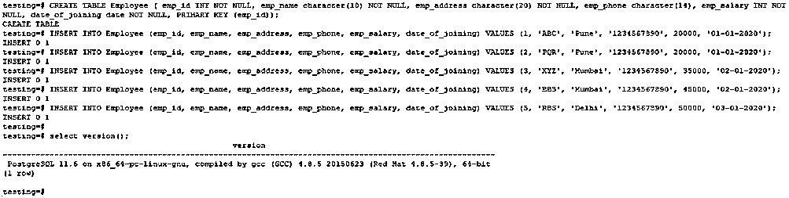
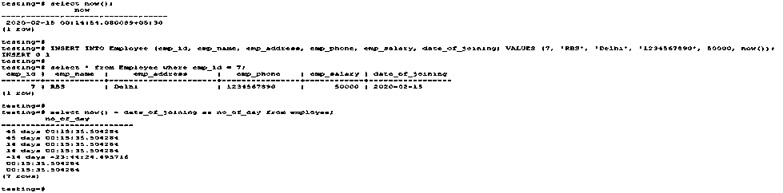
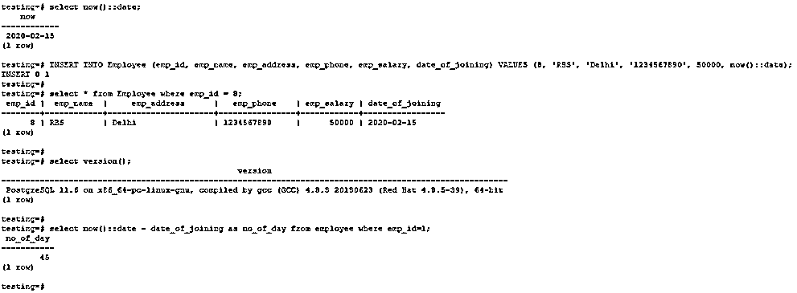
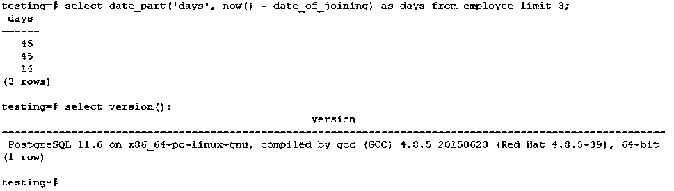
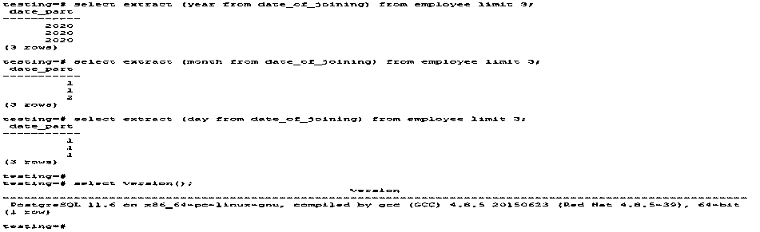
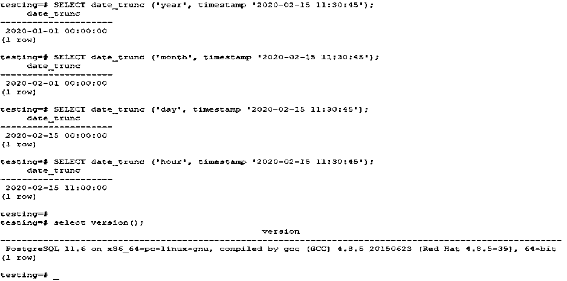
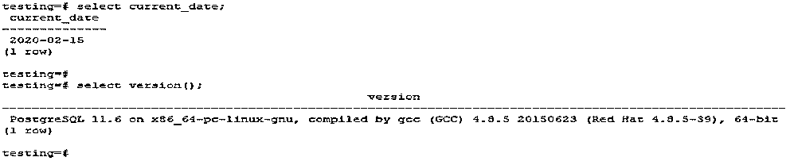
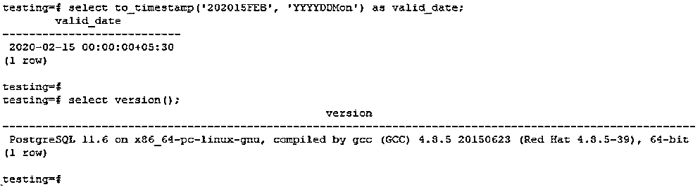
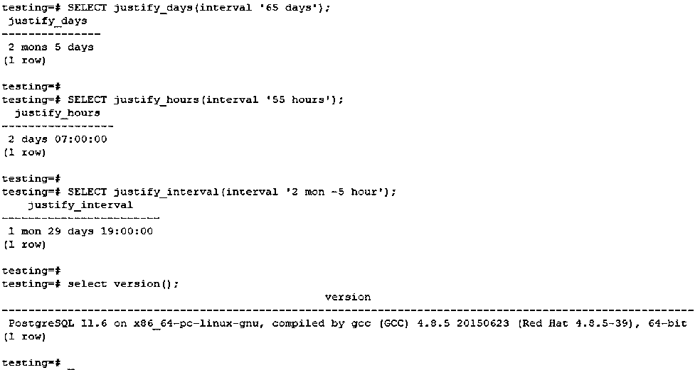

# PostgreSQL 日期函数

> 原文：<https://www.educba.com/postgresql-date-functions/>

## PostgreSQL 日期函数简介

在 PostgreSQL 中，可以使用各种日期函数来操作时间戳。日期函数在 PostgreSQL 中非常有用，非常重要；在日期函数中，输入有两种格式:

1.  一个是带时区的时间或带时区的时间戳
2.  另一个输入是不带时区的时间或不带时区的时间戳

PostgreSQL 中最常用的日期函数有 now()，date_part()，age()，extract()，date_trunc()，to_char()和 to_timestamp()。

<small>Hadoop、数据科学、统计学&其他</small>

### 所有 PostgreSQL 日期函数

下面是常见的日期函数。

*   现在()
*   Now()::日期
*   日期部分()
*   年龄()
*   提取()
*   date_trunc()
*   当前日期()
*   到时间戳()
*   对齐()

我们使用一个雇员表来描述日期函数。请在下面找到创建雇员表的示例。

`CREATE TABLE Employee ( emp_id INT NOT NULL, emp_name character(10) NOT NULL, emp_address character(20) NOT NULL, emp_phone character(14), emp_salary INT NOT NULL, date_of_joining date NOT NULL, PRIMARY KEY (emp_id));`

`INSERT INTO Employee (emp_id, emp_name, emp_address, emp_phone, emp_salary, date_of_joining) VALUES (1, 'ABC', 'Pune', '1234567890', 20000, '01-01-2020');`

`INSERT INTO Employee (emp_id, emp_name, emp_address, emp_phone, emp_salary, date_of_joining) VALUES (2, 'PQR', 'Pune', '1234567890', 20000, '01-01-2020');`

`INSERT INTO Employee (emp_id, emp_name, emp_address, emp_phone, emp_salary, date_of_joining) VALUES (3, 'XYZ', 'Mumbai', '1234567890', 35000, '02-01-2020');`

`INSERT INTO Employee (emp_id, emp_name, emp_address, emp_phone, emp_salary, date_of_joining) VALUES (4, 'BBS', 'Mumbai', '1234567890', 45000, '02-01-2020');`

#### 1.现在()

*   为了选择当前日期，我们使用了 now()函数。
*   现在，该函数将返回日期和时间以及当前事务开始的时区。
*   now()函数的返回类型是 timestamptz。
*   下面是 now()函数的语法和示例。

**语法**

`Select now ();`

**例子**

`INSERT INTO Employee (emp_id, emp_name, emp_address, emp_phone, emp_salary, date_of_joining) VALUES (7, 'RBS', 'Delhi', '1234567890', 50000, now());
select now();
select * from Employee where emp_id = 7;
select now() - date_of_joining as no_of_day from employee;`

#### 2.Now()::日期

要同时选择没有时间戳的日期，我们必须使用 now ():: date 函数。

下面是 now ():: date 函数的示例和语法。

**语法**

`Select now ():: date;`

**例子**

`select now()::date;
INSERT INTO Employee (emp_id, emp_name, emp_address, emp_phone, emp_salary, date_of_joining) VALUES (8, 'RBS', 'Delhi', '1234567890', 50000, now()::date);
select now()::date - date_of_joining as no_of_day from employee where emp_id=1;`

#### 3.日期部分()

date_part()函数的返回类型是双精度值。

要获取时间戳字段或时间间隔，如年、月、日，我们需要使用 date_part()函数。

下面是例子，date_part()函数的语法如下。

**语法**

`Date_part (subfield (month, day, year) from timestamp)`

**例子**

`select date_part('days', now() - date_of_joining) as days from employee limit 3;`

#### 4.年龄()

我们使用 PostgreSQL 中的 age()函数找到了两个日期之间的间隔。

age()函数的返回类型是区间。

它将计算两个时间戳的当前日期和时间戳之间的年龄；计算后，它返回符号结果。

下面是 PostgreSQL 中 age()函数的示例和语法。

**语法**

`Age (timestamp)`

**例子**

`select age(date_of_joining) from employee limit 3;`

#### 5.提取()

提取函数的返回类型为双精度值。

Extract () date 函数与 PostgreSQL 中的 date_part()函数相同。

此功能允许我们在日期、月份和年份字段之间隔离日期。使用 extract()函数在不同部分之间隔离日期。

下面是 PostgreSQL 中 extract()函数的语法和示例。

**语法**

`Extract(subfield(month, day, year) from timestamp)`

**例子**

`select extract (year from date_of_joining) from employee limit 3;
select extract (month from date_of_joining) from employee limit 3;
select extract (day from date_of_joining) from employee limit 3;`

#### 6.date_trunc ()

*   date_trunc()函数的返回类型是时间戳。Date_trunc()函数时间戳被截断到特定精度。
*   下面是例子，date_trunc()函数的语法如下。
*   Date_trunc()函数用于以指定的精度截断。

**语法**

`Date_trunc (field (month, day, year) from timestamp)`

**例子**

`SELECT date_trunc ('year', timestamp '2020-02-15 11:30:45');
SELECT date_trunc ('month', timestamp '2020-02-15 11:30:45');
SELECT date_trunc ('day', timestamp '2020-02-15 11:30:45');
SELECT date_trunc ('hour', timestamp '2020-02-15 11:30:45');`

**

** 

#### 7.当前日期()

*   当前[日期函数的返回类型是日期](https://www.educba.com/date-functions-in-hive/)。下面是 PostgreSQL 中 current_date()函数的例子如下。

**语法**

`select current_date;`

**例子**

`select current_date;`

#### 8.到时间戳()

*   PostgreSQL 将使用 PostgreSQL 中的 to_timestamp () date 函数将字符串值转换为适当的日期格式。
*   下面是 PostgreSQL 中 to_timestamp date 函数的示例和语法。

**语法**

`to_timestamp ()`

**例子**

`select to_timestamp('202015FEB', 'YYYYDDMon') as valid_date;`

#### 9.对齐()

下面是 PostgreSQL 中调整日期函数的间隔。

*   **JUSTIFY _ DAYS(interval)–**以 30 天的时间周期调整间隔。
*   **JUSTIFY _ HOURS(interval)–**以 24 小时为周期调整间隔。
*   **JUSTIFY _ INTERVAL(INTERVAL)–**通过天数、小时数和附加符号调整来调整间隔。

下面是语法，调整间隔的例子如下。

**语法**

`JUSTIFY_DAYS (interval)`

**例子**

`SELECT justify_days (interval '65 days');
JUSTIFY_HOURS (interval)`

**例子**

`SELECT justify_hours (interval '55 hours');
JUSTIFY_INTERVAL(interval)`

**例子**

`SELECT justify_interval (interval '2 mon -5 hour');`

### 结论

日期函数非常重要和有用。在 PostgreSQL 中有多种日期函数可用，但主要使用 now()、current_date()、date_part()、extract()、age()、justify()、date_trunc()、to_timestamp()和 to_char()日期函数。

### 推荐文章

这是一个 PostgreSQL 日期函数的指南。在这里，我们讨论了所有的函数以及例子和语法。您也可以看看以下文章，了解更多信息–

1.  [PostgreSQL 版本](https://www.educba.com/postgresql-versions/)
2.  [什么是 PostgreSQL？](https://www.educba.com/what-is-postgresql/)
3.  [PostgreSQL 运算符](https://www.educba.com/postgresql-operators/)
4.  [PostgreSQL 面试问题](https://www.educba.com/postgresql-interview-questions/)
5.  [PostgreSQL 别名指南](https://www.educba.com/postgresql-alias/)