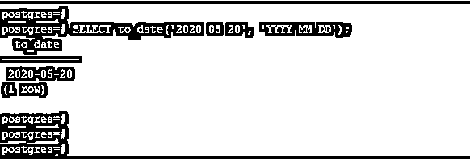
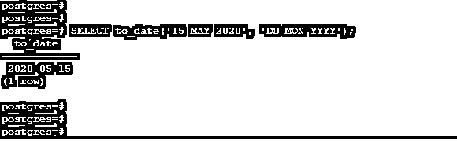
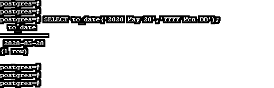
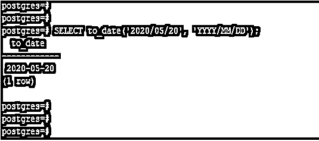
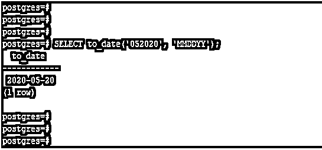

# PostgreSQL TO_DATE()

> 原文：<https://www.educba.com/postgresql-to_date/>

## PostgreSQL TO_DATE()简介

PostgreSQL 的 TO_DATE()函数用于将字符串文字转换为日期值；基本上，to_date 函数会将字符串转换成日期。我们在 PostgreSQL 中给了 to_date 函数两个输入参数实参，即 text 和 formatto_date 函数在 PostgreSQL 中将字符串转换成日期值是非常有用和重要的。按照我们在 PostgreSQL 中提供的 To_date 函数的输入参数，to_date 函数从函数中返回日期。To_date 函数用于处理简单造型无法转换的输入格式；该函数将通过最小错误检查来解释输入。

### 句法

下面是 PostgreSQL 中 to_date 函数的语法。

<small>Hadoop、数据科学、统计学&其他</small>

*   截止日期(文本，格式)或
*   to_date(文本，文本)或
*   到日期(字符串，格式)

**下面是 PostgreSQL 中 to_date 函数的参数描述语法。**

*   **To _ date-**To _ date 函数用于将字符串表示的日期转换为日期数据类型。
*   **Text–**Text 是 PostgreSQL 中的 to_date 函数接受的第一个参数。文本只是字符串参数，我们将它转换成日期**。**
*   **Format–**第二个参数是 to_date 函数的输入格式，它返回日期值。它将以日期部分的形式定义输入字符串的格式。
*   **String–**String 参数定义为我们将哪个字符串转换为日期。我们还在 to_date 函数中将一个字符串定义为文本。

### PostgreSQL TO_DATE()函数的工作原理

*   下面是 PostgreSQL 中的 to_date 函数的工作方式。
*   PostgreSQL 中 to_date 函数的主要用途是将 string lateral 转换成 date；to_date 函数用于将字符串转换成日期格式。
*   我们已经用 PostgreSQL 中的 to_date 函数传递了两个参数，即字符串和格式。
*   我们可以使用 PostgreSQL 中的 to_date 函数来格式化日期值，如下所示。

**PostgreSQL 中使用 to_date 函数格式化日期值的模式。**

1.  **Y，YYY—**这被定义为用逗号分隔的四位数的年份。第一个数字后用逗号隔开。
2.  **YYYY–**这种格式将年份定义为四位数。我们没有使用任何字符串来划分年份。
3.  **YYY—**该格式将定义年份的最后三位数字。
4.  **YY—**此格式将定义年份的最后两位数。
5.  **Y–**该格式将定义年份的最后一位数字。
6.  **IYYY—**这被定义为 ISO 年份编号。它将显示最后四个或更多的数字作为输出。
7.  **IYY–**这种 ISO 编号格式将定义星期编号年份的最后三位数字。
8.  **IY—**这种 ISO 编号格式将定义星期编号年份的最后两位数字。
9.  它将定义 ISO 8601 周编号年份的最后一位数字。
10.  **MONTH—**用于定义英文大写的月份名称。
11.  **Month—**这是一个全大写的英文月份名称。
12.  **月-**这是一个全小写英文月份名称。
13.  **MON–**这是缩写的大写英文月份名称，即 JAN，FEB
14.  **Mon–**这是缩写的大写英文月份名称，即 Jan，Feb。
15.  **mon–**这是缩写的小写英文月份名称，即 Jan，feb。
16.  MM–这被定义为从 0 到 12 的月份数。
17.  **DAY—**这被定义为一个全大写的日名。
18.  **Day—**这是一个全大写的日期名称。
19.  **day—**这被定义为完整的小写日期名称。
20.  **DY–**这是一个缩写的大写日名。
21.  **Dy**–这是一个缩写的大写日名。
22.  这是一个缩写的小写日期名称。
23.  **DDD**–这被定义为一年中从 000 到 366 的某一天。
24.  **DD–**这被定义为一个月中从 01 到 31 的某一天。
25.  **D–**这被定义为一周中的某一天，星期日为 1，星期六为 7。

*   我们可以在指定格式时使用 to_date 函数来转换日期；我们可以在 to_date 函数中使用上述任何格式。
*   如果假设我们必须将字符串 2020 年 5 月 20 日转换为日期值，我们可以使用“DD Mon YYY”或“YYYY Mon dd”的模式。

### 例子

下面是 PostgreSQL 中 to_date 函数的一个例子。

#### 示例 1–使用“YYYY MM DD”格式转换字符串

在下面的示例中，我们使用“YYYY MM DD”格式转换了“2020 05 20”日期。

`SELECT to_date('2020 05 20', 'YYYY MM DD');`

**输出:**

#### 示例 2–使用“DD MON YYYY”格式转换字符串

在下面的示例中，我们使用“DD MON YYYY”格式转换了“2020 年 5 月 15 日”日期。

`SELECT to_date('15 MAY 2020', 'DD MON YYYY');`

**输出:**

#### 示例 3–使用“YYYY Mon DD”格式转换字符串

在下面的示例中，我们使用“YYYY Mon DD”格式转换了“2020 年 5 月 20 日”日期。

`SELECT to_date('2020 May 20','YYYY Mon DD');`

**输出:**

#### 示例 4–PostgreSQL 迄今为止的问题

在下面的例子中，我们向 to_date 函数传递了一个无效的日期字符串。在传递无效的日期字符串后，我们将字符串转换成日期格式。

`SELECT to_date('2020/05/20', 'YYYY/MM/DD');`

**输出:**

#### 示例 5–使用“MMDDYY”格式转换字符串

在下面的示例中，我们使用“MMDDYY”格式转换了“052020”日期。

`SELECT to_date('052020', 'MMDDYY');`

**输出:**

### 推荐文章

这是 PostgreSQL TO_DATE()的指南。在这里，我们讨论 PostgreSQL TO_DATE()函数的工作方式和示例，以及函数和输出。您也可以阅读以下文章，了解更多信息——

1.  [SQL While 循环](https://www.educba.com/sql-while-loop/)
2.  [PostgreSQL 替换](https://www.educba.com/postgresql-replace/)
3.  [PostgreSQL For 循环](https://www.educba.com/postgresql-for-loop/)
4.  [PostgreSQL 日志](https://www.educba.com/postgresql-log/)