# PostgreSQL datediff

> 原文：<https://www.educba.com/postgresql-datediff/>

## PostgreSQL datediff 简介

PostgreSQL 为用户提供了 datediff 函数。datediff 意味着我们可以根据指定的时间间隔返回两个日期之间的差异。datediff 函数在数据库管理系统中起着重要的作用，因为 datediff 函数是一个日历，它对用户很有帮助。借助 datediff 函数，我们可以确定任何以前的日期、下一个日期，同样，我们可以确定前一天和第二天，也可以确定时间、星期和分钟。datediff 的一些函数根据查询语法使用系统当前日期。

**语法:**

<small>Hadoop、数据科学、统计学&其他</small>

`select datediff function() date1,  interval date2;`

**说明:**

*   在上面的语法中，我们使用 select 子句，其中 datediff 函数表示各种与日期相关的函数，其中 date1 是第一个指定日期，date2 是第二个指定日期。
*   这里，interval 用于确定我们指定的两个日期之间的差异。

### PostgreSQL 中 datediff 函数是如何工作的？

*   我们必须在系统中安装 PostgreSQL。
*   我们需要关于 PostgreSQL 的基础知识。
*   我们必须要求数据库应用 datediff 函数。

下面给出了不同的 datediff 函数，如下所示:

首先，我们看到与日期和时间相关的基本函数。

#### 1.now()函数

该函数用于了解系统的当前日期和时间，并且该函数是系统定义的函数，它给出时间戳结果。

**举例:**

**代码:**

`select now();`

**输出:**

**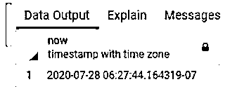

** 

#### 2.时间函数

这个函数以文本格式显示日期和时间。

**举例:**

**代码:**

`Select timeofday();`

**输出:**

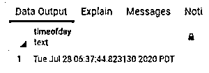

#### 3.四分之一函数

此函数用于了解一年中的季度。

**举例:**

**代码:**

`select     extract      (quarter       from        now());`

**说明:**

*   在本例中，我们提取当前年份的季度。
*   通过使用下面的快照来说明上述声明的最终结果。

**输出:**

#### 4.一年中的某一天

此函数用于计算一年中的天数。

**代码:**

`select     extract     (doy     from      now());`

**输出:**

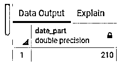

**说明:**

*   在此示例中，我们使用 extract 函数来了解一年中特定的天数。在此示例中，我们现在使用一个函数，这意味着它从系统当前日期开始计算天数。
*   通过使用下面的快照来说明上述声明的最终结果。

#### 5.星期几

该函数用于从一周中提取日期。

**举例:**

**代码:**

`Select    extract    (dow      from    now());`

**说明:**

*   在本例中，提取一周中的当前日期。系统需要当前日期才能知道从星期一开始的日期是 1，星期二是 2，依此类推。因此，默认情况下，Sunday 的值为 0。
*   通过使用下面的快照来说明上述声明的最终结果。

**输出:**

**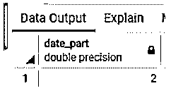

** 

#### 6.当前月份

该功能用于了解当前月份。

**举例:**

**代码:**

`select        extract       (month     from      now());`

**说明:**

*   在本例中，我们提取当前月份，其中 now()函数取系统的当前日期。
*   通过使用下面的快照来说明上述声明的最终结果。

**输出:**

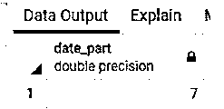

除了 datediff 和 extract 函数，我们还有另一个函数，我们称之为 date_part 函数，这个函数的工作原理和 datediff 函数一样。PostgreSQL 不直接支持 datediff 函数。

**举例:**

**代码:**

`Select    date_part       ('dow',    now());`

**说明:**

*   在这个例子中，我们使用 date_part 函数代替 extract。同样，我们通过使用 date_part 函数来实现上述所有功能。
*   通过使用下面的快照来说明上述声明的最终结果。

**输出:**

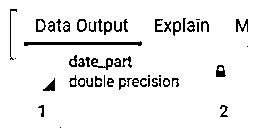

现在我们来看看主 datediff 函数的例子:

#### 例子#1:两年之间的差异

**代码:**

`select date_part  ('year', '2020/01/01'::date) -    date_part     ('year',     '2010/01/01'::date);`

**说明:**

*   假设我们在使用上述语句时需要知道两个日期之间的差异，这里我们使用 date_part 而不是 datediff，因为 PostgreSQL 不直接支持。
*   通过使用下面的快照来说明上述声明的最终结果。

**输出:**

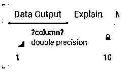

#### 例子 2:两天之间的差异

**代码:**

`Select         '2020-07-28 22:00:00'         ::          timestamp      -        '2020-07-26 02:00:00'           ::            timestamp;`

**说明:**

*   假设我们需要确定两天之间的差异，这时我们使用上面的语句。
*   通过使用下面的快照来说明上述声明的最终结果。

**输出:**

**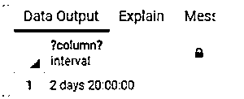

** 

#### 例 3:两个星期的区别

**代码:**

`Select       trunk     (date_part     ('day',    '2020-07-28'   ::    timestamp     -    '2020-07-21'  ::          timestamp)        /     7);`

**说明:**

*   假设我们需要知道两个星期之间的区别，这时我们使用上面的语句。
*   通过使用下面的快照来说明上述声明的最终结果。

**输出:**

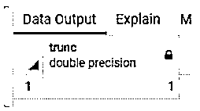

#### 示例 4:小时之间的差异

**代码:**

`select date_part('day','2020-07-28 07:55'::timestamp - '2020-07-28 08:05'::timestamp)
* 24+
date_part('hour','2020-07-28 07:55'::timestamp - '2020-07-28 08:05'::timestamp);`

**说明:**

*   假设我们需要知道两个小时的差异，这时我们使用上面的语句。
*   通过使用下面的快照来说明上述声明的最终结果。

**输出:**

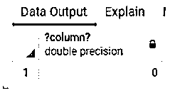

#### 例 5:分钟之间的差异

**代码:**

`select          date_part          ('hour',      '09:40:10'::time     -        '09:45:50'::time)    *60+
date_part    ('minute',          '09:40:10'::time -                              '09:45:50'::time);`

**说明:**

*   假设我们需要知道使用上述语句时分钟之间的差异。
*   通过使用下面的快照来说明上述声明的最终结果。

**输出:**

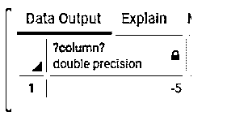

#### 例 6:秒之间的差异

**代码:**

`select   date_part        ('hour','09:40:10'::time - '09:40:50'::time)*60+
date_part           ('minute','09:40:10'::time - '09:40:50'::time)*60+
date_part        ('second','09:40:10'::time - '09:40:50'::time);`

**说明:**

*   假设我们需要知道当时我们使用上述语句的第二个区别。
*   通过使用下面的快照来说明上述声明的最终结果。

**输出:**

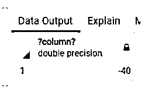

### 结论

从上面的文章中，我们看到了 datediff 的语法和 datediff 的基本函数，以及一些高级函数，如通过多个示例确定年、月、日、小时和分钟之间的差异。从本文中，我们看到了如何处理不同的 datediff 函数。

### 推荐文章

这是一个 PostgreSQL datediff 的指南。这里我们讨论一下 PostgreSQL 中 datediff 函数的介绍和工作原理？您也可以看看以下文章，了解更多信息–

1.  [PostgreSQL 删除数据库](https://www.educba.com/postgresql-drop-database/)
2.  [PostgreSQL 复制](https://www.educba.com/postgresql-replication/)
3.  [PostgreSQL 存储过程](https://www.educba.com/postgresql-stored-procedures/)
4.  [PostgreSQL 随机排序](https://www.educba.com/postgresql-order-by-random/)