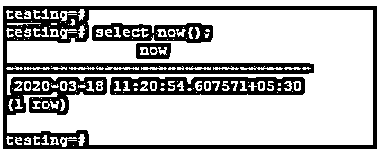
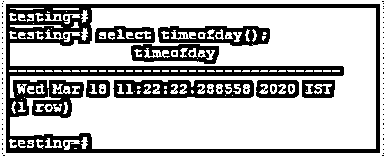
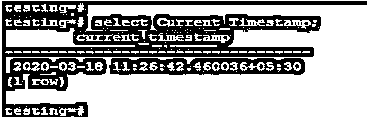
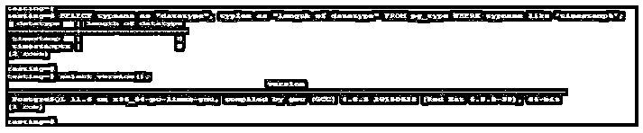
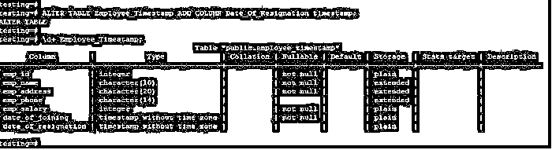
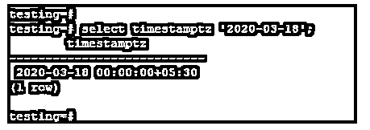
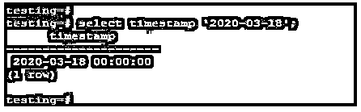

# PostgreSQL 时间戳

> 原文：<https://www.educba.com/postgresql-timestamp/>

## PostgreSQL 时间戳简介

PostgreSQL 时间戳用于将日期和时间格式数据存储到数据库中；timestamp 在每次修改行或向表中插入行时自动更新时间戳。如果，在某些情况下，如果服务器的时区改变，它不会影响我们已经存储在数据库中的实际数据。时间戳数据类型存储大小为 8 字节，用于将时间戳存储到数据库中；在 PostgreSQL 中，timestamp 数据类型对于将日期和时间数据存储到数据库中非常有用和重要。

**语法:**

<small>Hadoop、数据科学、统计学&其他</small>

`select now () :: timestamp;`

`select ‘date’ :: timestamp;`

`select ‘date: time’ :: timestamp;`

`select CURRENT_TIMESTAMP :: timestamp;`

**下面是上述语法的参数描述如下:**

*   **Select:** Select 用于选择时间戳语法中的时间戳值。我们可以选择任何日期或时间值来显示 PostgreSQL 中的时间戳格式。我们可以选择当前日期为 now，以及 PostgreSQL 中的当前时间戳函数。
*   **时间戳:**用于将日期和时间格式的数据存储到数据库中；它用于处理或存储存储在数据库中的数据的日期和时间。我们可以使用这种数据类型来选择日期和时间。
*   **Now ():** 该函数用于在 PostgreSQL 中选择当前日期和时间。如果我们想使用当前的日期和时间，那么我们已经在 PostgreSQL 中使用了 now 函数。现在函数更重要的是在 PostgreSQL 中选择当前日期和时间。
*   **日期和时间:**我们可以使用任何日期和时间来显示时间戳的格式。如果我们使用了唯一的日期，那么它将显示日期和时间。
*   **当前时间戳:**该函数用于选择 PostgreSQL 中的当前日期和时间。如果我们想使用当前的日期和时间，那么我们必须在 PostgreSQL 中使用一个当前的时间戳函数。当前时间戳函数对于在 PostgreSQL 中选择当前日期和时间更为重要。

### PostgreSQL 中时间戳数据类型是如何工作的？

*   我们可以使用带时区和不带时区的时间戳数据类型。如果我们想使用不带时区的，我们需要使用时间戳数据类型；如果我们想使用时区，我们需要使用时间戳数据类型。
*   基本上，时间戳数据类型分为带时区和不带时区的类型。
*   下面是时间戳数据类型的功能如下。

1.  现在()
2.  当前时间戳
3.  Timeofday ()

*   Now 函数用于选择 PostgreSQL 中的当前日期和时间。如果我们想使用当前的日期和时间，那么我们需要在 PostgreSQL 中使用 now 函数。现在函数更重要的是在 PostgreSQL 中选择当前日期和时间。

下图显示了 PostgreSQL 中 now 函数的示例:

**代码:**

`select now();`

**输出:**

*   时间功能用于选择今天的日期、日期和时区时间格式。

下图显示了 PostgreSQL 中时间函数的示例。

**代码:**

`select timeofday();`

**输出:**

*   当前时间戳函数用于选择 PostgreSQL 中的当前日期和时间。如果我们想使用当前的日期和时间，那么我们需要在 PostgreSQL 中使用一个当前的时间戳函数。

**代码:**

`select Current_timestamp;`

**输出:**

*   时间戳不是时区数据类型；它只存储时间和日期；在某些情况下，如果服务器的时区改变了，它不会影响我们存储到数据库中的实际数据。
*   时间戳数据存储大小为 8 字节，用于将数据存储到数据库中；在 PostgreSQL 中，timestamp 数据类型对于存储数据的日期和时间数据非常有用和重要。
*   时间戳数据类型的低值是 BC 4713，PostgreSQL 中时间戳数据类型的高值是 AD 294276。
*   时间戳数据类型存储大小是 8 字节。

以下示例显示了 PostgreSQL 中时间戳数据类型的大小:

**代码:**

`SELECT typname as "datatype", typlen as "length of datatype" FROM pg_type WHERE typname like 'timestamp%';`

**输出:**

### PostgreSQL 时间戳的示例

下面是一些例子:

#### 示例#1

我们在创建表时给出了时间戳的数据类型。

在下面的例子中，我们为连接列的日期指定了时间戳格式。

**代码:**

`CREATE TABLE Employee_Timestamp (emp_id INT NOT NULL, emp_name character(10) NOT NULL, emp_address character(20) NOT NULL, emp_phone character(14), emp_salary INT NOT NULL, date_of_joining timestamp NOT NULL);`

**输出:**

#### 实施例 2

以下示例显示了使用 alter 命令添加一个列并将时间戳数据类型分配给新添加的列，如下所示。

**代码:**

`ALTER TABLE Employee_Timestamp ADD COLUMN Date_Of_Resignation timestamp;`

**输出:**

#### 实施例 3

在下面的例子中，我们使用的日期使用的时间戳格式如下。使用带和不带时区格式。

*   **带时区:**下面的示例显示了 PostgreSQL 中带时区的时间戳。

**代码:**

`select timestampz ‘2020-03-18’;`

**输出:**

*   **不带时区:**下面的示例显示了 PostgreSQL 中不带时区的时间戳，如下所示。

**代码:**

`select timestamp '2020-03-18';`

**输出:**

### **结论**

时间戳使用 8 字节存储空间将数据存储到数据库中；在 PostgreSQL 中，时间戳数据类型有利于将日期和时间数据存储到数据库中。PostgreSQL 中有三种时间戳数据类型，即 now()、timeofday()和 Current_timestamp。

### 推荐文章

这是一个 PostgreSQL 时间戳的指南。这里我们讨论一下入门，如何在 PostgreSQL 中对数据类型进行时间戳操作？还有例子。您也可以看看以下文章，了解更多信息–

1.  [PostgreSQL 日期函数](https://www.educba.com/postgresql-date-functions/)
2.  [PHP 中的日期函数](https://www.educba.com/date-function-in-php/)
3.  [PostgreSQL 表](https://www.educba.com/postgresql-table/)
4.  [PostgreSQL 获取](https://www.educba.com/postgresql-fetch/)
5.  [PostgreSQL 唯一约束指南](https://www.educba.com/postgresql-unique-constraint/)
6.  [PostgreSQL 通知|示例](https://www.educba.com/postgresql-notify/)