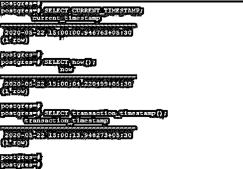
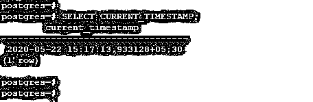
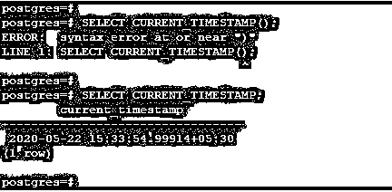
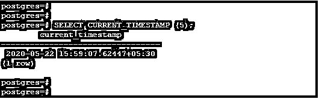
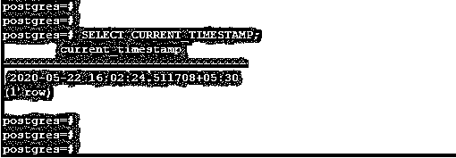
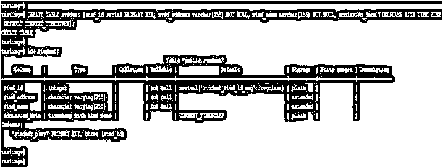
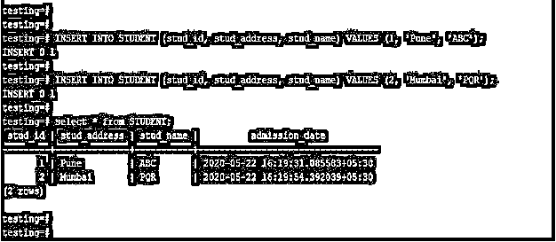

# PostgreSQL CURRENT_TIMESTAMP()

> 原文：<https://www.educba.com/postgresql-current_timestamp/>

## PostgreSQL CURRENT_TIMESTAMP()简介

PostgreSQL CURRENT_TIMESTAMP()用于返回带有时区的当前日期和时间，它将显示我们的事务开始的时间。这是 PostgreSQL SQL 标准函数，用于根据 PostgreSQL 中当前事务的开始时间返回值。Current timestamp 和 transaction timestamp 函数彼此等效，但是 current timestamp 将返回当前日期和时间，而 transaction timestamp 将返回事务开始时间。当前时间戳、事务时间戳和 now 函数在 PostgreSQL 中做的完全一样，但是当前时间戳是语法古怪的函数。

### 句法

下面是 PostgreSQL 中 current_timestamp 函数的语法。

<small>Hadoop、数据科学、统计学&其他</small>

`Current_timestamp;`

运筹学

`Current_timestamp (<Precision>)`

#### 参数描述

下面是 PostgreSQL 中当前时间戳函数的参数描述语法。

**当前时间戳:**PostgreSQL 中的当前时间戳将返回当前日期和时间。当前时间戳是 PostgreSQL 中的 SQL 标准函数，用于根据当前事务的开始时间返回值。

**Precision:** 可选参数，用于 PostgreSQL 中的当前时间戳函数。精度是 PostgreSQL 中结果的第二个字段中的小数秒精度的位数。如果我们没有在当前时间戳函数中使用 precision 参数，它将返回带时区的时间戳，这包括 PostgreSQL 中的完整小数秒的精度。

### PostgreSQL CURRENT_TIMESTAMP()函数是如何工作的？

下面是 PostgreSQL 中当前时间戳的工作方式:

*   在 PostgreSQL 中，当前时间戳用于返回带有时区的当前日期和时间。
*   我们可以在 PostgreSQL 的当前时间戳函数中使用 precision 参数。
*   在 PostgreSQL 内部，当前时间戳将像 PostgreSQL 中的 now 函数一样工作。当前时间戳和 now 函数类似于 PostgreSQL 中的工作。
*   事务时间戳和当前时间戳在 PostgreSQL 中彼此等价。但是事务时间戳将反映函数返回的相同内容。

### 实现 PostgreSQL CURRENT_TIMESTAMP()的示例

下面的例子表明，现在，当前时间戳和事务时间戳函数的工作方式彼此相似:

#### 示例#1

**代码:**

`SELECT CURRENT_TIMESTAMP;
SELECT now();
SELECT transaction_timestamp();`

**输出:**

**解释:**上面的例子显示了所有三个函数工作的时间和时间戳是相同的。当前时间戳基本上用作 PostgreSQL 中一列的默认时间戳值。当前时间戳和当前时间将在 PostgreSQL 中传递时区值。当前语句的开始时间是从客户端收到的最新命令的时间。当前时间戳在 PostgreSQL 中非常有用和重要，可以返回日期和时间戳以及时区。我们可以通过使用 default 关键字为 PostgreSQL 中的列提供当前时间戳的默认值。我们可以在创建表时为该列提供默认的当前时间戳值。在将默认值指定为当前时间戳之后，我们就不需要在每个 insert 语句中插入当前时间戳值了。它将自动获取 PostgreSQL 中定义了默认当前时间戳的列中的当前日期和时间。PostgreSQL 中的当前时间戳函数将以如下格式返回当前日期。

' YYYY-MM-DD HH:MM: SS。美国+TZ'

#### 实施例 2

以下示例显示了 PostgreSQL 中当前时间戳函数的格式:

**代码:**

`SELECT CURRENT_TIMESTAMP;`

**输出:**

**说明:**在上面的例子中，当前时间戳的格式如下。

*   YYYY–它被定义为四位数的年份。
*   它用两位数定义月份。范围是 01 到 12。
*   DD–它被定义为两位数的今天的日期。范围是 01 到 31。
*   HH–它被定义为两位数的当前小时。范围是 00 到 23。
*   MM–它被定义为两位数的当前分钟。范围是 00 到 59。
*   SS–它被定义为两位数的当前秒。范围是 00 到 59。
*   TZ——它被定义为当前时间戳函数中的时区。
*   当我们没有使用 precision 参数时，我们不需要在当前的时间戳函数中使用()。

#### 实施例 3

如果我们使用不带精度参数的()将显示一个语法错误。下面的例子表明，当我们没有使用 precision 参数时，我们不需要使用()。

**代码:**

`SELECT CURRENT_TIMESTAMP;`

**输出:**

#### 实施例 4

具有精度值的当前时间戳:

在下面的例子中，我们将当前时间戳的精度值设为 5。我们使用了五个小数秒来定义当前时间戳。

**代码:**

`SELECT CURRENT_TIMESTAMP (5);`

**输出:**

#### 实施例 5

不使用精度值的当前时间戳:

在下面的例子中，我们没有使用当前时间戳的精度值。我们没有使用()，因为我们在下面的例子中没有定义精度值。

**代码:**

`SELECT CURRENT_TIMESTAMP;`

**输出:**

#### 实施例 6

使用列中的当前时间戳作为默认值:

在下面的例子中，我们使用当前时间戳作为学生表中的默认值。在下面的例子中，我们在入院日期列创建了默认的当前时间戳。

**代码:**

`CREATE TABLE student (stud_id serial PRIMARY KEY, stud_address varchar(255) NOT NULL, stud_name varchar(255) NOT NULL, admission_date TIMESTAMP WITH TIME ZONE DEFAULT CURRENT_TIMESTAMP);`

**输出:**

#### 实施例 7

在创建学生表之后，我们不需要在列名中插入值作为 admission_date。它会将自动值作为插入时的当前时间戳，如下所示。

**代码:**

`INSERT INTO STUDENT (stud_id, stud_address, stud_name) VALUES (1, 'Pune', 'ABC');
INSERT INTO STUDENT (stud_id, stud_address, stud_name) VALUES (2, 'Mumbai', 'PQR');
select * from STUDENT;`

**输出:**

### 推荐文章

这是 PostgreSQL CURRENT_TIMESTAMP()的指南。这里我们讨论 PostgreSQL CURRENT_TIMESTAMP()的介绍，它的语法，它是如何工作的，以及例子。您也可以浏览我们的其他相关文章，了解更多信息——

1.  [PostgreSQL 授权](https://www.educba.com/postgresql-grant/)
2.  [PostgreSQL Trunc()](https://www.educba.com/postgresql-trunc/)
3.  [PostgreSQL 完全外部连接](https://www.educba.com/postgresql-full-outer-join/)
4.  [PostgreSQL 替换](https://www.educba.com/postgresql-replace/)