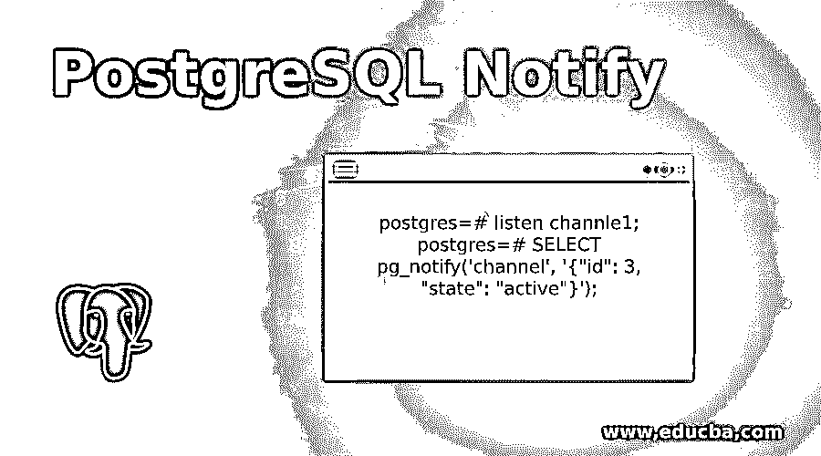
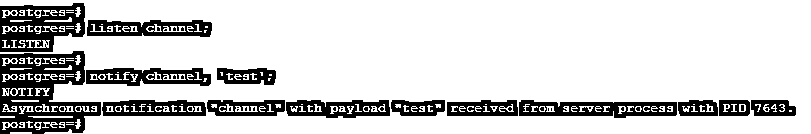
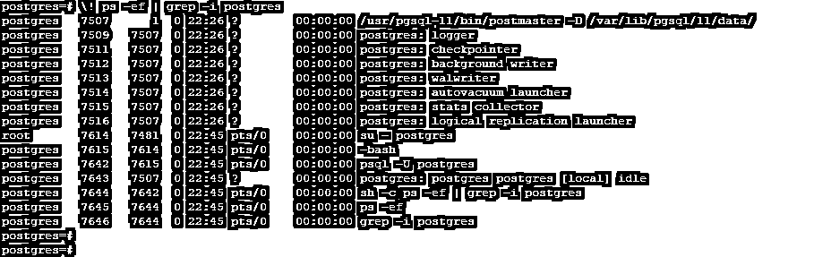
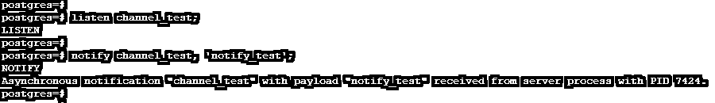
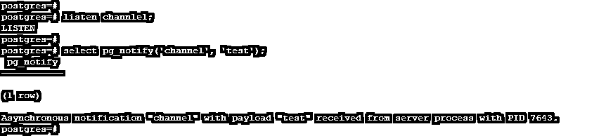
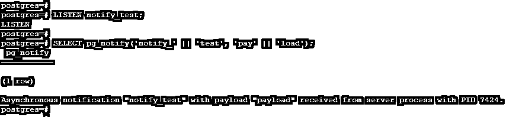
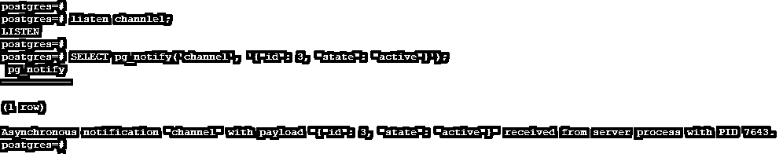

# PostgreSQL 通知

> 原文：<https://www.educba.com/postgresql-notify/>

## PostgreSQL 通知的定义

PostgreSQL notify 用于生成一个通知或通知事件，其有效负载作为一个字符串发送给客户端应用程序，该客户端应用程序以前执行过监听我们所使用的数据库上的指定通道名称。当我们调用一个 notify 触发器时，所有监听该特定通道的会话都会得到通知，所有会话都会打开并连接到应用程序。Notify 用于减少数据库和应用程序之间的往返次数。在应用程序中使用 notify，我们必须提高应用程序的性能。

**语法:**

<small>Hadoop、数据科学、统计学&其他</small>

下面是语法有:

`Notify channel (Channel that we have used with notify in PostgreSQL) [ , payload (Default flag used with notify in PostgreSQL) ]`

`Notify channel channel_name;`

`Pg_notify (Argument 1 (Name of first argument as channel name), Argument 2 Name of second argument as payload string)`

**参数:**

下面是上述语法的参数描述。

*   **Notify:** 它用于生成一个通知或通知事件，以字符串的形式将有效负载发送给客户端应用程序，该客户端应用程序先前执行了监听，监听我们所使用的数据库上的指定通道名称。
*   **通道:**这是发出信号的通知通道的名称。我们已经在 PostgreSQL notify 中为通知通道指定了任何名称。
*   **Payload:** 这是 PostgreSQL notify 中的默认字符串。这是与服务器发送的通知一起传送的字符串。
*   **通道名称:**这只是通知通道的名称，在 PostgreSQL notify 中发出信号。

### PostgreSQL 中通知的工作方式

下面是 PostgreSQL notify 的工作原理。

*   在 PostgreSQL 中，通道名和有效负载字符串对于通知服务器之间发送信号非常重要。
*   有效负载对于多台服务器之间的通信非常重要。在 PostgreSQL notify 中，有效负载的默认配置值小于 8000 字节。
*   通知事件包括通知的通道名称、有效负载字符串和通知会话服务器 PID。
*   下图显示了从通知通道收到的事件消息。

**代码:**

`postgres=# listen channel;
postgres=# notify channel, 'test';`

**输出:**

*   在上图中，通知从一个通道发送，该通道将有效负载表示为一个测试，并将显示该进程的进程 ID。以下示例显示 PostgreSQL 服务器进程 ID 如下。上述进程从 7643 进程 ID 开始运行。

**代码:**

`postgres=# \! ps -ef | grep -i postgres`

**输出:**

*   上图表明将为 PostgreSQL 中的每个通道创建进程 ID。
*   通道名称是由开发人员给定的，取决于他给定的名称。尽管如此，为了便于识别，给出特定于应用程序的通道名称是很重要的。
*   当我们调用一个 notify 触发器时，所有监听该特定通道的会话都被通知，所有会话都已打开并连接到应用程序。
*   PostgreSQL notify 提供了进程和 PostgreSQL 数据库之间的简单通信。PostgreSQL 通知是与 SQL 事务交互的。
*   为了在 PostgreSQL 中发送通知，我们还使用了 pg_notify 函数来发送通知或通知事件。
*   Pg_notify 是一个用于发送通知事件的内置函数。Pg_notify 函数将在第一个参数中使用通道名称，在第二个参数中使用有效载荷字符串。Pg_notify 函数比 notify 命令更容易使用。
*   要通知任何消息，需要先用 PostgreSQL 中的通道名进行监听。

### PostgreSQL 通知示例

下面是 PostgreSQL notify 的例子。

#### 示例 1–在 PostgreSQL 中使用 notify

*   以下示例显示了如何在 PostgreSQL 中通知 works。要发送通知消息，首先，它通过信道进行侦听。我们使用通道名作为 channel_test，有效负载字符串名作为 notify_test。
*   它会将通知显示为从 PID 为 7424 的服务器进程接收的负载为“notify_test”的异步通知“channel_test”。

**代码:**

`postgres=# listen channel_test;
postgres=# notify channel_test, 'notify_test';`

**输出:**

#### 示例 2–简单的 pg_notify 函数

*   下面的例子显示了一个简单的 notify 函数，我们使用通道名作为 chanel1，有效载荷字符串作为测试。

**代码:**

`postgres=# listen channle1;
postgres=# select pg_notify('channel', 'test');`

**输出:**

#### 示例 3–使用 pg_notify 函数

*   以下示例显示了 PostgreSQL 中的 thatpg_notify 函数。我们使用通道名作为通知测试，使用有效负载名作为有效负载。
*   我们将通道名称和有效载荷分成不同的部分。

**代码:**

`postgres=# LISTEN notify_test;
postgres=# SELECT pg_notify('notify_' || 'test', 'pay' || 'load');`

**输出:**

#### 示例 4–使用 ID 和 state 作为有效负载的 Pg_notify 函数

*   在下面的例子中，我们使用了一个通道名作为 channel1，有效负载字符串作为 ID 和 state。
*   我们使用 ID 为 3，state 为 active，因此来自服务器的有效负载消息以“{"id": 3 "state": "active"}”的形式接收。

**代码:**

`postgres=# listen channle1;
postgres=# SELECT pg_notify('channel', '{"id": 3, "state": "active"}');`

**输出:**

### 优势

下面是在 PostgreSQL 中使用 notify 的优点。

*   它提供了进程和 PostgreSQL 数据库之间的简单通信。
*   它用于向先前执行的客户端应用程序生成一个通知，该通知以字符串的形式包含或不包含有效负载，以侦听指定的通道。
*   它用于减少数据库和应用程序之间的往返次数。
*   Notify 在 PostgreSQL 中非常有用和重要，用于发送通知或通知事件。
*   它用于提高应用程序的性能。
*   Notify 是一个常用的定义函数，它是预编译的，存储在数据库中，因此它将提高应用程序的性能。
*   一旦我们开发了通知功能，我们可以在任何其他应用程序中使用它。PostgreSQL，notify 函数是可重用的。
*   与 SQL 事务交互很有用。

### 推荐文章

这是一个 PostgreSQL 通知指南。在这里我们讨论 PostgreSQL 中的定义和如何通知工作以及不同的例子和它的代码实现。您也可以看看以下文章，了解更多信息–

1.  [PostgreSQL 日期函数](https://www.educba.com/postgresql-date-functions/)
2.  [PostgreSQL 中的外键](https://www.educba.com/foreign-key-in-postgresql/)
3.  [PostgreSQL 完全连接](https://www.educba.com/postgresql-full-join/)
4.  [PostgreSQL 中的通配符](https://www.educba.com/wildcards-in-postgresql/)
5.  [PostgreSQL RANK() |如何工作？](https://www.educba.com/postgresql-rank/)