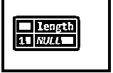
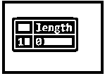
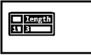
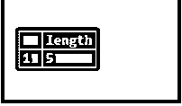
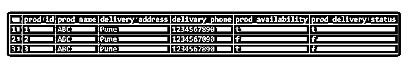
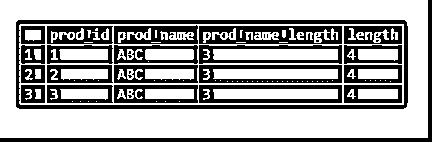

# PostgreSQL 长度()

> 原文：<https://www.educba.com/postgresql-length/>

## PostgreSQL 长度介绍()

PostgreSQL length()函数是用来求字符串的长度的，我们在 length 函数中已经用到。Length 函数用于查找字符串中的字符数，length 函数还与列名一起用于查找列行的长度。长度函数用于 PostgreSQL 8.4 到 PostgreSQL 12 版本。我们已经使用了带有长度函数的 cast 来查找整数的长度，cast 对于在 PostgreSQL 中查找整数字符串的长度非常有用。PostgreSQL 的 length 函数对于查找字符串的长度非常重要和有用。

### 句法

下面是 PostgreSQL 长度函数的语法如下。

<small>Hadoop、数据科学、统计学&其他</small>

*   长度(字符串(我们用来计算长度的字符串名称。));
*   选择长度(")；(我们已经在 PostgreSQL 中使用了使用长度函数的空字符串。)
*   选择长度(空)；(我们已经在 PostgreSQL 中使用了使用长度函数的空字符串。)
*   选择长度(“”)；(我们已经在 PostgreSQL 中使用了使用长度函数的空格字符串。)
*   Select column_name1，Column_name2，LENGTH(Column _ name)from table _ name order by Column _ name。

#### 因素

下面是上述语法的参数说明如下。

*   **Length:** Length 函数用于查找字符串的长度。我们已经使用这个函数在 PostgreSQL 中查找列行长度。长度函数在 PostgreSQL 中非常重要和有用。
*   **Null:** 我们也在 length 函数中使用了空字符串。空字符串的结果为空。
*   **Length('):**我们还在 Length 函数中使用了空格字符串。空间字符串的结果是我们在字符串中使用了多少空间。
*   **Length ("):** 我们也在 Length 函数中使用了空字符串。空字符串的结果为零。
*   **String:** String 定义为我们使用 PostgreSQL 中的 length 函数找到长度的字符串或单词。
*   **Select:** 我们已经使用 Select 来选择 PostgreSQL 中字符串的长度。我们还使用 select 从表中选择列名，并查找列的长度。
*   **第 1 列到第 N 列:**列名，用于使用 length 函数查找列的字符长度。
*   **Order by:** Order by 子句用于 length 函数中，以升序或降序排列列的长度。
*   **表名:**表名用于选择列名，通过使用列名找到列的长度。

### PostgreSQL 中 LENGTH()函数是如何工作的？

下面是 length()函数的工作原理。

*   Length 函数用于查找我们在 length 函数中使用的字符串的长度。长度函数在 PostgreSQL 中计算字符串的长度是非常重要和有用的。
*   Length 函数用于查找字符串中的字符数。
*   Length 函数也与列名一起使用，以查找列行的长度。我们还在 length 函数中使用了 order by 来按升序或降序显示字符串的字符数。
*   我们已经使用了带有长度函数的 cast 来寻找整数的长度。
*   在 PostgreSQL 中，长度函数的 Cast 对于查找整数字符串的长度非常有用。
*   如果我们在长度函数中使用空值作为字符串，则空值字符串的结果始终为空。
*   如果我们在长度函数中使用了空间值作为字符串，空间值字符串的结果是我们在字符串中使用了多少空间，它将在字符串的结果长度中显示我们在空间字符串中使用了多少空间。
*   大写字母和小写字母的长度在长度函数中是相同的。在下面的例子中，我们使用了“abcdefgh”和“ABCDEFGH”字符串，这两个字符串的长度函数结果是相同的。

**举例:**

`select length ('ABCDEFGH');`

*   如果我们在长度函数中使用空值作为字符串，空值字符串的结果总是零。
*   PostgreSQL 长度函数接受字符串作为参数值。长度函数将显示以下数据类型的长度如下。

1.  茶
2.  可变长字符串
3.  文本

*   PostgreSQL 中的 Length 函数将返回一些我们在字符串中使用过的字符。

### 在 PostgreSQL 中实现 LENGTH()函数的示例

下面是长度函数的例子。

#### 示例#1

在下面的例子中，我们找到了空字符串的长度。空字符串的结果为空。

`select length (NULL);`

#### 实施例 2

在下面的例子中，我们找到了空字符串的长度。空字符串的结果为零。

`select length ('');`

#### 实施例 3

在下面的例子中，我们找到了空字符串的长度。空字符串的结果是 3，因为我们给了三个空格。

`select length ('   ');`

#### 实施例 4

在下面的例子中，我们找到了数字串的长度。我们需要使用 cast 函数来查找整数字符串的长度。

`SELECT LENGTH (CAST('12345' as TEXT));`

#### 

我们已经用乘积表描述了 PostgreSQL 中长度函数的例子。下面是产品表的表格描述。

`Select * from product;`

#### 实施例 5

以下示例显示了从产品表中查找列数据的长度。

`select prod_id, prod_name, length(prod_name)AS prod_name_length, length(delivery_address) from product order by prod_name_length ASC;`

### 结论

PostgreSQL 长度函数用于查找字符串的长度，我们在长度函数中使用过。它接受字符串作为参数值或字符串。使用 length 函数的字符串值接受 char、varchar 和 text 数据类型的字符串。

### 推荐文章

这是 PostgreSQL LENGTH()的指南。这里我们讨论 PostgreSQL LENGTH()的介绍，以及它如何与查询示例一起工作。您也可以看看以下文章，了解更多信息–

1.  [PostgreSQL ROLLUP](https://www.educba.com/postgresql-rollup/)
2.  [PostgreSQL 子查询](https://www.educba.com/postgresql-subquery/)
3.  [PostgreSQL 中的序列](https://www.educba.com/sequence-in-postgresql/)
4.  [SQL 中的 roll up](https://www.educba.com/rollup-in-sql/)