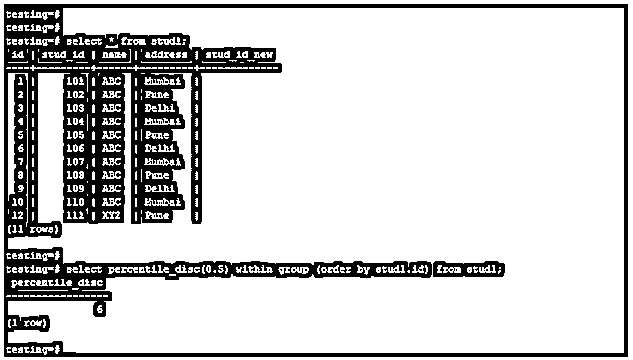
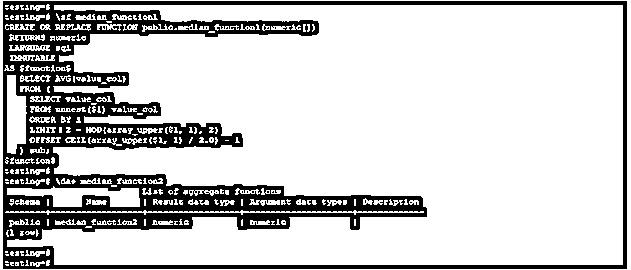
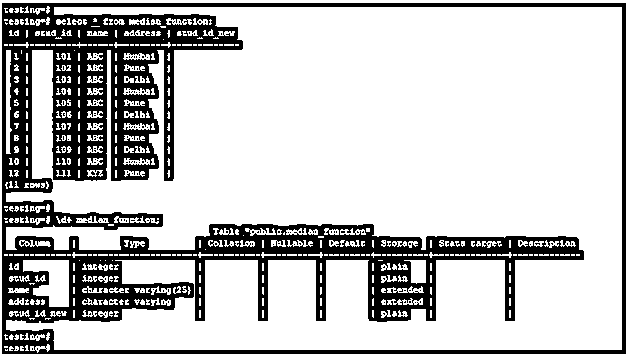
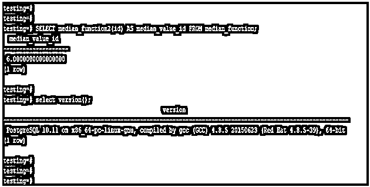
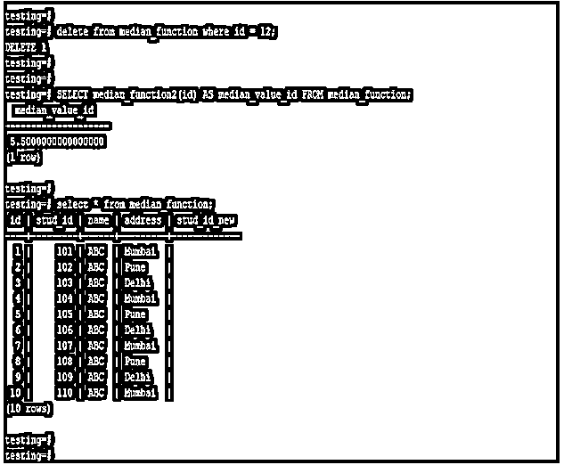
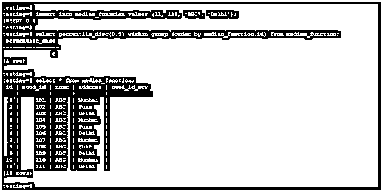

# PostgreSQL 中值

> 原文：<https://www.educba.com/postgresql-median/>

## PostgreSQL 中位数的定义

PostgreSQL median 的定义是从我们使用 median 的列中找到中值，没有像 median 这样的内置函数可用，我们可以通过创建用户定义的函数来实现相同的功能。此外，我们可以使用 percentile_disc (0.5)找到列的中值，而使用 percentile 0.5 将返回 PostgreSQL 列表的中值。我们使用带有列名的 order by 运算符来查找表列的中值。

### 语法和参数

下面是 PostgreSQL 中 median 的语法。

<small>Hadoop、数据科学、统计学&其他</small>

*   **用 percentile_disc (0.5)求中位数**

`Select percentile_disc(0.5) (Percentile disc with 0.5 used to find median from the table column.)within group (order by name_of_table.name_of_table);`

*   **通过创建函数和集合求中位数**

`SELECT median (We have calling aggregate function with specifying column name) (name_of_column) AS (alias of column name) FROM name_of_table;`

**参数:**

PostgreSQL 中值参数描述如下。

*   **Select:** 该操作用于从表中选择一个指定的列，从中我们可以找到中值。
*   **列名:**这被定义为从中检索中值的列名。
*   **表名:**这被定义为在 PostgreSQL 中查找中间值的列名所在的表的名称。
*   **Percentile disc (0.5):** 我们已经使用 percentile_disc (0.5)在 PostgreSQL 中找到了列的中位数。没有像 median 这样可用的函数，所以我们使用 percentile_disc (0.5)来代替 median。
*   **Median:** 这被定义为从表格列中找到中值。我们必须根据我们在中值中使用的列来找到中值。
*   **列名的别名:**这被定义为我们使用了显示在输出中的其他列名。
*   **Within group:** 这被定义为一个子句，用于在 PostgreSQL 中从表列中查找中位数。此子句用于计算指定组的百分位值。

### PostgreSQL 中的 Median 是如何工作的？

*   下面是 PostgreSQL 中中位数的工作原理。
*   Median 定义为用于查询的序列的中值。我们也可以在 PostgreSQL 中使用列名代替系列。
*   如果假设我们使用系列值作为偶数，那么中位数将返回两个值的平均值作为 PostgreSQL 中的中位数。
*   与 PostgreSQL 中的平均值相比，PostgreSQL 中的中值更具代表性。
*   如果假设我们使用系列值作为奇数，那么中位数将返回中间值作为 PostgreSQL 中的中位数。
*   下面的例子表明，如果我们使用一个系列值作为奇数，那么中值将返回中间值作为中值。
*   在下面的示例中，stud1 表包含 11 条记录，即奇数，因此中值将作为表中第 6 个个值返回。
*   我们已经使用 id 表从列中找到了中值。

`select * from stud1;
select percentile_disc(0.5) within group (order by stud1.id) from stud1;`

*   我们正在 PostgreSQL 中创建用户定义的中值函数，在创建相同的函数后，我们将在后面使用它。
*   在创建函数时，它实际上会显示 PostgreSQL 中偶数个数列的中值。
*   我们还可以通过使用第 50 个个百分点值来计算 PostgreSQL 中的中值，因为 PostgreSQL 中没有计算中值的内置函数。
*   我们使用组内子句和 order by 子句，并带有百分点值(0.5)。order by 子句在 percentile 中的主要用途是在 PostgreSQL 中计算中值之前按照顺序对值进行排序。

### PostgreSQL 中位数示例

*   下面是 PostgreSQL 中中位数的示例。我们使用函数 median_function1 和 aggregate 作为 median_function2 来描述 PostgreSQL 中的中位数示例。
*   下面是聚合的结构和功能。

`\sf median_function1
\da+ median_function2`

*   此外，我们使用 median_function 表来描述 PostgreSQL 中的中位数示例。下面是 median_function 表和数据。

`select * from median_function;
\d+ median_function;`

**通过创建函数和集合求中值**

*   以下示例显示了通过创建函数和聚合来查找中位数。我们已经创建了一个名为 median_function1 的函数和一个名为 median_function2 的聚合函数。
*   我们使用 id 列 with aggregate 作为 median_function2 来从 median_function 表中查找中位数。

`SELECT median_function2(id) AS median_value_id FROM median_function;`

**通过创建函数和聚合来查找偶数列值的中值**

*   以下示例显示了通过创建函数和聚合来查找偶数列值的中值。
*   我们使用函数名作为 median_function1，聚合名作为 median_function2。

`delete from median_function where id = 12;
SELECT median_function2(id) AS median_value_id FROM median_function;
select * from median_function;`

**用 percentile_disc (0.5)求中位数**

*   以下示例显示了如何使用 percentile_disc (0.5)来计算中位数。
*   我们使用 id 列来查找 median_function 表中的中位数。

`insert into median_function values (11, 111, 'ABC', 'Delhi');
select percentile_disc(0.5) within group (order by median_function.id) from median_function;
select * from median_function;`

### 推荐文章

这是一个 PostgreSQL 中值的指南。在这里，我们还将讨论 PostgreSQL 中 median 的定义和工作原理。以及不同的示例及其代码实现。您也可以看看以下文章，了解更多信息–

1.  [PostgreSQL 缓存](https://www.educba.com/postgresql-caching/)
2.  [PostgreSQL 当前时间戳()](https://www.educba.com/postgresql-current_timestamp/)
3.  [PostgreSQL 比较字符串](https://www.educba.com/postgresql-compare-strings/)
4.  [PostgreSQL 文本搜索](https://www.educba.com/postgresql-text-search/)