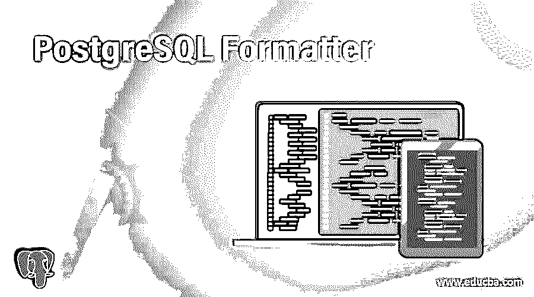
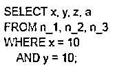
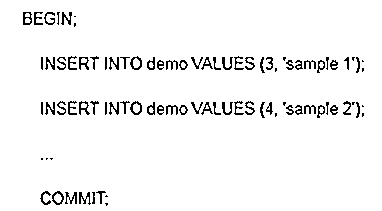

# PostgreSQL 格式化程序

> 原文：<https://www.educba.com/postgresql-formatter/>

## PostgreSQL 格式化程序的定义

PostgreSQL 为用户提供了一个格式化工具。PostgreSQL 格式化程序作为控制台格式化程序工作；它将自动检测 PostgreSQL 语句的简单环境，作为文本文件或 HTML 文件中的输出。PostgreSQL 格式化程序最重要的功能是给出 PostgreSQL 语句的适当表示，这意味着它避免了语句的复杂性。它给出了一个易于理解的格式良好的 PostgreSQL 语句。PostgreSQL 格式化程序提供了不同的执行选项，如匿名化、逗号开始、逗号分隔、换行注释、调试和逗号结束等。

### PostgreSQL 格式化程序是如何工作的？

*   我们必须在您的系统中安装 pg 格式化程序。
*   我们需要关于 PostgreSQL 的基础知识。
*   我们需要一个查询语句来执行格式化程序。
*   我们需要关于 pg 格式化程序的基本知识，也就是如何使用它。
*   我们可以在 pg 格式化程序的帮助下对 sql 语句执行不同的操作。

### PostgreSQL 格式化程序的示例

让我们看一个带有不同选项的 PGformatter 的不同示例，如下所示。

<small>Hadoop、数据科学、统计学&其他</small>

#### 示例 1–缩进

**语句:**

`CREATE TABLE employee ( user_id serial PRIMARY KEY, empname VARCHAR ( 50 )  NOT NULL,      empaddress VARCHAR ( 50 ) NOT NULL, email VARCHAR ( 255 ) UNIQUE NOT NULL);`

**解释**

在上面的例子中，我们试图在查询语句中实现缩进。在本例中，我们创建了一个表名，作为具有不同属性的雇员，如 sql 语句所示。在应用缩进选项后，我们通过使用以下语句来说明上述声明的最终结果。

`CREATE TABLE employee (user_id serial PRIMARY KEY,
empname VARCHAR (50) NOT NULL,
empaddress VARCHAR (50) NOT NULL,
email VARCHAR (255) UNIQUE NOT NULL);`

让我们看看如何通过使用 pgformatter 来格式化查询，这个例子是带有选项-W 的 select 和 from。

**语句:**

`SELECT x, y, z, a FROM n_1, n_2, n_3 WHERE x = 20 AND y = 20;`

**解释:**在上面的例子中，我们尝试用 select 和 where 子句实现 pgformatter。在这个例子中，我们在 select 子句中使用一些变量，如 x、y、z 和 a，同样，我们在 from 子句中使用 n_1、n_2 和 n_3，并且我们还为变量 x 和 y 赋值。在这个例子中，我们将选项 wrap query 包装到特定长度。缩进不是用来计算字符数的。我们在下面的快照中展示了上述语句的最终结果。

类似地，我们可以如下实现其他选项。

*   **Option–C:**在这个选项中，我们用–w 将注释换行到指定的长度。注释换行包括缩进。
*   **Option–t:**Option–t 表示查询的格式类型，在这个选项中我们在语句中增加一个新行。
*   **Option–g:**在该选项中，pgformatter 对事务中的所有语句进行分组。有关更多详细信息，请参见下面的示例。

#### 实施例 2

`BEGIN;
INSERT INTO demo VALUES (3, 'sample 1');
INSERT INTO demo VALUES (4, 'sample 2');
...
COMMIT;`

**解释:**在这个例子中，我们尝试在 pgformatter 中实现一个选项–g 在上面的例子中，我们简单的事务应该以 BEGIN 开始，以 COMMIT 结束在这些事务之间，我们使用不同的语句，如例子所示。因此，当我们执行选项–g 时，它会在每个语句之间包含一个新行。我们在下面的快照中展示了上述语句的最终结果。

*   **Option–L:**Option–L 表示 pgformatter 中没有多余的行。当'；'时，总是在语句的末尾添加一个新行(分号)存在，并且假设用户不需要输出控制台中的额外行，那么您可以通过在命令行中使用此选项来删除新行。
*   **选项–额外函数:**在上述选项中，用户可以格式化 PostgreSQL 内部函数，但无法检测 PostgreSQL 中的自定义函数。一种可能的方法是，它可以每行定义一个函数名，或者我们说将函数列表放入一个文件中，并通过 pg 格式化程序给出一个额外的函数选项，该选项将被格式化为 PostgreSQL 内部函数。
*   **提示:**有时 pgformatter 不能满足用户需求，所以此时我们可以通过使用配置文件而不是重用命令行选项来改变 pg_format 的行为。默认情况下，pgformatter 有一个~/。pg_format，但是您可以使用命令行选项–c |–config 选择另一个替代配置文件
*   **使用 stdin 格式化:**您可以不带任何参数地执行 pg_format，或者我们可以说您可以使用 stdin 执行语句。stdin 是 pgformatter 的一种交互模式，在这种模式下，您应该在语句末尾键入强制 ctrl+d。

#### 实施例 3

`$ pg_format
select * from emp;
<ctrl+d>`

我们也可以在一行中使用 stdin，如下所示

`echo "select * from emp;" | pg_format`

*   **使用 VI:** 格式化 **在这种类型的 pgformatter 中，它通过更改配置文件来自动格式化语句。**
*   **使用 atom 格式化:**如果一些用户使用 Atom 作为编辑器，我们需要用 node.js 包装器包安装 pg_formatter。Atom 的主要特性是在保存模式下格式化所有 SQL 文件。
*   **使用 Visual Studio 格式化:** Visual Studio 代码还提供了 pg_formatter 扩展来格式化 PostgreSQL 语句。
*   **防止替换小代码:**有时用户需要在查询中保持相同的查询语句格式不变。此时，我们在命令行中使用–p 或–placeholder 选项来保持代码不受 pgformatter 的影响。

### PostgreSQL 格式化程序的使用

*   它给出了查询的适当表示
*   它避免了查询语句的复杂性。
*   根据用户的需要，我们在命令中使用不同的选项
*   我们可以将 pg_formatter 与不同的编辑器工具一起使用，这意味着根据我们的选择，我们可以使用任何工具来格式化查询语句。

### 结论

我们希望通过这篇文章，您已经了解了 PostgreSQL pg_formatter。从上面的文章中，我们已经了解了 pg_formatter 的基本示例。我们还学习了如何在 PostgreSQL 中用不同的选项实现它们。从本文中，我们了解了如何处理 PostgreSQL pg_formatter。

### 推荐文章

这是一个 PostgreSQL 格式化程序的指南。在这里，我们还将讨论 postgresql 格式化程序的定义和工作原理。以及不同的示例及其代码实现。您也可以看看以下文章，了解更多信息–

1.  [PostgreSQL 变更数据库](https://www.educba.com/postgresql-alter-database/)
2.  [PostgreSQL vs SQLite](https://www.educba.com/postgresql-vs-sqlite/)
3.  [PostgreSQL 复制](https://www.educba.com/postgresql-replication/)
4.  [PostgreSQL vs SQLite](https://www.educba.com/postgresql-vs-sqlite/)