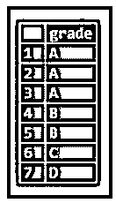
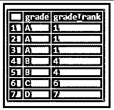
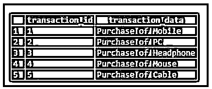
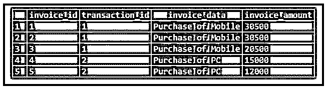
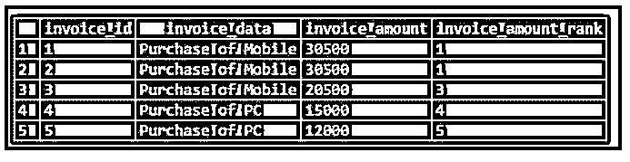
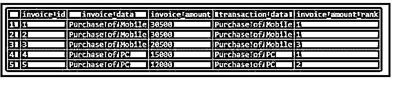

# PostgreSQL 排名()

> 原文：<https://www.educba.com/postgresql-rank/>

## PostgreSQL RANK()简介

以下文章提供了关于 PostgreSQL RANK()的概述。我们可以使用 rank()函数为结果集分区的每一行指定一个等级。分区的第一行的秩是 1。等级以这样的方式递增，其中下一行的等级等于与该等级相关的行数。排名计算不需要任何显式参数，因为其值是使用 OVER 子句在内部计算的。

**语法:**

<small>Hadoop、数据科学、统计学&其他</small>

`RANK() OVER (
[PARTITION BY partition_exp, .... ] ORDER BY sort_exp [ASC | DESC], ....
)`

**说明:**

*   **PARTITION BY 子句:**应用了 PostgreSQL RANK()函数的结果集的分区的行。
*   **ORDER BY 子句:**定义 PostgreSQL RANK()函数应用到的每个分区中行的顺序。

### PostgreSQL 中 RANK()函数是如何工作的？

*   为了计算下一行(PostgreSQL)的排名，rank 函数将行数添加到上一个排名所分配的排名中。
*   因此，等级可能不是连续的。
*   分区中具有相同值的所有行都获得相同的等级。

### PostgreSQL RANK()的示例

下面是一些例子:

现在，让我们使用 CREATE TABLE 语句创建一个名为“Grades”的新表，该表将包含一个名为“Grade”的列，如下所示:

**代码:**

`CREATE TABLE Grades (
Grade VARCHAR(1)
);`

现在，使用 insert 语句将一些数据插入“Grades”表，如下所示:

**代码:**

`INSERT INTO Grades(Grade)
VALUES
('A'),('A'),('A'),
('B'),('B'),
('C'),
('D');`

借助以下快照和 SQL 语句说明 Grades 表的内容。

**代码:**

`SELECT
Grade
FROM
Grades;`

**输出:**

现在，在 RANK()函数的帮助下，我们可以为成绩表结果集中的成绩列指定一个等级，如下所示:

**代码:**

`SELECT
Grade,
RANK () OVER (
ORDER BY Grade
) grade_rank
FROM
Grades;`

**输出:**

在上面的快照中，我们可以看到前三行的等级被指定为等级 1，这对于所有值为“A”的行都一样。

由于 PostgreSQL，第四和第五行的等级被分配为等级 4。

RANK()函数计算出前一个等级与该等级相关的总行数之和。类似地，它将等级 6 和等级 7 分别分配给第六和第七行。

现在让我们创建名为“transaction”和“invoices”的表，以便理解带有 PARTITION BY 子句的 RANK 函数。

让我们使用 CREATE TABLE 语句创建表，如下所示:

**代码:**

`CREATE TABLE transaction (
transaction_id serial PRIMARY KEY,
transaction_data VARCHAR (256) NOT NULL
);`

`CREATE TABLE invoices (
invoice_id serial PRIMARY KEY,
transaction_id INT NOT NULL,
invoice_data VARCHAR (256) NOT NULL,
invoice_amount INT NOT NULL,
FOREIGN KEY (transaction_id) REFERENCES transaction (transaction_id)
);`

现在，使用 insert 语句在事务和发票表中插入一些数据，如下所示:

**代码:**

`INSERT INTO transaction (transaction_data)
VALUES
('Purchase of Mobile'),
('Purchase of PC'),
('Purchase of Headphone'),
('Purchase of Mouse'),
('Purchase of Cable');`

`INSERT INTO invoices (invoice_data, transaction_id,invoice_amount)
VALUES
('Purchase of Mobile', 1,30500),
('Purchase of Mobile', 1,30500),
('Purchase of Mobile', 1,20500),
('Purchase of PC', 2,15000),
('Purchase of PC', 2,12000);`

借助以下快照和 select 语句来说明上述语句的结果:

**代码:**

`select * from transaction;`

**输出:**

**代码:**

`select * from invoices;`

**输出:**

#### 示例#1

无隔板

此示例根据发票的 transaction_id 为每一行分配一个等级。

**代码:**

`SELECT
invoice_id,
invoice_data,
invoice_amount,
RANK () OVER (
ORDER BY invoice_amount DESC
) invoice_amount_rank
FROM
invoices;`

**输出:**

在上面的例子中，整个表被认为是一个分区，因为我们没有定义 Partition BY 子句。

#### 实施例 2

分区依据

**代号:**
`SELECT
invoice_id,
invoice_data,
invoice_amount,
transaction_data,
RANK () OVER (
PARTITION BY i.transaction_id
ORDER BY invoice_amount DESC
) invoice_amount_rank
FROM
invoices i
INNER JOIN transaction t
ON i.transaction_id = t.transaction_id;`

**输出:**

在上面的例子中，您可以看到我们已经定义了 PARTITION BY 子句。PARTITION BY 子句将发票分割成按 transaction_id 列分组的分区。此外，我们还定义了一个 ORDER BY 子句，该子句根据发票金额对每个分区中的发票从高到低进行排序。

在这里，您可以清楚地看到使用 rank 函数为每个交易数据分配了等级的发票，当交易数据发生变化时，它会再次重新初始化。

### 结论

我们希望通过上面的文章，您已经理解了如何使用 PostgreSQL RANK 函数，以及 PostgreSQL RANK()函数如何分配等级和获取数据。此外，我们还添加了一些 PostgreSQL RANK()函数的示例来详细理解它。

### 推荐文章

这是一个 PostgreSQL RANK()的指南。这里我们讨论介绍，rank()函数如何在 PostgreSQL 中工作，以及相应的例子。您也可以看看以下文章，了解更多信息–

1.  [PostgreSQL 中的通配符](https://www.educba.com/wildcards-in-postgresql/)
2.  [PostgreSQL 左连接](https://www.educba.com/postgresql-left-join/)
3.  [PostgreSQL 获取](https://www.educba.com/postgresql-fetch/)
4.  [PostgreSQL 中的序列](https://www.educba.com/sequence-in-postgresql/)
5.  [PostgreSQL Boolean |如何工作？](https://www.educba.com/postgresql-boolean/)
6.  [PostgreSQL 联合指南](https://www.educba.com/postgresql-coalesce/)