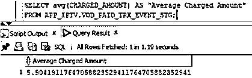
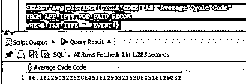
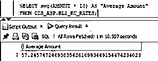
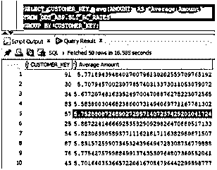
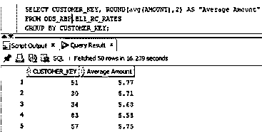
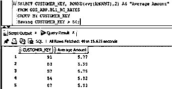

# PostgreSQL 平均值

> 原文：<https://www.educba.com/postgresql-average/>

## PostgreSQL 平均值介绍

average 函数是一个可以同时处理多行的函数。average 函数的结果是单个结果。主要功能是查找特定数字列的平均值。它通常与 GROUP BY 子句一起使用，按照某种标准将这些行关联在一起。它们可以与具有聚合函数的查询一起使用，这些函数对将出现在结果集目标中的选定行进行操作。

### 句法

`AVG(column)`

<small>Hadoop、数据科学、统计学&其他</small>

**说明:**该功能可用于选择 and having 子句。它将找到所有输入值的平均值或算术平均值。此函数的参数可以是以下数据类型:smallint、int、bigint、real、double precision、numeric 或 interval。

**结果:**对于任何整数类型的参数，该函数的结果都是数值。对于任何浮点参数或与参数相同的数据类型，它都是 double。当在查询中使用 Having 子句时，也可以对它们进行分组。

### PostgreSQL 中的 Average 函数是如何工作的？

让我们看看平均函数是如何工作的。

让我们考虑具有以下值的列:

记号

——-

Twenty-three

Seventy-eight

Eighty-seven

Fifty-six

Forty-five

PostgreSQL AVG()函数将帮助我们获得这一列的平均值，Marks，它有不同的标记。如果这个班的老师想找出这五个学生的平均分数，那么使用 AVG()函数就可以很容易地找到。

在这里，函数转换所有的标记，并把它们交给平均函数。列中的所有值都被发送到 average 函数，输出是这些列的平均值。

`AVG(MARKS)
MARKS(23, 78, 87, 56, 45)`

因此，上述 AVG()函数的输出将是 57.8

`AVG()`

在后端，AVG()函数将所有这五个数字相加，然后将总数除以标记数。为了解释这一点，它确实:

23 + 78 + 87 + 56 + 45 = 289

289 / 5 = 57.8

因此，上述 AVG()函数的输出将是 57.8

### 实现 PostgreSQL 平均值的示例

让我们看一些 PostgreSQL avg 函数示例，并探索如何使用 avg 函数:

#### 示例#1

可能会发生这样的情况，一家公司想知道客户收取的平均金额。因此，下面的查询有助于获得该值。

**代码:**

`SELECT AVG(CHARGED_AMOUNT) AS "Average Charged Amount"
FROM APP_IPTV.VOD_PAID_TRX_EVENT_STG;`

**输出:**

**说明:**利用该查询得到金额的平均值。可以找到收费金额的平均值，并可以进一步使用。

#### 实施例 2

对于特定的列，可能会出现表中存在重复项的情况。您希望得到平均值，但是您希望平均值在表中具有不同的值。这也可以在 PostgreSql 中通过使用 AVG()函数和查询中的 DISTINCT 子句来完成。

**代码:**

`SELECT avg(DISTINCT CYCLE_CODE) AS "Average Cycle Code"
FROM APP_IPTV.VOD_PAID_RECON
WHERE TRX_TYPE = 'EVENT';`

**输出:**

**解释:**在上面的查询中，对于列 CYCLE_CODE 有很多类似的条目。可能需要我们要求像上述查询中那样的过滤条件，TRX _ 类型= '事件'，并且该过滤器有多个循环代码。因此，我们使用 DISTINCT 子句，这有助于获得 CYCLE_CODE 表中的不同值。找到差异后，AVG()函数处理这些值，并获得所需的平均值。上面是带有 DISTINCT 子句的查询的输出。

#### 实施例 3

找到相异点后，让我们看看如何利用 AVG()进行公式或数学计算。AVG()函数也可以和任何公式一起使用。下面的代码有助于你更好地理解这一点。

**代码:**

`SELECT avg(AMOUNT * 10) AS "Average Amount"
FROM ODS_ABP.BL1_RC_RATES;`

**输出:**

**解释:**如前所述，这个例子帮助我们理解了 AVG()函数和计算的用法。在这里，金额作为一列，需要找出平均值。除了平均值，还需要将这个数乘以 10。上面的查询完成了这项工作。它首先求出平均值，然后将它乘以 10。输出是该计算的值。

#### 实施例 4

PostgreSQL 中的 AVG()函数有助于根据某个字段的平均结果进行分组。结果可以按分组，也可以在同一查询中同时找到平均值。下面的代码将帮助您更好地理解这一点。

**代码:**

`SELECT CUSTOMER_KEY, avg(AMOUNT) AS "Average Amount"
FROM ODS_ABP.BL1_RC_RATES
GROUP BY CUSTOMER_KEY;`

**输出:**

**解释:**上面的查询查找所有客户键以及客户键组的相应平均金额。客户密钥 91 的平均值为 5.77。这意味着有多个值为 91 的客户密钥，它们的集合平均值为 5.77。group by 子句帮助我们根据特定条件获取值。此外，由于 AVG()是一个聚合函数，它必须附带一个 group by 子句。为了对此进行临时处理并获得最多两位小数的平均结果，ROUND()函数也可以与 AVG()一起使用。下面的查询帮助我们完成 AVG()函数的值。

**代码:**

`SELECT CUSTOMER_KEY, ROUND(avg(AMOUNT),2) AS "Average Amount"
FROM ODS_ABP.BL1_RC_RATES
GROUP BY CUSTOMER_KEY;`

**输出:**

**解释:**HAVING 子句可以帮助我们进一步在现有的查询中添加更多的条件。如果用户希望在计算平均值时只考虑大于 50 的客户键，那么下面的查询将满足这一需求。

**代码:**

`SELECT CUSTOMER_KEY, ROUND(avg(AMOUNT),2) AS "Average Amount"
FROM ODS_ABP.BL1_RC_RATES
GROUP BY CUSTOMER_KEY
Having CUSTOMER_KEY > 50;`

**输出:**

**说明:**选择所有大于 50 的客户密钥。

### 结论

因此，PostgreSQL 中的 AVG()函数是一个非常有用的聚合函数。它可以在所有字段中使用，以查找多行的平均值并给出单个输出。除此之外，我们还可以使用 PostgreSQL 的其他功能并增强其功能。

### 推荐文章

这是一个 PostgreSQL 平均指南。这里我们讨论 PostgreSQL Average 的介绍、语法、Average 函数如何与相应的查询示例一起工作。您也可以浏览我们的其他相关文章，了解更多信息——

1.  [PostgreSQL 变量](https://www.educba.com/postgresql-variables/)
2.  [PostgreSQL Trunc()](https://www.educba.com/postgresql-trunc/)
3.  [PostgreSQL Like](https://www.educba.com/postgresql-like/)
4.  [PostgreSQL 回合](https://www.educba.com/postgresql-round/)