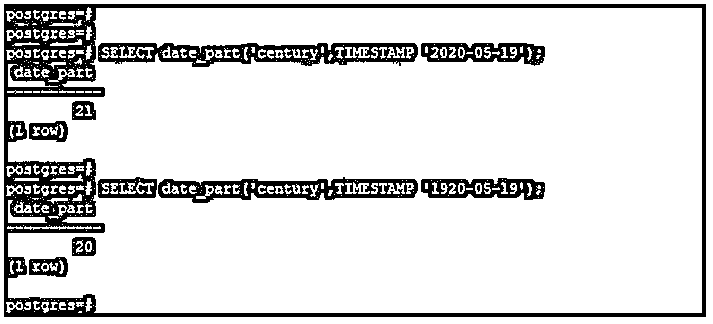
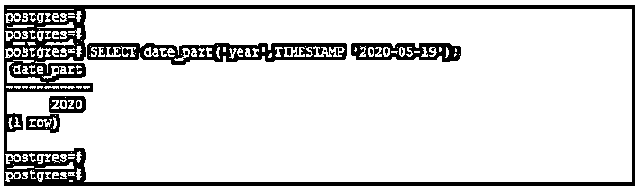
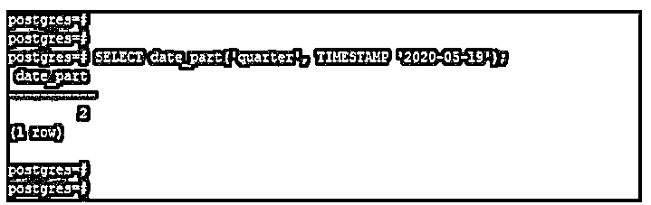
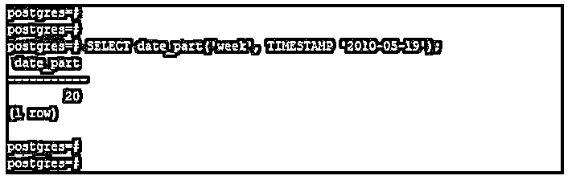
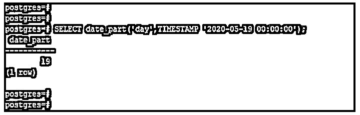
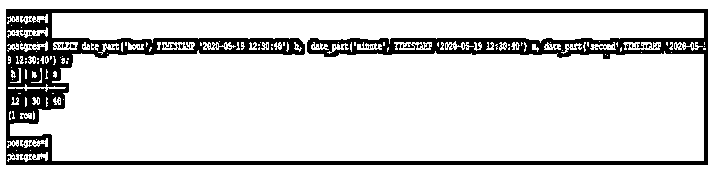

# PostgreSQL 日期部分()

> 原文：<https://www.educba.com/postgresql-date_part/>

## PostgreSQL DATE_PART()简介

PostgreSQL 的 DATE_PART()函数主要用于返回日期和时间的部分；PostgreSQL 中的 date_part 函数将从日期和时间值中减去子字段。PostgreSQL date_part 函数将允许从日期和时间值中检索子字段，例如，周、月和年。基本上，有两个参数我们用 date_part 函数传递，即字段和源；字段决定了我们从源中提取哪个字段。

**语法:**

<small>Hadoop、数据科学、统计学&其他</small>

下面给出了 PostgreSQL date_part 函数的语法:

`date_part (text, timestamp)`

`date_part (text, interval)`

`date_part (unit, date)`

`date_part (field, source)`

**下面给出的是上述语法的参数描述:**

*   **日期部分:** PostgreSQL date_part 函数用于从表达式中提取日期部分的值。我们可以在 PostgreSQL 中用 date_part 函数作为文本和时间戳提供一个参数。
*   **Text:** Text 是我们在 PostgreSQL 的 date_part 函数中使用的第一个参数。
*   **时间戳:**这是 PostgreSQL 中 date_part 函数的第二个参数。我们已经使用 PostgreSQL 中的 date_part 函数定义了时间戳值。
*   **Interval:** Interval 与 PostgreSQL 中的时间戳值相同。我们可以在 PostgreSQL 中使用一个间隔来代替时间戳值。
*   **单位:**date _ part 函数中的单位类型为分、小时、月等间隔。单位是 date_part 函数中的一个基本参数。
*   **日期:**定义为日期、时间戳、时间或间隔值，用于部分执行。
*   **字段:**这是 PostgreSQL 中 date_part 函数的一个参数，用来从源中抽取哪个字段。
*   **Source:** Source 在 date_part 函数中定义为第二个参数。这与 PostgreSQL 中 date_part 函数中的 interval 参数相同。

### PostgreSQL DATE_PART()函数如何工作？

如果我们想在 PostgreSQL 中同时返回日期和时间值，我们使用 date_part 函数。使用 PostgreSQL 中的 date_part 函数，我们可以从时间戳中提取世纪。为了从日期时间戳中提取年份，我们需要在 date_part 函数中传递字段参数。

在 PostgreSQL 中，date_part 函数中使用的单位类型具有以下形式。单位类型不过是日、月、分钟和小时。

*   **世纪:**使用公历，其中第一个世纪将从“公元 0001-01-01 00:00:00”开始。
*   **Day:** 这被定义为一个月中从 1 到 31 的某一天。
*   **Decade:** Decade 在 PostgreSQL date_part 函数中定义为年份除以 10。
*   **星期几:**定义为一周中从周日到周六的某一天。
*   **一年中的某一天:**这被定义为一年中从一月到十二月的某一天。
*   **Epoch:** 这在 date_part 函数中定义为几个区间值。
*   **小时:**这被定义为一天中从 0 到 23 的一个小时。
*   **千年:**这在 date_part 函数中定义为千年值。
*   **毫秒:**这被定义为第二次乘以 1000。
*   **微秒:**这被定义为与 100000 的第二次乘法。
*   **分钟:**这被定义为从 0 到 59 的一小时中的一分钟。
*   **Quarter:** Quarter 是在 date_part 函数中定义的 1 到 4。
*   **秒:**这是 date_part 函数中的小数秒。
*   **年份:**定义为四位数的年份。

要使用 date_part 函数从 timestamp 中提取秒、分和小时，我们需要传递相应的值，即秒、分和小时。

### PostgreSQL DATE_PART()的示例

下面是提到的例子:

#### 示例#1

使用 date_part 函数从时间戳中提取世纪。

在下面的例子中，我们使用 2020 年和 1920 年从时间戳中提取一个世纪。

**代码:**

`SELECT date_part('century', TIMESTAMP '2020-05-19');`

`SELECT date_part('century', TIMESTAMP '1920-05-19');`

**输出:**

在上面的例子中，使用 1920 年这样的年份，它将把一个世纪显示为 20，使用 2020 年这样的年份，它将把这个世纪显示为 21。

#### 实施例 2

使用 date_part 函数从时间戳中提取年份。

在下面的例子中，我们将年份作为 2020 年，从时间戳中提取年份。

**代码:**

`SELECT date_part('year', TIMESTAMP '2020-05-19');`

**输出:**

#### 实施例 3

使用 date_part 函数从时间戳中提取季度。

在下面的例子中，我们将年份作为 2020 年，从时间戳中提取一个季度。

**代码:**

`SELECT date_part('quarter', TIMESTAMP '2020-05-19');`

**输出:**

#### 实施例 4

使用 date_part 函数从时间戳中提取月份。

在下面的例子中，我们用一个月作为 May 来从时间戳中提取月份。

**代码:**

`SELECT date_part('month', TIMESTAMP '2010-05-19');`

**输出:**

#### 实施例 5

使用 date_part 函数从时间戳中提取周。

在下面的例子中，我们用 2010 年作为年份，用 5 月作为月份，从时间戳中提取星期。

**代码:**

`SELECT date_part(week, TIMESTAMP '2010-05-19');`

**输出:**

#### 实施例 6

使用 date_part 函数从时间戳中提取日。

在下面的例子中，我们用 2020 年作为年份，用 5 月作为月份，从时间戳中提取日期。

**代码:**

`SELECT date_part('day',TIMESTAMP '2020-05-19 00:00:00');`

**输出:**

#### 实施例 7

使用 date_part 函数从时间戳中提取小时、分钟和秒。

以下示例显示了使用 date_part 函数从时间戳中提取小时、分钟和秒。

**代码:**

`SELECT date_part('hour', TIMESTAMP '2020-05-19 12:30:40') h,  date_part('minute', TIMESTAMP '2020-05-19 12:30:40') m, date_part('second',TIMESTAMP '2020-05-19 12:30:40') s;`

**输出:**

### 推荐文章

这是 PostgreSQL DATE_PART()的指南。这里我们分别用工作和例子来讨论 PostgreSQL DATE_PART()的介绍。您也可以看看以下文章，了解更多信息–

1.  [PostgreSQL 授权](https://www.educba.com/postgresql-grant/)
2.  [PostgreSQL Trunc()](https://www.educba.com/postgresql-trunc/)
3.  [PostgreSQL 自动递增](https://www.educba.com/postgresql-auto-increment/)
4.  [PostgreSQL 主键](https://www.educba.com/postgresql-primary-key/)