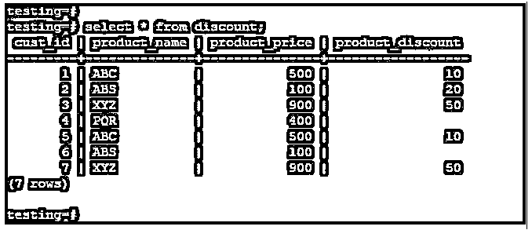
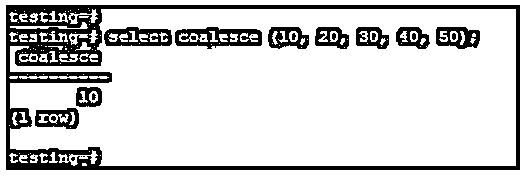
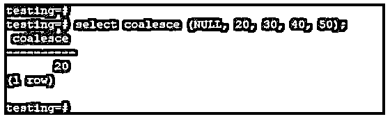
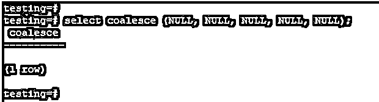
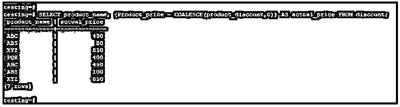

# PostgreSQL 联合

> 原文：<https://www.educba.com/postgresql-coalesce/>

## PostgreSQL 联合简介

PostgreSQL Coalesce 函数的工作方式与 SQL 中的 IFNULL 函数相同；这是一个 PostgreSQL 函数。此函数将从左到右计算值或参数，以找到第一个非空值或参数；找到第一个参数后，它不会计算剩下的参数。Coalesce 函数将接受几个参数或值，但它将第一个参数或值作为非空结果返回；如果所有的值都为空，那么 PostgreSQL coalesces 函数将在结果集中返回空结果或空值。

**语法:**

<small>Hadoop、数据科学、统计学&其他</small>

下面给出的语法如下:

`COALESCE (Value (Any value which we have used with coalesce function) [, ….])`

`COALESCE (Argument1, Argument2,….,ArgumentN);`

`Select column1, column2,…., columnN
COALESCE(description, short_description, '(none)')
From table_name;`

**参数:**

1.**值:**我们在 PostgreSQL 中与 coalesce 函数一起使用的任何值。对于多个值，coalesce 函数将在结果中返回第一个非空值。

2. **Coalesce:** Coalesce 声明 PostgreSQL 中函数名，作为结果返回第一个非空值。Coalesce 函数在 PostgreSQL 中是必不可少的和有用的。

3. **Select:** Select 用于使用 PostgreSQL 中的 coalesce 函数从表中提取数据。我们可以一次使用多列或单列从表中获取数据。

4.**参数 1 到参数 N:** 参数只是一个整数值，我们在 PostgreSQL 中用 coalesce 函数传递它。如果我们传递三个参数，并且第一个参数包含空值，那么 coalesce 函数将在结果中返回第二个值。

5.**第 1 列到第 N 列:**这是表格的列名。如果我们想使用 PostgreSQL 中的 coalesce 函数从表中获取数据，我们可以同时传递多个列。此外，我们已经用 PostgreSQL 中的 coalesce 函数给出了列名。

6. **From:** From 是 PostgreSQL 中的关键字，与 select 查询中的表名一起使用。

7.**表名:**表名用于合并功能。

8.**描述:**我们用 PostgreSQL 中的 coalesce 函数传递描述。在 coalesce 函数的描述中，我们还传递了使用 coalesce 函数的表的列名。

9.**快照描述:**在 PostgreSQL 中使用 coalesce 函数时，我们还使用了一个简短的描述参数。

10. **None:** 是 PostgreSQL 中用 coalesce 函数传递的参数。

### PostgreSQL 中的 COALESCE 函数是如何工作的？

*   我们通过使用 PostgreSQL 中的 coalesce 函数将任何默认值数据替换为空值。
*   它用于返回第一个值，该值在表中不为空。
*   如果该表有多个值，并且列行包含一个有空值的记录，但结果是我们当时不需要任何空值，我们使用了这个函数。
*   在 PostgreSQL 中，Coalesce 函数对于返回第一个值是必不可少的，它在列中不为空。
*   我们在 PostgreSQL 中假设零个或任何列行值，以使用 coalesce 函数查找表的实际结果。
*   该函数将从左到右计算值或参数，以找到非空值或参数。找到第一个参数后，它不会计算剩下的参数。
*   PostgreSQL 中的 Coalesce 函数将接受几个参数或值，但它返回第一个参数或值作为非 null 的结果。如果所有参数都为 null，那么 coalesce 函数将在结果集中返回 null 值(空结果)。
*   联合函数的工作与 SQL 中的 IFNULL 函数相同。

### PostgreSQL 联合示例

下面是一些例子:

我们使用折扣表来描述示例，如下所示:

下面是折扣表的数据描述，我们用它来描述这个例子。

**代码:**

`select * from discount;`

**输出:**

#### 示例#1

在下面的例子中，我们传递 10、20、30、40 和 50 这样的值。Coalesce 函数将只返回第一个值，因为它在第一个记录中找到了非空值。

**代码:**

`select coalesce (10, 20, 30, 40, 50);`

**输出:**

#### 实施例 2

在下面的例子中，我们将值传递为 NULL、20、30、40 和 50。Coalesce 函数将返回第二个值，因为它首先没有找到非空值，所以它将继续第二个值，即 20。

**代码:**

`select coalesce (NULL, 20, 30, 40, 50);`

**输出:**

#### 实施例 3

在下面的例子中，我们用 coalesce 函数传递所有的空值；它将返回空结果，因为我们传递的所有值都是 null。

**代码:**

`select coalesce (NULL, NULL, NULL, NULL, NULL);`

**输出:**

#### 实施例 4

在下面的例子中，我们检索产品的实际价格。在空值的地方，我们必须使用一个联合函数来定义零值。

**代码:**

`SELECT product_name, (Product_price - COALESCE(product_discount,0)) AS actual_price FROM discount;`

**输出:**

### 在 PostgreSQL 中使用 COALESCE 的优势

*   Coalesce 函数从左到右计算值，以从列中查找非空值。
*   在空值的位置，我们输入零或任何值来计算结果。
*   我们通过使用 PostgreSQL 中的 coalesce 函数将任何默认值数据替换为空值。
*   Coalesce 函数对于返回第一个值是必不可少的，并且非常有用，该值在列中不为空。
*   它用于返回第一个值，该值在表中不为空。

### 结论

PostgreSQL，coalesce 函数用于从列中查找非空值，它将从左到右进行计算。找到第一个参数后，它不会计算剩下的参数。我们假设零个或任何列行值，以使用 coalesce 函数找到表的实际结果。

### 推荐文章

这是 PostgreSQL COALESCE 的指南。这里我们讨论一下入门，COALESCE 函数是如何工作的？例子和优点。您也可以看看以下文章，了解更多信息–

1.  [PostgreSQL 完全连接](https://www.educba.com/postgresql-full-join/)
2.  [PostgreSQL 中的通配符](https://www.educba.com/wildcards-in-postgresql/)
3.  [PostgreSQL 中的序列](https://www.educba.com/sequence-in-postgresql/)
4.  [PostgreSQL 获取](https://www.educba.com/postgresql-fetch/)
5.  [PostgreSQL 连载|如何工作？](https://www.educba.com/postgresql-serial/)