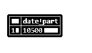

# PostgreSQL 提取()

> 原文：<https://www.educba.com/postgresql-extract/>

")

## PostgreSQL EXTRACT()的定义

PostgreSQL extract 函数()用于从日期/时间值字段中获取子字段，比如一个小时、一年或一天。输入字段应该是日期时间字段。输入字段是一个日期-时间值或时间间隔或时间戳的字符串，我们从中提取秒、分、小时、日期等字段。PostgreSQL 支持各种单位，我们可以从中提取输入的日期-时间源字符串。作为返回结果，PostgreSQL EXTRACT()函数给出一个双精度值。

**语法:**

<small>Hadoop、数据科学、统计学&其他</small>

考虑 PostgreSQL EXTRACT()函数的以下语法:

`extract(unit from timestamp)
or
extract(unit from interval)`

**说明:**

*   **时间戳或时间间隔:**是从中提取单元的输入源字符串。
*   **单位:**定义了要提取的单位类型，如分钟、小时、日、月等等。

考虑下表以理解该单元的可能值:

| **单位** | **时间戳** | **间隔** |
| 百年 | 一个世纪 | 世纪号 |
| 天 | A day of the given month编号如下(1-31) | 星期几 |
| 十年 | 被十除的一年 | 类似于时间戳 |
| 美国陶氏 | 工作日(0)周日至(6)周六 | 无 |
| DOY | A day of the given year numbered like(1 – 366) | 无 |
| 世 | 世界协调时 1970-01-01 00:00:00 的第二个数字 | 第二个数字 |
| 小时 | 小时数大概是(0-23) | 小时数 |
| 香茶菜 | 给定的一周中的一天，在 ISO 8601 定义为星期一到星期日 | 无 |
| 等年 | ISO 8601 年的周数 | 无 |
| 微秒 | 带小数部分的秒，乘以“1000000” | 类似于时间戳 |
| 千禧年 | 千禧年 | 千禧年数字 |
| 毫秒 | 带小数部分的秒，乘以“1000” | 类似于时间戳 |
| 分钟 | 像(0-59)这样编号的分钟 | 分钟数 |
| 月 | 像 1-12 这样编号的月份 | 以(0-11)为模的月份数 |
| 四分之一 | 给定年份的季度 | 季度号 |
| 第二 | 一秒钟 | 第二个数字 |
| 时区 | 它以秒为单位 | 无 |
| 时区 _ 小时 | 时区的小时字段。 | 无 |
| 时区 _ 分钟 | 时区的分钟字段。 | 无 |
| 周 | 根据 ISO 8601，赐予者一年中的一周 | 无 |
| 年 | A year | Similar to TIMESTAMP |

### PostgreSQL EXTRACT()函数是如何工作的？

为了理解提取功能的工作原理，请考虑以下图示；按照提取语法中指定的单位，PostgreSQL 提取函数从输入中提取单位并返回该值。

-1.1")

### 在 PostgreSQL 中实现 EXTRACT()函数

让我们考虑下面的例子来理解 PostgreSQL 提取函数的例子。

*   考虑以下提取日期值的示例:

`SELECT extract(day from date '2020-04-03');`

-1.2")

`SELECT extract(month from date '2020-04-03') AS MONTH;`

-1.3")

`SELECT extract(year from date '2020-04-03') AS year;`

-1.4")

*   考虑以下提取时间戳值的示例。

`SELECT extract(day from timestamp '2020-04-03 09:57:10');`

**T2】**

 **`SELECT extract(month from timestamp '2020-04-03 09:57:10');`

-1.6")

`SELECT extract(minute from timestamp '2020-04-03 09:57:10');`

-1.7")

`SELECT extract(second from timestamp '2020-04-03 09:57:10');`

-1.8")

`SELECT extract(hour from timestamp '2020-04-03 09:57:10');`

*   考虑以下提取时间值的示例。

`SELECT extract(minute from time '09:57:10');`

`SELECT extract(second from time '09:57:10');`

`SELECT extract(milliseconds from time '09:57:10.5');`

*   考虑以下提取间隔值的示例。

`SELECT extract(day from interval '4 days 4 hours');`

`SELECT extract(hour from interval '4 days 4 hours');`

### 在 PostgreSQL 中使用 EXTRACT()函数的优点

*   我们可以使用 extract 函数从源字符串中提取日、月、小时、分钟等单位。
*   PostgreSQL EXTRACT()函数给出一个双精度值。
*   为获取结果而定义的单元是人类可读的。
*   我们可以提取时间戳、时间间隔和日期时间等类型的输入源。

### 结论

我们希望通过上面的文章，您已经理解了如何使用 PostgreSQL EXTRACT()函数以及 PostgreSQL EXTRACT()函数是如何工作的。此外，我们还添加了几个 PostgreSQL EXTRACT()函数的示例来详细理解它。

### 推荐文章

这是 PostgreSQL EXTRACT()的指南。这里我们也讨论一下 PostgreSQL extract()函数的介绍和工作原理？以及不同的示例及其代码实现。您也可以看看以下文章，了解更多信息–

1.  [PostgreSQL 管理](https://www.educba.com/postgresql-administration/)
2.  [PostgreSQL 滞后()](https://www.educba.com/postgresql-lag/)
3.  [PostgreSQL 限制](https://www.educba.com/postgresql-limit/)
4.  [PostgreSQL 别名](https://www.educba.com/postgresql-alias/)
5.  [PostgreSQL 系列|示例](https://www.educba.com/postgresql-serial/)**