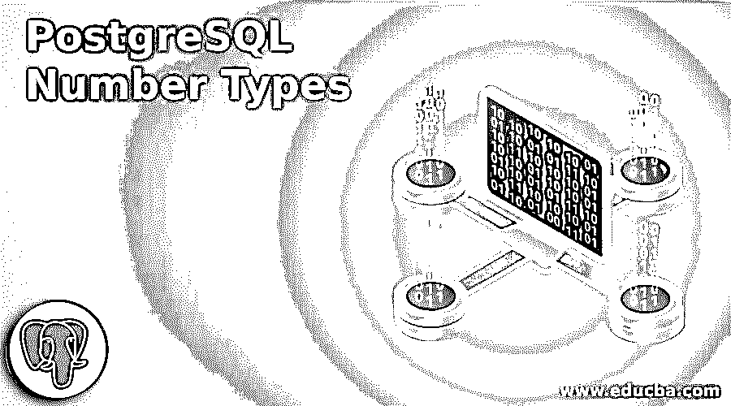
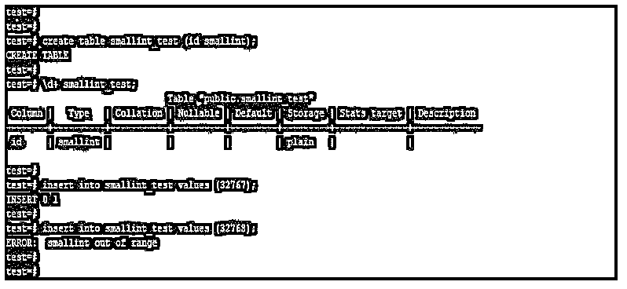
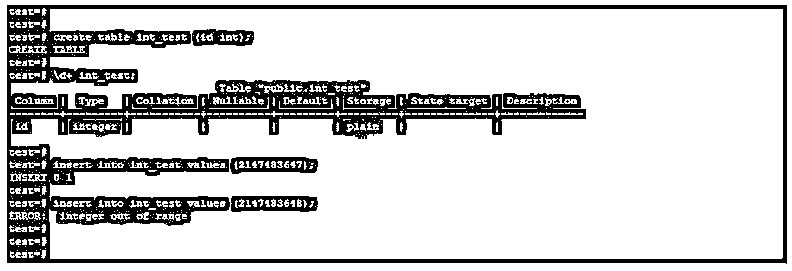
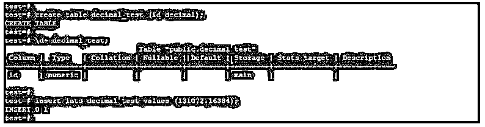
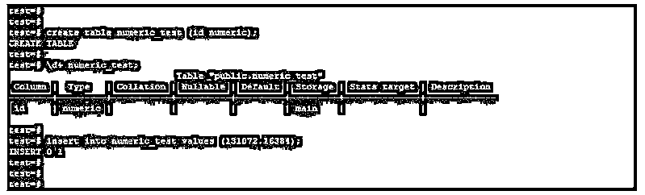
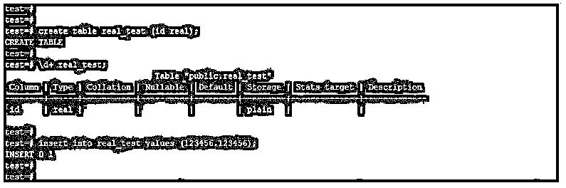
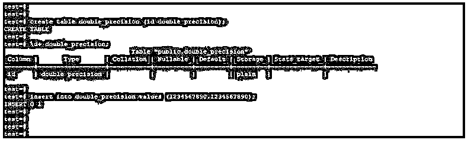
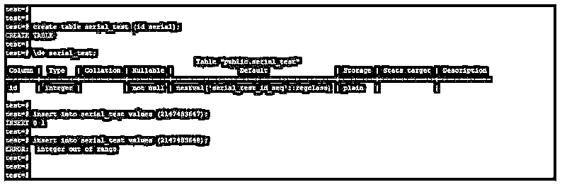
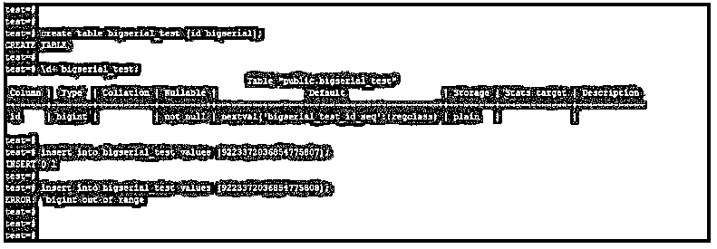

# PostgreSQL 数字类型

> 原文：<https://www.educba.com/postgresql-number-types/>

## PostgreSQL 数字类型介绍

PostgreSQL 数字类型由两个、四个和八个字节的整数或浮点数值组成，PostgreSQL 中有多种类型的数字。基本上，PostgreSQL 中有四种主要的可用数字类型，即整数类型、任意精度数字、浮点类型和序列类型，每种数字类型在 PostgreSQL 中都有其子类型。它用于将数值存储到数据库表中。

### 不同的 PostgreSQL 数字类型

下面给出了不同的号码类型:

<small>Hadoop、数据科学、统计学&其他</small>

*   斯莫列特
*   整数
*   比吉斯本
*   小数
*   数字的
*   真实的
*   双倍精密度
*   小型串行
*   连续的
*   大连载

每种数字类型都有其不同的存储大小和范围。PostgreSQL 中的数字类型由 2 字节、4 字节和 8 字节整数类型、4 字节和 8 字节浮点数以及 PostgreSQL 中的精度小数组成。

#### 1.斯莫列特

PostgreSQL 中 smallint number 类型的存储大小是 2 个字节，PostgreSQL 中 smallint 类型的范围是-32768 到 32767。当磁盘大小小于 32767 并且不需要大于 32767 的值时，使用 Smallint 数值类型。

**语法:**

`Create table name_of_table (name_of_column smallint, name_of_column datatype);`

**举例:**

**代码:**

`create table smallint_test (id smallint);
\d+ smallint_test;
insert into smallint_test values (32767);
insert into smallint_test values (32768);`

**输出:**

#### 2.整数

整数类型的存储大小是 4 个字节，PostgreSQL 中整数类型的范围是-2147483648 到 2147483647。

**语法:**

`Create table name_of_table (name_of_column int, name_of_column datatype);`

**举例:**

**代码:**

`create table int_test (id int);
\d+ int_test;
insert into int_test values (2147483647);
insert into int_test values (21474836478);`

**输出:**

#### 3.比吉斯本

bigint number 类型的存储大小为 8 字节，bigint int 类型的范围为-9223372036854775808 到+9223372036854775807。

**语法:**

`Create table name_of_table (name_of_column bigint, name_of_column datatype);`

**举例:**

**代码:**

`create table bigint_test (id bigint);
\d+ bigint_test;
insert into bigint_test values (9223372036854775807);
insert into bigint_test values (9223372036854775808);`

**输出:**

#### 4.小数

小数类型的存储大小是可变的，小数类型的范围是小数点后 16384 位，小数点前 131072 位。

**语法:**

`Create table name_of_table (name_of_column decimal, name_of_column datatype);`

**举例:**

**代码:**

`create table decimal_test (id decimal);
\d+ decimal_test;
insert into decimal_test values (131072.16384);`

**输出:**

#### 5.数字的

数字类型的存储大小是可变的，数字类型的范围是小数点后 16384 位和小数点前 131072 位。

**语法:**

`Create table name_of_table (name_of_column numeric, name_of_column datatype);`

**举例:**

**代码:**

`create table numeric_test (id numeric);
\d+ numeric_test;
insert into numeric_test values (131072.16384);`

**输出:**

#### 6.真实的

实数类型的存储大小为 4 字节，实数类型的范围为 6 位小数精度。

**语法:**

`Create table name_of_table (name_of_column real, name_of_column datatype);`

**举例:**

**代码:**

`create table real_test (id real);
\d+ real_test;
insert into real_test values (123456.123456);`

**输出:**

**

** 

#### 7.双倍精密度

双精度数字类型的存储大小为 8 个字节，双精度类型的范围为 15 位小数精度。

**语法:**

`Create table name_of_table (name_of_column double precision, name_of_column datatype);`

**举例:**

**代码:**

`create table double_precision (id double precision);
\d+ double_precision;
insert into double_precisionvalues (1234567890.1234567890);`

**输出:**

#### 8.小型串行

小序列号类型的存储大小是 2 个字节，小序列号类型的范围是 1 到 32767。

**语法:**

`Create table name_of_table (name_of_column smallserial, name_of_column datatype);`

**举例:**

**代码:**

`create table smallserial_test (id smallserial);
\d+ smallserial_test;
insert into smallserial_test values (32767);
insert into smallserial_test values (32768);`

**输出:**

#### 9.连续的

序列号类型的存储大小为 4 字节，序列号类型的范围为 1 至 2147483647。

**语法:**

`Create table name_of_table (name_of_column serial, name_of_column datatype);`

**举例:**

**代码:**

`create table serial_test (id serial);
\d+ serial_test;
insert into serial_test values (2147483647);
insert into serial_test values (2147483648);`

**输出:**

#### 10.大串行

bigserial number 类型的存储大小为 8 字节，bigserial 类型的范围为 1 到 9223372036854775807。

**语法:**

`Create table name_of_table (name_of_column bigserial, name_of_column datatype);`

**举例:**

**代码:**

`create table bigserial_test (id bigserial);
\d+ bigserial_test;
insert into bigserial_test values (9223372036854775807);
insert into bigserial_test values (9223372036854775808);`

**输出:**

### 推荐文章

这是 PostgreSQL 数字类型指南。这里我们分别用 10 种不同的类型来讨论 PostgreSQL 数字类型的介绍。您也可以看看以下文章，了解更多信息–

1.  [PostgreSQL 角色](https://www.educba.com/postgresql-roles/)
2.  [PostgreSQL 比较日期](https://www.educba.com/postgresql-compare-date/)
3.  [PostgreSQL 日期 _ 部分()](https://www.educba.com/postgresql-date_part/)
4.  PostgreSQL 中的[数组](https://www.educba.com/array-in-postgresql/)