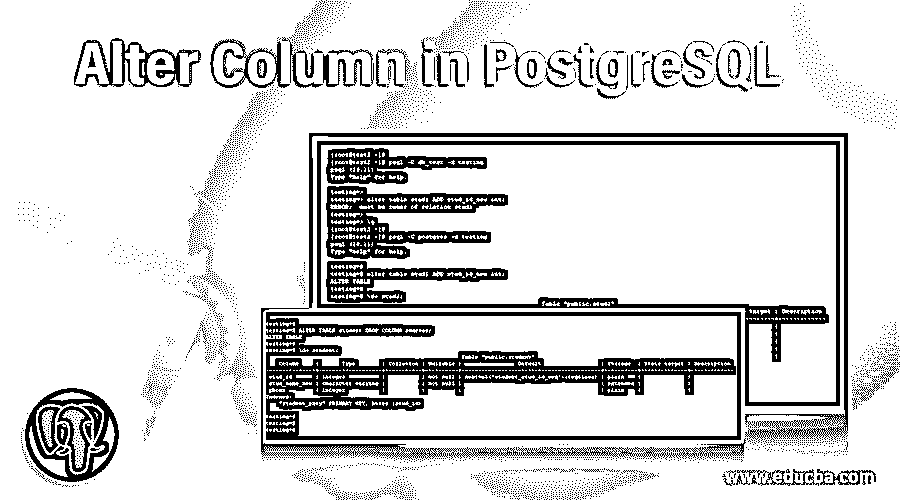
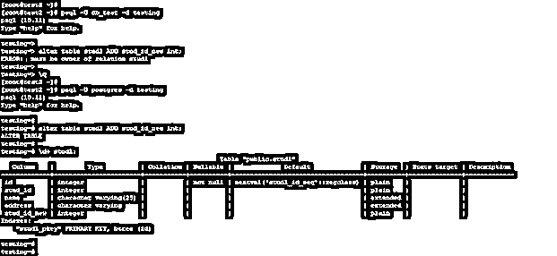
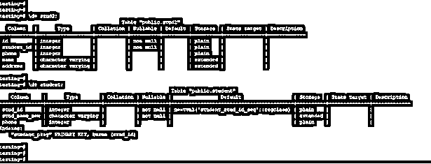
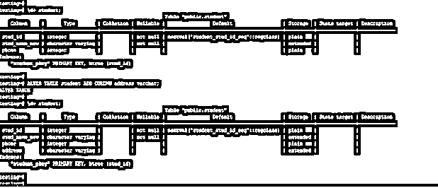
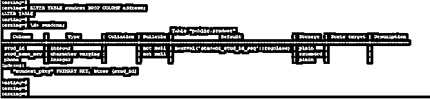
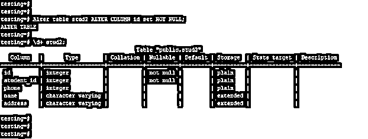
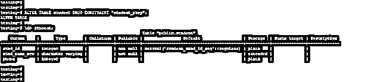
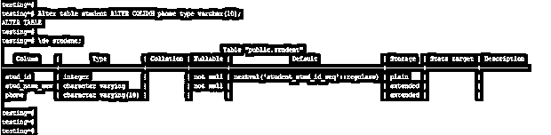

# 在 PostgreSQL 中更改列

> 原文：<https://www.educba.com/alter-column-in-postgresql/>

## PostgreSQL 中的 Alter Column 简介

用于更改表列结构的 PostgreSQL 中的 Alter column 我们可以重命名表中的列，向表中添加新列，从表中删除列也可以向表中添加约束。我们可以通过使用 alter table 语句来改变 PostgreSQL 中的列；使用 alter table 语句，我们必须添加一个新列，重命名一个现有列，并在 PostgreSQL 中更改该列的数据类型。我们可以根据用户的要求修改栏目表。

### 如何在 PostgreSQL 中修改列？

下面是在 PostgreSQL 中修改列的方法。要更改 PostgreSQL 中的列，用户必须拥有同一表上的超级用户权限或表所有者权限，才能更改 PostgreSQL 中的列。

<small>Hadoop、数据科学、统计学&其他</small>

下面是一个例子，我们需要对表拥有表所有者特权。

*   在第一个示例中，我们尝试使用 db_test 用户添加一个列，但是它将发出错误“ERROR:must be owner of relation stud1 ”,因为 db_test 用户没有足够的权限来修改该列。
*   在第二个例子中，我们使用了 Postgres 用户；Postgres 用户有足够的权限在 PostgreSQL 中添加列。

**代码#1**

`psql -U db_test -d testing
alter table stud1 ADD stud_id_new int;
psql -U postgres -d testing
alter table stud1 ADD stud_id_new int;
\d+ stud1;`

**输出:**

使用 stud2 和 student 表来描述在 PostgreSQL 中修改列的示例如下。下面是 student 和 stud2 表的表描述。

**代码#2**

`\d+ student;
\d+ stud2;`

**输出:**

### PostgreSQL 中改变列的方法

下面是同样的方法:

#### 1.重命名列名

在下面的示例中，我们使用了 alter table 命令来更改现有列的名称。下面是更改列名的 alter table 的语法。

**语法**

`Alter table existing_table_name RENAME COLUMN old_column_name TO new_column_name;`

在上面的语法中，alter table 语句被定义为使用 alter table 语句更改列名。重命名列定义为用新名称重命名现有列。

**代码:**

`ALTER TABLE student RENAME COLUMN stud_name TO stud_name_new;
\d+ student;`

**输出:**

在上面的例子中，我们必须将表列名从 stud_name 改为 stud_name_new。

#### 2.添加新列

在下面的示例中，我们使用 alter table 语句向表中添加了一个新列。下面是 alter table 添加新列的语法如下。

**语法:**

`Alter table name_of_tableADD COLUMN column_name (Name of column which we have adding) data_type;`

在上面的语法中，alter table 语句被定义为使用 alter table 语句添加新列。添加列定义为向现有表中添加新列。

**代码:**

`ALTER TABLE student ADD COLUMN address varchar;
\d+ student;`

**输出:**

#### 3.删除列

我们必须使用 PostgreSQL 中的 alter table 语句从表中删除一列。下面是 alter table to delete 列的语法。

**语法**

`Alter table name_of_tableDROP COLUMN column_name (Name of column which we have deleting);`

在上述语法中，alter table 语句被定义为使用 alter table 语句删除新列。Drop column 是用于删除列的关键字。

**代码:**

`ALTER TABLE student DROP COLUMN address;
\d+ student;`

**输出:**

#### 4.添加约束

在下面的例子中，我们添加了约束。下面是在 PostgreSQL 中添加约束的语法。

**语法**

`Alter table name_of_tableALTER COLUMN name_of_columnset name_of_constraint;`

在上面的语法中，alter table 语句被定义为向列添加约束。Alter column 用于向列添加约束。

**代码:**

`Alter table stud2 ALTER COLUMN id set NOT NULL;
\d+ stud2;`

**输出:**

#### 5.移除约束

在下面的例子中，我们必须移除约束。下面是移除约束的语法。

**语法:**

`Alter table name_of_tableDROP CONTRAINT name_of_constraint;`

在上面的语法中，alter table 语句被定义为从列中删除约束。Drop constraint 用于从列中删除约束。

**代码:**

`ALTER TABLE student DROP CONSTRAINT "student_pkey";
\d+ student;`

**输出:**

#### 6.列的数据类型

在下面的例子中，我们必须改变列的数据类型。下面是更改数据类型的语法。

**语法:**

`Alter table name_of_tableALTER COLUMN name_of_column data_type;`

在上面的语法中，alter table 语句被定义为更改列数据类型。Alter column 用于更改列的数据类型。

**代码:**

`Alter table student ALTER COLUMN phone type varchar(10);
\d+ student;`

**输出:**

### 推荐文章

这是一个在 PostgreSQL 中修改列的指南。这里我们讨论一个 PostgreSQL 中 Alter Column 的介绍，语法，方法以及实现的例子。您也可以浏览我们的其他相关文章，了解更多信息——

1.  [PostgreSQL TRIM()](https://www.educba.com/postgresql-trim/?source=leftnav)
2.  [PostgreSQL 日志](https://www.educba.com/postgresql-log/?source=leftnav)
3.  [PostgreSQL REGEXP _ MATCHES()](https://www.educba.com/postgresql-regexp_matches/?source=leftnav)
4.  [PostgreSQL MD5](https://www.educba.com/postgresql-md5/?source=leftnav)