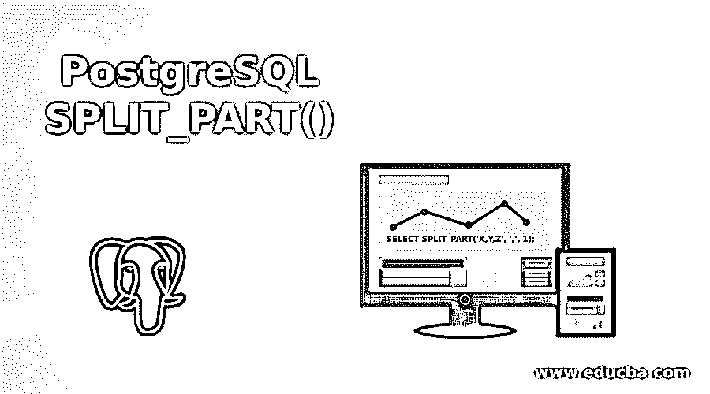
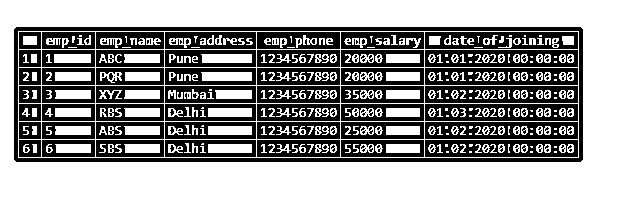
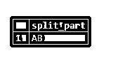
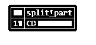

# PostgreSQL SPLIT_PART()

> 原文：<https://www.educba.com/postgresql-split_part/>

## PostgreSQL SPLIT_PART()的定义

PostgreSQL split_part 函数用于使用指定的分隔符将一个字符串拆分成第 n 个子字符串；字符串的分割基于我们使用的指定分隔符。使用 split_part 函数从左到右拆分字符串；它总是从左向右拆分字符串。PostgreSQL split_part 函数需要字符串、分隔符和位置三个参数。字符串参数表示用来拆分的字符串，一个分隔符用来将字符串拆分成第 n 部分。position 表示我们要返回的位置字符串。

**语法:**

<small>Hadoop、数据科学、统计学&其他</small>

下面是 PostgreSQL 中 split_part 函数的语法。

`Split_part (String, delimiter, Position)`

`Select split_part (String (In this position column name as we have defined a string.), delimiter, Position), split_part (String (In this position column name as we have defined a string.), delimiter, Position), Column_nameN from table_name;`

**参数:**

下面是上述语法的参数描述。

*   **String:** String 表示我们在 PostgreSQL 中使用 split_part 函数拆分了哪个字符串。我们可以用任何一根弦来分割它；我们还可以使用列名作为子字符串来分割列中的数据。
*   **Split _ part():**PostgreSQL Split _ part 函数用于将字符串拆分成指定的分隔符，并作为第 n 个子字符串返回到结果中，字符串的拆分基于我们使用的指定分隔符。
*   **Delimiter:** Delimiter 用于使用 PostgreSQL 中的 split_part 函数将字符串拆分成子部分。我们可以使用分隔符将字符串分成几个部分。
*   **Position:**split part 函数中的 Position 声明了我们要使用 PostgreSQL 中的 split_part 函数返回哪个位置字符串。位置会从 1 开始，不应该是负数；它总是一个正整数。
*   **Select:** Select 用于使用 PostgreSQL 中的 split_part 函数选择表中的一列。我们可以使用 split_part 函数和拆分列字符串来选择列。
*   **列 1 到列 N:** 用于从表中获取信息的列名。我们可以使用 PostgreSQL 中的 split_part 函数拆分列数据行。
*   **表名:**表名用于使用 PostgreSQL 中的 split_part 函数从指定的列中检索数据。

### PostgreSQL SPLIT_PART()函数如何工作？

下面是 PostgreSQL split_part 函数的工作原理。

*   Split part 函数在 PostgreSQL 中将一个字符串拆分成 n 个部分是非常重要和有用的。
*   我们需要将位置值定义为正数；position 参数中不允许出现负值。
*   我们需要在 PostgreSQL 中使用 split_part 函数定义一个大于零的值。
*   在下面的第一个例子中，我们使用了位置 1；使用位置 1 后，它将显示字符串的值是 x。
*   使用值 0 和-1 将显示错误为“错误:字段位置必须大于零”。

`SELECT SPLIT_PART('X,Y,Z', ',', 1);`

")

`SELECT SPLIT_PART('X,Y,Z', ',', -1);
SELECT SPLIT_PART('X,Y,Z', ',', 0);`

**T2】**

 ***   它用于将字符串分割成指定的分隔符，并作为第 n 个子字符串返回到结果中，字符串的分割基于我们使用的指定分隔符。
*   string 参数说明我们在 PostgreSQL 中使用 split_part 函数拆分了哪个字符串。我们可以用任何一根弦来分割它；我们还可以使用列名作为子字符串来分割列中的数据。
*   Delimiter 参数用于通过使用 PostgreSQL 中的 split_part 函数将字符串拆分成子部分。我们可以使用分隔符将字符串分成若干部分。
*   position 参数是 split part 函数，它说明了我们要使用 split_part 函数返回哪个位置字符串。位置将从 1 开始，它不应该是负的；它总是正整数。
*   使用 split_part 函数从左到右拆分字符串；它总是从左向右拆分字符串。
*   它需要三个参数作为字符串、分隔符和位置。

### 在 PostgreSQL 中实现 SPLIT_PART()函数的示例

*   下面是 PostgreSQL 中 split_part 函数的例子如下。
*   我们用雇员表的例子来描述 PostgreSQL 中 split_part 函数的例子。下面是员工表如下。

`select * from employee;`

1.在下面的例子中，我们使用分隔符将 ABBCCD 字符串分成三部分。在第一部分中，我们将字符串拆分为 AB，第二部分拆分为 BC，第三部分拆分为 CD。

`SELECT SPLIT_PART('AB,BC,CD', ',', 1);`

`SELECT SPLIT_PART('AB,BC,CD', ',', 2);`

-3.2")

`SELECT SPLIT_PART('AB,BC,CD', ',', 3);`

2.在下面的示例中，我们将加入日期列按年、月和日期分成三列。

`SELECT emp_id, emp_name, emp_phone, emp_salary, split_part(date_of_joining::TEXT,'-',
1) AS Year, split_part(date_of_joining::TEXT,'-', 2) AS Month, split_part(date_of_joining::TEXT,'-', 3) AS Date FROM employee;`

-4.1")

在上面的例子中，我们将连接列的日期分成三个子串，即日期、年份和月份。

3.下面的示例显示只显示雇员表中雇员加入的月份和年份。

`SELECT emp_id, emp_name, emp_phone, emp_salary, split_part(date_of_joining::TEXT,'-',
1) AS Year, split_part(date_of_joining::TEXT,'-', 2) AS Month FROM employee;`

-5.1")

### 在 PostgreSQL 中使用 SPLIT_PART()函数的优点

*   split part 函数用于在 PostgreSQL 中将字符串拆分成第 n 部分。
*   通过使用 split_part 函数，我们可以从表列中识别公共数据。
*   在 PostgreSQL 中使用 split_part 函数可以提高数据质量。
*   我们可以在 PostgreSQL 中从一个字符串中提取多个子字符串。
*   Split_part 函数是 PostgreSQL 中必不可少的有用函数。

### 结论

它用于使用指定的分隔符拆分字符串，并作为第 n 个子字符串返回到结果中，字符串的拆分基于我们使用的指定分隔符。Split_part 函数需要三个参数作为字符串、分隔符和位置。

### 推荐文章

这是 PostgreSQL SPLIT_PART()的指南。这里我们也讨论一下 postgresql split_part()函数的介绍和工作原理？以及不同的示例和代码实现。您也可以看看以下文章，了解更多信息–

1.  [PostgreSQL 时间戳](https://www.educba.com/postgresql-timestamp/)
2.  [PostgreSQL 管理](https://www.educba.com/postgresql-administration/)
3.  [PostgreSQL 限制](https://www.educba.com/postgresql-limit/)
4.  [PostgreSQL 别名](https://www.educba.com/postgresql-alias/)
5.  [PostgreSQL NOW 指南()](https://www.educba.com/postgresql-now/)**