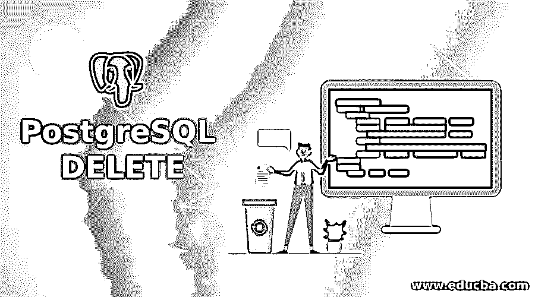
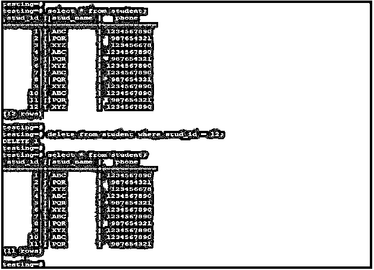
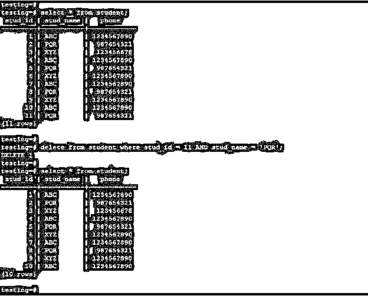
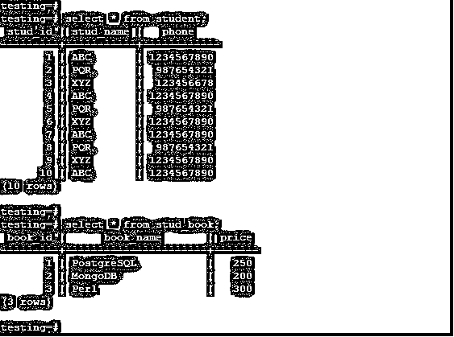
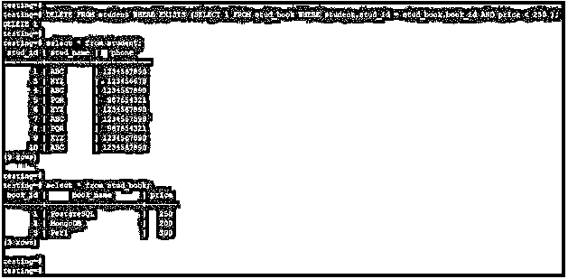
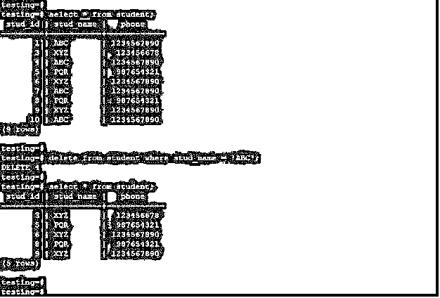
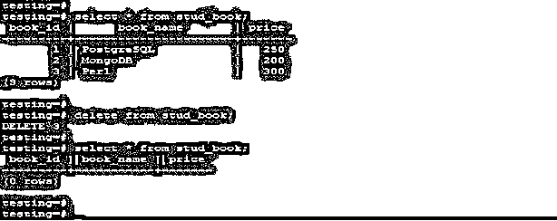
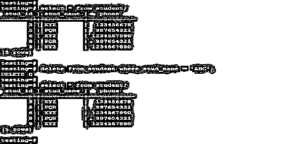

# PostgreSQL 删除

> 原文：<https://www.educba.com/postgresql-delete/>

## PostgreSQL 删除简介

PostgreSQL，delete 语句用于从 PostgreSQL 的表中删除特定行或多行。PostgreSQL 中的 Delete 语句用于从表中删除已有的记录，我们可以使用 where 子句从表中删除选中的行。如果我们没有在 delete 语句中使用 where 子句，表中的所有行都将被删除。Delete 语句也是通过使用另一个表从一个或多个列中检查引用条件。

### 句法

下面是 delete 语句的语法:

<small>Hadoop、数据科学、统计学&其他</small>

`Delete from table_name (Table name which we have used with delete statement) where [ Condition ]`

**或**

`Delete from table_name (Table on which we have deleting the rows.)`

**或**

`Delete from table_name [ USING using-list ] where [ Condition ]`

#### 因素

下面是 delete 语句的参数描述语法:

*   **Delete:** 该语句在 PostgreSQL 中用于从表中删除现有的行。我们可以使用 delete 语句一次删除单行、多行或所有行。
*   **表名:**这被定义为我们在 PostgreSQL 中使用 delete 语句从其中删除行的表名。表名是 delete 语句中一个非常重要的参数。
*   **Where:** Where 子句在 PostgreSQL 中与 delete 语句一起使用，指定与 delete 语句的条件。
*   **条件:**我们可以在 delete 语句中使用 where 子句定义条件。在 PostgreSQL 中，我们可以使用任何条件通过 delete 语句从表中删除行。
*   **使用 list:** 我们可以在 PostgreSQL 中使用带有 delete 语句的 exist 子句。使用列表是 delete 语句中的一个可选参数。我们可以使用现有的子句来检查一个或多个列的条件。

### DELETE 语句的使用

在各种查询中使用 DELETE 语句:

#### 1.有一个条件的 Delete 语句

我们可以在 PostgreSQL 中删除单行。使用 where 子句，我们从表中删除一行。在下面的例子中，我们从学生表中删除了一行，如下所示。

**代码:**

`select * from student;
delete from student where stud_id = 12;
select * from student;`

**输出:**

**解释:**在上面的例子中，我们从学生表中删除了 stud id 为 12 的行。删除行 stud id 12 后，从表中删除。

#### 2.带有两个条件的 Delete 语句

我们可以使用两个条件从 PostgreSQL 的表中删除行。使用 AND、where 子句，我们从表中删除了两行。在下面的例子中，我们从 student 表中删除了使用两个条件的行。

**代码:**

`select * from student;
delete from student where stud_id = 11 AND stud_name = PQR;
select * from student;`

**输出:**

**解释:**在上面的例子中，我们从学生表中删除了一个 stud id 为 11、stud name 为 PQR 的行。删除行 stud id 11 后，将从表中删除。

#### 3.具有 exists 条件的 Delete 语句

在 PostgreSQL 中，我们可以从一个表中删除基于另一个表的记录。

我们可以使用 exists 条件删除该记录。基本上，PostgreSQL 中的 from 子句不允许从多个表中删除记录。以下示例显示了如何使用 PostgreSQL 中的现有条件删除记录。我们用 student 和 stud_book 表来描述 delete 语句使用现有条件的例子如下。

**代码:**

`select * from student;
select * from stud_book;`

**输出:**

**代码:**

`DELETE FROM student WHERE EXISTS (SELECT 1 FROM stud_book WHERE student.stud_id = stud_book.book_id AND price < 250 );
select * from student;
select * from stud_book;`

**输出:**

**解释:**在上面的例子中，我们通过检查 student 和 stud_book 表中的条件，删除了表中的行。通过检查 stud_book 表中的条件，我们已经从 student 表中删除了 stud_id 为 2 的行。

#### 4.使用 where 条件删除多行

我们可以使用 delete 语句在 PostgreSQL 中删除多行。我们可以使用 where 子句删除这些行。以下示例显示了如何在 PostgreSQL 中使用 where 条件删除多行。

**代码:**

`select * from student;
delete from student where stud_name = 'ABC';
select * from student;`

**输出:**

**解释:**在上面的例子中，我们要使用 where 子句删除四行。我们在 stud_name 行上使用了一个条件，删除了包含学生姓名 ABC 的行。使用 PostgreSQL 中的 delete 语句将删除所有包含学生姓名 ABC 的姓名。

#### 5.使用 Delete 语句删除表中的所有行

我们可以使用 PostgreSQL 中的 delete 语句删除表中的所有行。要删除表中的所有行，不需要在 delete 语句中使用 where 子句。从表中删除所有行时，不需要使用 where 子句和条件。以下示例显示了使用 PostgreSQL 中的 delete 语句从 stud_book 表中删除所有行的 delete 语句。

**代码:**

`select * from stud_book;
delete from stud_book;
select * from stud_book;`

**输出:**

#### 6.使用 Delete 语句删除符合条件的行

如果我们的条件与我们用 delete 语句提供的条件不匹配，那么它将返回 false 条件作为结果。以下示例显示，如果条件失败，则 delete 语句将返回错误结果作为输出。

**代码:**

`select * from student;
delete from student where stud_name = 'ABC';
select * from student;`

**输出:**

### 推荐文章

这是一个 PostgreSQL 删除的指南。这里我们讨论 PostgreSQL DELETE 的介绍、语法、参数、DELETE 语句的使用以及查询示例。您也可以浏览我们的其他相关文章，了解更多信息——

1.  [hstore in PostgreSQL](https://www.educba.com/hstore-in-postgresql/)
2.  [PostgreSQL CTE](https://www.educba.com/postgresql-cte/)
3.  [PostgreSQL 授权](https://www.educba.com/postgresql-grant/)
4.  [PostgreSQL 集群](https://www.educba.com/postgresql-cluster/)