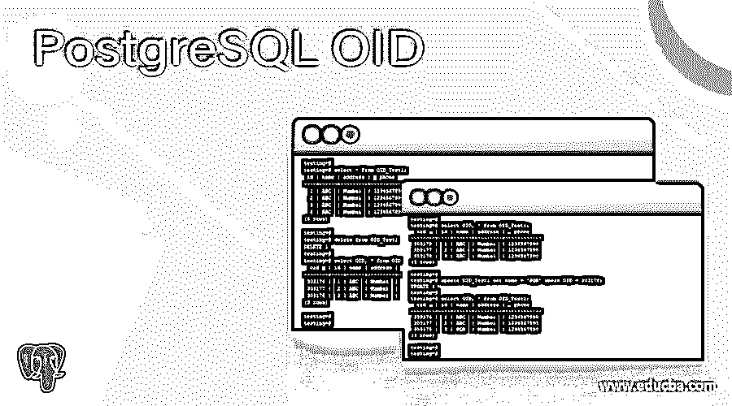
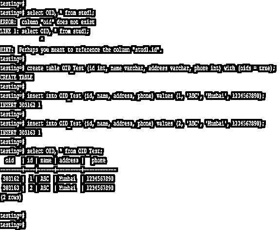
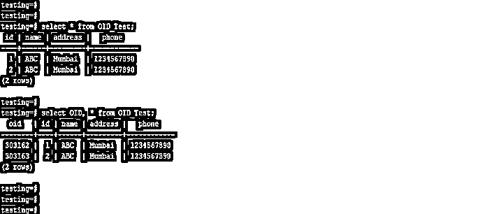
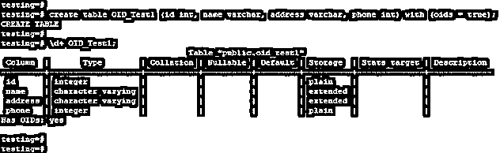
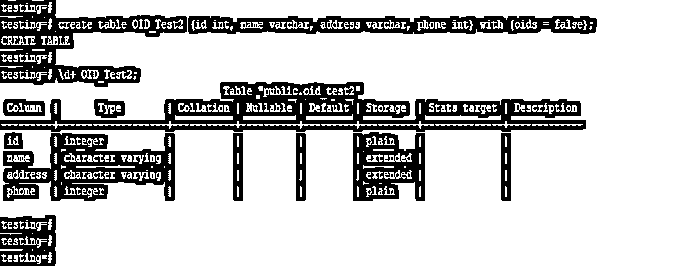
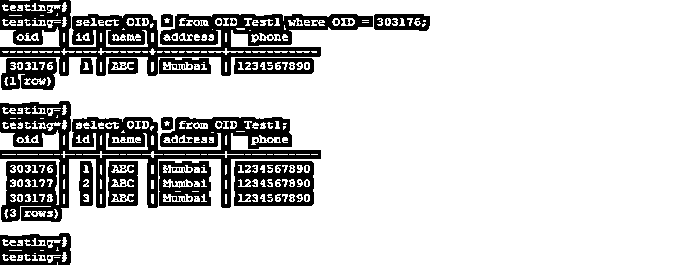
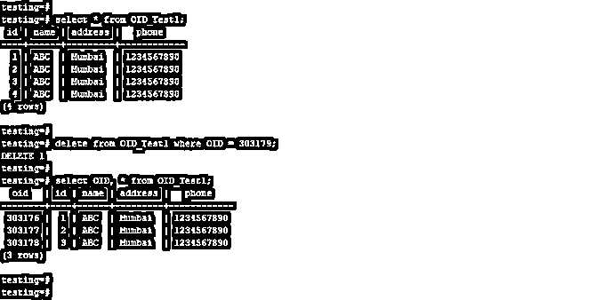
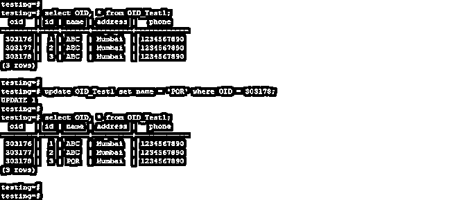

# PostgreSQL OID

> 原文：<https://www.educba.com/postgresql-oid/>

## PostgreSQL OID 的定义

PostgreSQL OID 被定义为一个 32 位正数，PostgreSQL 数据库中的每一行都将包含对象标识符。在 PostgreSQL 中默认情况下，OID 列是隐藏的，我们可以通过在表选择操作中将列名指定为 OID 来看到行 OID。OID 在 PostgreSQL 中定义行的唯一值非常有用和重要，因为每一行都包含其特定的 OID。通过使用不带 OID 的子句，我们可以忽略表中的 OID。

**语法:**

<small>Hadoop、数据科学、统计学&其他</small>

下面是 PostgreSQL 中 OID 的语法:

**1。使用 OID** 创建表格

`Create table name_of_table (name_of_column1 data_type, name_of_column2 data_type, name_of_column3 data_type, …, name_of_columnN data_type) with (OIDS = TRUE);`

**2。不使用 OID** 创建表格

`Create table name_of_table (name_of_column1 data_type, name_of_column2 data_type, name_of_column3 data_type, …, name_of_columnN data_type) with (OIDS = FALSE);`

**3。使用 OID** 选择表格数据

`Select OID, name_of_column1, name_of_column2, name_of_column3, …, name_of_columnN from name_of_table where [condition];`

**4。使用 OID** 删除表格数据

`Delete from name_of_table where OID = (OID_number);`

**5。使用 OID** 更新表格数据

`Update name_of_table set name_of_column = (value_of_column) where OID = (OID_number);`

**下面是 PostgreSQL 中 OID 的参数描述语法**

*   **选择–**用于从表格中选择 OID 列。我们可以同时选择一个 OID 列和另一个表列。
*   **更新—**更新操作用于更新表格数据。我们还可以使用 OID 列来更新表数据。
*   **删除—**用于删除表格数据。我们还可以通过使用 PostgreSQL 中的 OID 列来删除表数据。
*   **表格名称–**表格名称用于显示唯一指定的表格名称。
*   **数据类型—**定义为创建表格时指定列的数据类型。我们可以为该列定义任何数据类型。
*   **使用 OIDS–**这被定义为使用 OIDS 创建表，如果我们将 OIDS 值定义为 true，则将为 PostgreSQL 中的每一行生成 OID。
*   **无 OIDS—**这被定义为创建表时不使用 OIDS，如果我们将 OIDS 值定义为 false，那么 OID 将不会在 PostgreSQL 中生成该行。
*   **OID—**这被定义为 PostgreSQL 中的每一行都定义了一个对象标识符。这是每一行的唯一标识符。

### OID 如何在 PostgreSQL 中工作？

*   下面是 OID 在 PostgreSQL 中的工作。
*   我们可以为 PostgreSQL 中的每一行定义一个唯一的标识符。默认情况下，表中的 OID 是禁用的，我们需要在创建表时启用。
*   以下示例显示，默认情况下，PostgreSQL 中禁用了 OID。我们需要在创建表时对其进行定义。

`select OID, * from stud1;
create table OID_Test (id int, name varchar, address varchar, phone int) with (oids = true);
insert into OID_Test (id, name, address, phone) values (1, 'ABC', 'Mumbai', 1234567890);
insert into OID_Test (id, name, address, phone) values (2, 'ABC', 'Mumbai', 1234567890);
select OID, * from OID_Test;`

*   在 stud1 表中，我们不必在创建表时定义 OID，因此在从表中选择数据时会出现错误。
*   在第二个例子中，我们已经创建了表 OID _ 测试，在创建表的时候，我们必须将 OIDS 定义为真。将 OID 的值定义为 true 后，它将显示表中的 OID 值。
*   默认情况下，OID 列在 PostgreSQL 中是隐藏的，我们可以通过指定 OID 列的名称来选择它。

以下示例显示，默认情况下，OID 列在 PostgreSQL 中是隐藏的。

`select * from OID_Test;
select OID, * from OID_Test;`

*   在第一个例子中，我们没有定义 OID 列，所以它不会显示来自 OID 列的数据。
*   在第二个示例中，我们定义了 OID 列，在定义了 OID 列之后，它将显示 OID 列中的数据。

### 例子

以下示例显示了 PostgreSQL 中的 OID。

#### 1.使用 OID 创建表

以下示例显示了如何使用 OID 创建表。我们必须创建一个名为 OID _ 测试 1 的表。

`create table OID_Test1 (id int, name varchar, address varchar, phone int) with (oids = true);
\d+ OID_Test1;`

#### 2.不使用 OID 创建表

以下示例显示了如何在不使用 OID 的情况下创建表。我们已经创建了一个名为 OID _ 测试 2 的表。

`create table OID_Test2 (id int, name varchar, address varchar, phone int) with (oids = false);
\d+ OID_Test2;`

#### 3.使用 OID 从表中选择数据

以下示例显示了如何使用 OID 从表中选择数据。

`select OID, * from OID_Test1 where OID = 303176;
select OID, * from OID_Test1;`

#### 4.使用 OID 从表中删除数据

以下示例显示了如何使用 OID 从表中删除数据。我们已经从表中删除了“303179”OID。

`select * from OID_Test1;
delete from OID_Test1 where OID = 303179;
select OID, * from OID_Test1;`

#### 5.使用 OID 更新表中的数据

以下示例显示了如何使用 OID 更新表中的数据。

`select OID, * from OID_Test1;
update OID_Test1 set name = 'PQR' where OID = 303178;
select OID, * from OID_Test1;`

### 推荐文章

这是一个 PostgreSQL OID 的指南。在这里，我们讨论定义、语法、参数、实际例子以及 OID 在 PostgreSQL 中是如何工作的？.您也可以浏览我们推荐的文章，了解更多信息——

1.  [PostgreSQL 限制偏移量](https://www.educba.com/postgresql-limit-offset/)
2.  [PostgreSQL 浮点型](https://www.educba.com/postgresql-float/)
3.  [PostgreSQL 客户端](https://www.educba.com/postgresql-client/)
4.  [PostgreSQL 删除](https://www.educba.com/postgresql-delete/)