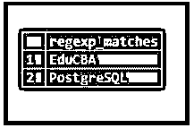
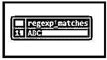
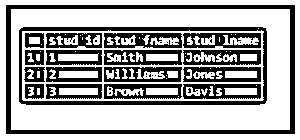
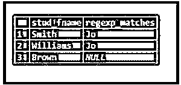

# PostgreSQL 正则表达式匹配项()

> 原文：<https://www.educba.com/postgresql-regexp_matches/>

## PostgreSQL REGEXP_MATCHES()简介

正则表达式是一个字符序列，是字符串列表的简称。假设任何字符串与任何字符串匹配，这是正则表达式定义的字符串列表的一部分。它支持正则表达式，PostgreSQL 提供的函数 PostgreSQL REGEXP_MATCHES()用于从正则表达式中获取所有结果字符串。它使用 POSIX 正则表达式模式。

**语法:**

<small>Hadoop、数据科学、统计学&其他</small>

`regexp_matches(input_string, pattern [, flags ])`

**说明:**

*   **input_string:** 这定义了输入字符串，我们希望从其中提取指定模式的所有匹配子字符串，一个 POSIX 正则表达式。
*   **模式:**定义 POSIX 正则表达式来匹配字符串。
*   **标志:**这个标志用于控制 REGEXP_MATCHES()函数的行为。这可以有一个或多个字符的值。

### PostgreSQL REGEXP_MATCHES()函数是如何工作的？

*   如果正则表达式模式与输入字符串不匹配，则不返回任何行。
*   它返回一个单元素的文本数组，如果正则表达式模式没有包含括号的子表达式，则该数组包含与指定模式匹配的子字符串。
*   REGEXP_MATCHES()函数有一个可选的 flags 参数。flag 参数包含零个或多个字符。flags 参数改变 REGEXP_MATCHES()函数的行为。
*   如果 PostgreSQL REGEXP_MATCHES()函数的输出仍然是单个元素，它将返回一个文本集。

### PostgreSQL REGEXP_MATCHES()的示例

下面是一些例子:

#### 示例#1

我们将发布一个与当前教育观点的趋势内容相关的帖子，如下所示:

#EduCBA 是#PostgreSQL 的最佳学习平台'

我们可以通过使用 PostgreSQL REGEXP_MATCHES()函数从上述文本中提取子字符串，如下所示，该函数实际上返回给定字符串中包含 hashtag 的所有字符串。

**代码:**

`SELECT REGEXP_MATCHES('#EduCBA is best learning platform for #PostgreSQL', '#([A-Za-z0-9]+)', 'g');`

**输出:**

输出包含' #eduCBA '和' #PostgreSQL '字符串，这意味着用模式中定义的正则表达式匹配字符串。在上面的示例中，正则表达式是“([A-Za-z0-9]+)”，它匹配字符串，该字符串以字符哈希(#)开头，后跟任何字母数字字符。我们使用了“g”标志，它用于执行全局搜索，这意味着它允许搜索每个事件，而不仅仅是第一个事件。

#### 实施例 2

PostgreSQL REGEXP_MATCHES()函数返回数组形式的结果，而不是字符串格式的 int。

如果我们使用组来返回字符串部分，则生成的数组将包含组，如下所示:

**代码:**

`SELECT REGEXP_MATCHES
(
'ABC',
'^(A)(..)$',
'g'
);`

**输出:**

用下面的快照说明上面语句的结果。T3T5】

#### 实施例 3

我们将使用 CREATE TABLE 语句创建一个名为“student”的表，如下所示:

**代码:**

`create table student
(
stud_id serial PRIMARY KEY,
stud_fname VARCHAR(80) NOT NULL,
stud_lname VARCHAR(80) NOT NULL
);`

现在，我们将使用 INSERT INTO 语句向 student 表中插入一些数据，如下所示:

**代码:**

`INSERT INTO student(stud_fname,stud_lname)
VALUES
('Smith','Johnson'),
('Williams','Jones'),
('Brown','Davis');`

通过使用下面的 SQL 语句和快照来说明上面的 INSERT 语句的结果。

`select * from student;`

**输出:**

考虑下面的 SQL 语句，它匹配 stud_lname 列中的“Jo”模式，并返回结果“Jo”。如果模式匹配，则返回 NULL。

**代码:**

`SELECT stud_fname, (SELECT regexp_matches(stud_lname, '(Jo)')) FROM student;`

**输出:**

### PostgreSQL REGEXP_MATCHES()的优点

下面给出了一些优点:

1.PostgreSQL REGEXP_MATCHES()函数支持各种标志。

考虑这样的例子:

*   **标志‘I’**:不区分大小写匹配。
*   **标志‘g’:**全局搜索每一个出现。

2.PostgreSQL REGEXP_MATCHES()函数根据定义的模式不返回行、返回一行或多行。

3.我们可以使用 PostgreSQL REGEXP_MATCHES()函数来搜索所有需要出现的字符串或只搜索第一个，或者我们可以在任何位置搜索。

4.我们还可以[使用正则表达式](https://www.educba.com/regular-expression-in-ruby/)提取表格的列值。

5.出于有效性目的，我们可以使用 PostgreSQL REGEXP_MATCHES()函数。

6.我们可以用它来执行复杂的任务，比如用随机字符进行字符串搜索。

### 结论

这里我们已经看到了如何使用 PostgreSQL REGEXP_MATCHES()函数以及该函数的工作原理。此外，我们还添加了几个 PostgreSQL REGEXP_MATCHES()函数的示例。

### 推荐文章

这是 PostgreSQL REGEXP_MATCHES()的指南。这里我们讨论 PostgreSQL REGEXP_MATCHES()的介绍以及工作原理和优点。您也可以看看以下文章，了解更多信息–

1.  [PostgreSQL 时间戳](https://www.educba.com/postgresql-timestamp/)
2.  [PostgreSQL 管理](https://www.educba.com/postgresql-administration/)
3.  [PostgreSQL 限制](https://www.educba.com/postgresql-limit/)
4.  [PostgreSQL 别名](https://www.educba.com/postgresql-alias/)