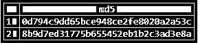
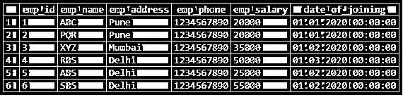
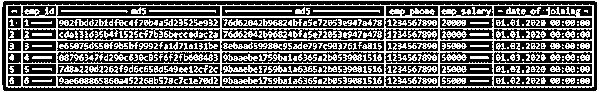

# PostgreSQL MD5

> 原文：<https://www.educba.com/postgresql-md5/>

## PostgreSQL MD5 函数介绍

PostgreSQL MD5 函数用于在 PostgreSQL 中将一个字符串转换成 32 个字符的文本字符串；它用于数据安全性是主要关注点的关键应用中。MD5 是一种加密哈希函数，用于生成 32 个字符的文本字符串，即 128 位校验和的文本十六进制值表示。PostgreSQL 中以 128 位设计的 MD5 算法它是 PostgreSQL 中的加密算法，用于将字符串转换为 32 个字符的文本字符串。MD5 函数在 PostgreSQL 中非常有用和重要。

**语法:**

<small>Hadoop、数据科学、统计学&其他</small>

*   Md5(字符串(我们希望转换为 32 个字符的文本字符串的任何字符串))
*   Select column_name1，md5 (Column_name2(我们用来将字符串转换为 32 个字符的文本字符串的列名))，md5(column_name3(我们用来将字符串转换为 32 个字符的文本字符串的列名))，..，Column _ nameN from table _ name
*   选择 MD5('字符串')；

### PostgreSQL MD5 的参数

下面是对上述语法的参数描述如下:

1.  **MD5:** MD5 是一种加密哈希函数，用于生成 32 个字符的文本字符串，即 128 位校验和的文本十六进制值表示。MD5 函数在 PostgreSQL 中非常有用和重要。
2.  **String:**PostgreSQL 中我们要转换成 32 字符文本串的任意字符串。我们可以使用任何字符串将一个字符串转换成 32 位的文本字符串。
3.  **Select:** Select 用于选择 PostgreSQL 中要转换成 32 字符文本串的任意字符串。
4.  **第 1 列到第 N 列:**PostgreSQL 中用于将数据转换为文本字符串的列名。我们可以将字符数据类型的列数据转换为 32 个字符的文本字符串。
5.  **表名:**表名，用于显示 PostgreSQL 中指定表的数据。

### PostgreSQL MD5 函数如何工作？

*   PostgreSQL 中的 MD5 函数在将字符串转换为文本字符串时，接受一个字符串或参数作为输入字符串。
*   它用于主要关注数据安全性的关键应用中。
*   MD5 函数在 PostgreSQL 中非常有用和重要。
*   该函数用于在 PostgreSQL 中将字符串转换为 32 个字符的文本字符串。
*   我们可以在创建用户时使用 MD5 函数，在 PostgreSQL 中为用户提供加密的密码。
*   MD5 函数会将 PostgreSQL 中的每个单词视为一个字符串。它只对字符串有效，对整数值无效。
*   下面的例子表明，它将把每个字符串视为一个字符，而不是一个整数值。要将字符串转换成文本字符串，我们需要在单引号中定义一个字符串。

`select MD5 (10);`

`select MD5 ('10');`

*   在上面的第一个例子中，我们传递了 10 个没有单引号的值；传递该值将显示一个错误，说明 MD5 函数不存在。
*   但是当我们在单引号中传递 10 值时，它将显示 32 个字符串。
*   MD5 函数不适用于整数数据类型的数据。在下面的数据类型示例中，虽然我们必须显示整数类型的 emp_id，但它不会显示数据；它将显示一个错误。

`select MD5 (emp_id) from Employee limit 2;`

`select MD5 (emp_name) from Employee limit 2;`

*   在上图的第一个示例中，我们从整数数据类型列中检索数据，同时它将显示一个错误。但是当我们从字符数据类型中检索数据时，它不会发出错误；它将以文本格式显示 32 个字符串的结果。

### PostgreSQL 中实现 MD5 函数的实例

*   下面是 PostgreSQL 中 MD5 函数的例子。
*   我们用 employee 表来描述 PostgreSQL 中 MD5 函数的例子如下。

`select * from employee;`

图:描述 PostgreSQL 中 MD5 函数示例的雇员表示例。

#### 1.将单个字符串转换为 32 位字符串

下面是在 PostgreSQL 中将单个字符串转换为 32 位字符文本字符串的示例。在下面的例子中，我们必须将 ABC 字符串转换成 32 位字符文本字符串。

`select MD5 ('ABC');`

在上面的示例中，ABC string 将使用 PostgreSQL 中的 MD5 函数返回“902 FBD D2 B1 df 0 C4 f 70 B4 a5d 23525 e 932”字符串。

#### 2.转换表格数据

下面的例子展示了如何在 PostgreSQL 中将一个字符串转换成 32 位的文本字符串。

`SELECT emp_id, md5 (emp_name), md5 (emp_address), emp_phone, emp_salary, date_of_joining FROM employee;`

在上面的示例中，我们必须使用 PostgreSQL 中的 md5 函数将 emp_name 和 emp_address 列转换为 32 字符串文本格式。

#### 3.使用 UUID 的 MD5 函数

以下示例显示了 UUID 函数如何在 PostgreSQL 中使用 MD5 函数。

`SELECT md5('MD5 String')::uuid;`

### PostgreSQL MD5 的优势

*   PostgreSQL 中的 MD5 函数，用于将字符串转换为 32 个字符的文本字符串。
*   MD5 函数用于数据安全性是主要关注点的关键功能中。MD5 函数在 PostgreSQL 中是必不可少的。
*   MD5 函数用于将字符串转换成文本字符串。
*   我们可以使用 MD5 函数以文本格式存储用户密码。
*   我们在关键应用中使用 MD5 函数来保护数据安全和隐私。

### 结论

MD5 函数用于将一个字符串转换成 32 个字符的文本字符串；它用于安全性是主要关注点的关键应用中。MD5 是一种加密哈希函数，用于生成 32 个字符的文本字符串，即 128 位校验和的文本十六进制值表示。

### 推荐文章

这是一个 PostgreSQL MD5 的指南。在这里，我们讨论 PostgreSQL MD5 的介绍以及实际的例子和不同的子查询表达式。您也可以浏览我们推荐的文章，了解更多信息——

1.  [如何在](https://www.educba.com/postgresql-notify/) [PostgreSQL](https://www.educba.com/postgresql-notify/) 中通知作品？
2.  [PostgreSQL JSON(示例)](https://www.educba.com/postgresql-json/)
3.  [PostgreSQL 唯一约束](https://www.educba.com/postgresql-unique-constraint/)
4.  [PostgreSQL 连载|如何工作？](https://www.educba.com/postgresql-serial/)
5.  [PostgreSQL 使用指南](https://www.educba.com/postgresql-having/)
6.  [PostgreSQL 随机示例](https://www.educba.com/postgresql-random/)