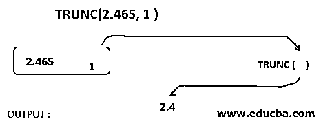
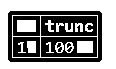
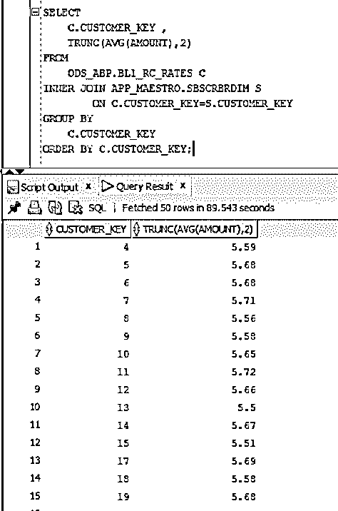

# PostgreSQL Trunc()

> 原文：<https://www.educba.com/postgresql-trunc/>

")

## PostgreSQL Trunc()的定义

PostgreSQL 中的 trunc()函数用于将小数位截断到某个精度。如果没有定义精度，它还可以返回一个被截断为整数的数字。trunc()函数是 PostgreSQL 中的一个数学函数。该功能有助于根据需要处理数字。小数可以根据项目需要修改到小数位并加以利用。让我们来看看函数及其不同的用途。

**语法:**

<small>Hadoop、数据科学、统计学&其他</small>

以下语法说明了 PostgreSQL trunc()函数的语法。

`Trunc (number [, precision])`

**参数:**

*   **数字:**这里，数字表示应该被截断的数字。
*   **Precision:** 该参数是可选参数。它表示一个整数值，让我们知道要截断的小数位数。
*   如果这个精度数是一个正整数，trunc()函数将截断小数点右边的位数。
*   如果精度数是负整数，trunc()函数将截断小数点左边的数字。
*   如前所述，precision 参数是可选参数。如果未指定，则采用默认值 0，这将使数字被截断为整数。
*   该函数的结果与第一个参数的数值数据类型相同。不管指定了多少个参数，它都返回一个数值。

### PostgreSQL 中 Trunc()函数是如何工作的？

让我们看看 trunc()函数是如何工作的。

考虑上面的例子。我们考虑的数字是 2.465。这里还有一个精度参数，即 1。当使用 trunc()函数时，编译器会查找精度参数。它找到数字 1，这是精度参数。然后，它接受两个参数，并对这个数字应用 trunc()。一旦完成，只需从小数点右边取 1 个十进制数。即数字为 2.465；它会取小数点右边的数字，也就是说它会取小数 4。因此这里的输出将是 2.4。这个截断的值可以进一步使用。trunc()函数在所有需要将数字的小数点截断为整数的查询中非常有用。

### 在 PostgreSQL 中实现 TRUNC()的示例

我们现在知道 trunc()函数是什么，以及它是如何工作的。为了更好地理解，让我们看一些例子。

1.未指定精度时，Trunc()函数采用默认值。在这个例子中，我们将看到 trunc()函数在没有指定精度参数时是如何工作的。

`select trunc(125.135);`

-1.1")

这里的另一个例子将消除您的疑问，如果数字小数点后的数字为 99，该数字将被四舍五入。让我们取一个数字:125.999，并对其应用 trunc()函数。

`select trunc(125.999);`

-1.1")

从结果可以看出，这个数字没有四舍五入。它只是截断小数点后的数字。

2.在这个例子中，我们将看到当一个正数作为精度值被发送到参数中时，trunc()函数是如何工作的。我们取了一个精度为 2 的数 123.456。为此，PostgreSQL 语句如下所示:

`SELECT trunc(123.456,2);`

-1.3")

这里的值是 123.45。旁边的数字被截断为 0。

3.在这个例子中，我们将看到当一个负数作为精度值被发送到参数中时，trunc()函数是如何工作的。

我们取了一个精度为-2 的数字 150.45。为此，PostgreSQL 语句如下所示:

`SELECT trunc(150.45, -2);`

当函数的精度为负时，它在小数点的左边起作用。它会取小数点左边的数字。在上面的例子中，它需要 50 并将其截断。小数点的右边，因为它是无效的。

4.在本例中，我们将尝试截断查询返回的数字。

`SELECT
C.CUSTOMER_KEY ,
TRUNC(AVG(AMOUNT),2)
FROM
ODS_ABP.BL1_RC_RATES C
INNER JOIN APP_MAESTRO.SBSCRBRDIM S
ON C.CUSTOMER_KEY=S.CUSTOMER_KEY
GROUP BY
C.CUSTOMER_KEY
ORDER BY C.CUSTOMER_KEY;`

上述查询考虑了两个表。它从 BL1_RC_RATES 表中获取值的数量。该列接受十进制值，我们将其截断到小数点后两位。我们也取这个场的平均值。然后，该查询将这个平均和截断的值与客户键一起使用。该查询在这两个给定的表之间进行内部连接。还有 group by 子句，因为我们使用聚合函数 average，它需要 group by 子句。我们还使用 order by 子句，并根据 CUSTOMER_KEY 对数据进行排序。上述查询的输出如下所示。

您可以看到 CUSTOMER_KEY 与 amount 一起被选中。取其平均值，然后，我们使用 trunc()函数。trunc()函数将值的数量截断到 2 位，并给出所需的输出，如上所示。因此，trunc()函数也可以用于执行其他操作的查询。

### 结论

trunc()函数是一个非常有用的数学函数。利用这个函数，你可以很容易地处理你的数学数据。小数点可以在你方便的时候去掉。它可以达到某些点或完全。当数据与电信、银行和零售业相关时，此函数被广泛使用。它有助于根据用户的需要处理数字，也有助于将十进制数字转换成整数。

### 推荐文章

这是 PostgreSQL Trunc()的指南。在这里，我们还讨论了 trunc()函数的定义和如何在 PostgreSQL Trunc()中工作，以及不同的示例和代码实现。您也可以看看以下文章，了解更多信息–

1.  [PostgreSQL NULLIF](https://www.educba.com/postgresql-nullif/)
2.  [PostgreSQL 联合](https://www.educba.com/postgresql-coalesce/)
3.  [PostgreSQL 布尔值](https://www.educba.com/postgresql-boolean/)
4.  [PostgreSQL 通知](https://www.educba.com/postgresql-notify/)
5.  [PostgreSQL 回合示例](https://www.educba.com/postgresql-round/)