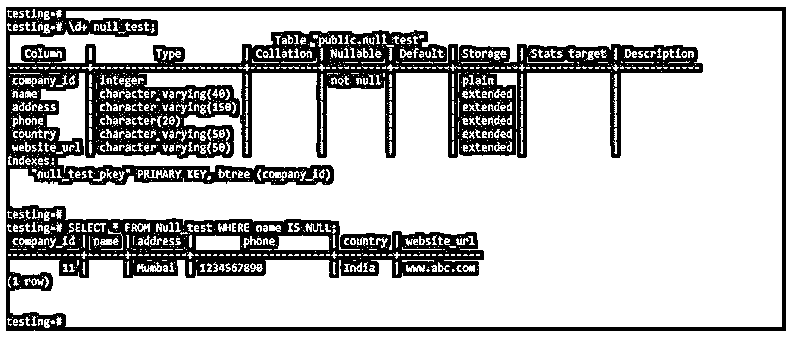
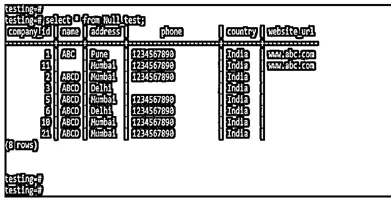
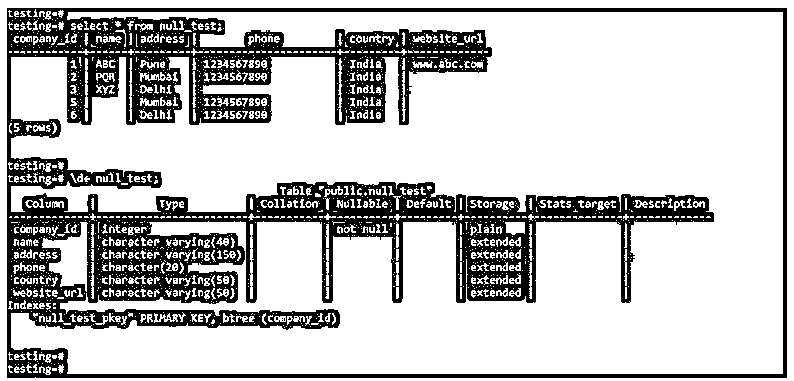
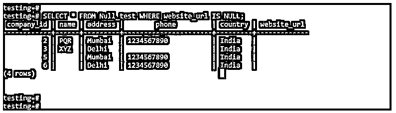
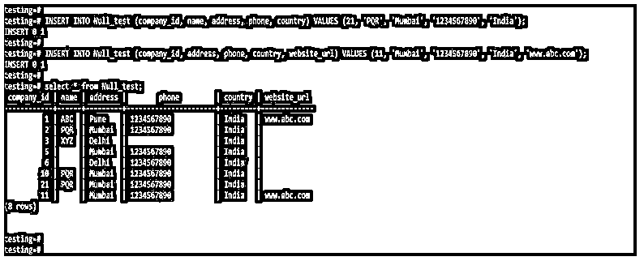
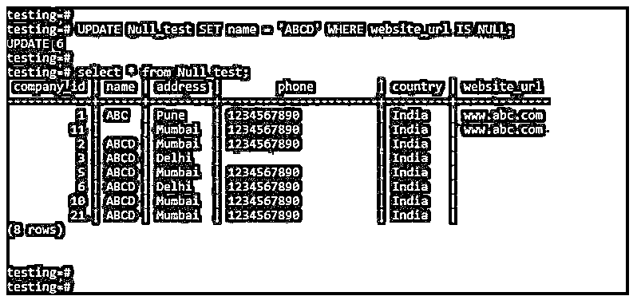
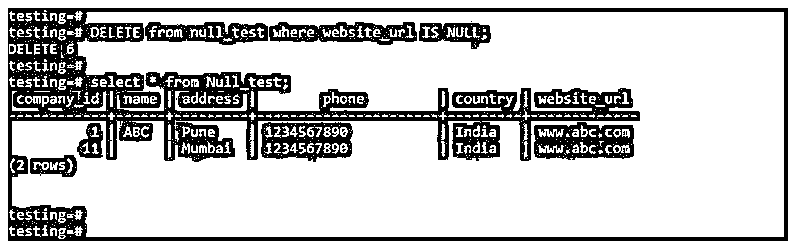

# PostgreSQL 为空

> 原文：<https://www.educba.com/postgresql-is-null/>

## PostgreSQL 简介为空

PostgreSQL IS NULL 主要用于检查或测试插入、更新、删除和选择查询中的空值。当我们想要检查一个给定值是否为空时，我们使用了 null；当 PostgreSQL 中的给定值为 null 时，给定条件返回 true 值。当表中的一个或多个字段设置为空白时使用。

**语法:**

<small>Hadoop、数据科学、统计学&其他</small>

下面是 PostgreSQL 中 IS NULL 运算符的工作原理。

1.是使用 select 语句的空运算符

`Select coumn_name1, column_name2, …, column_nameN from table_name where column_name IS NULL;`

2.使用 insert 语句的 IS 空运算符

`Insert into table_name (coumn_name1, column_name2, …, column_nameN) select coumn_name1, column_name2, …, column_nameN from table_name where column_name IS NULL;`

3.是使用 update 语句的空运算符

`Update table_name set column_name = ‘Value of column’ where column_name IS NULL;`

4.是使用 delete 语句的空运算符

`Delete from table_name where column_name IS NULL;`

5.是使用表达式的空运算符

`Expression (Expressions which was used in our query) IS NULL;`

**下面是 PostgreSQL 中 IS NULL 运算符的参数描述语法:**

*   **Select:** 我们在 Select 语句中使用了 IS NULL 运算符。我们通过使用 IS NULL 运算符和 select 语句从表中检索结果。
*   **Insert:** 我们在 Insert 语句中使用了 IS NULL 运算符。我们使用 IS NULL 运算符和 insert 语句将行插入到表中。
*   **Update:** 我们在 Update 语句中使用了 IS NULL 操作符。我们已经通过使用 IS NULL 操作符和 update 语句将行更新到表中。
*   **Delete:** 我们在 Delete 语句中使用了 IS NULL 操作符。我们已经使用 IS NULL 运算符和 delete 语句从表中删除了该行。
*   **From:** From 子句用于选择一个特定的表，对所选的表执行操作。我们已经使用了数据库中的任何表格。
*   **列名:**这被定义为一个选择列名表单表，我们在其上应用 IS NULL 运算符来执行选择、更新、删除和插入操作。
*   **其中:**该子句用于从表中选择特定的列，以对表执行特定的操作。
*   **表达式:**我们在 PostgreSQL 中使用了带有 IS NULL 运算符的任何表达式。基本上，我们已经使用了选择、更新、删除和插入表达式。
*   **表名:**这是 IS NULL 运算符的一个重要参数。我们已经使用 IS NULL 操作符从表中选择了特定的列。

### PostgreSQL 中的空操作符是如何工作的？

下面是 PostgreSQL 中 IS NULL 运算符的工作原理。

*   PostgreSQL 中的 IS NULL 运算符主要用于检查一列的空值。
*   NULL 和 IS NULL 运算符在 PostgreSQL 中的作用相同。
*   下面的示例显示我们在空值列上使用了 IS NULL 运算符。

**代码:**

`\d+ null_test;
SELECT * FROM Null_test WHERE name IS NULL;`

**输出:**

*   在 PostgreSQL 数据库中，IS null 定义为缺少我们正在搜索的列中的信息。
*   PostgreSQL 中的 IS NULL 不是值。它是列字段的空白值。
*   表中的列字段包含空值。

**代码:**

`SELECT * FROM Null_test`

**输出:**

### PostgreSQL 为 NULL 的示例

下面是提到的例子:

我们使用 null_test 表来描述 PostgreSQL 中 IS NULL 运算符的示例，如下所示。

下面是 null_test 表的表描述和数据。

**代码:**

`select * from null_test;
select * from null_test;`

**输出:**

#### 示例#1

是使用 select 语句的 NULL 运算符。

*   我们在 PostgreSQL 的 select 语句中使用了 IS NULL 运算符。以下示例显示了使用 select 语句的空运算符。
*   在下面的示例中，我们在 website_url 列上使用了 IS NULL 运算符。在对 website_url 列使用 IS NULL 运算符后，它将显示来自 null_test 表的记录，其中 website_url 列的值为 NULL。

**代码:**

`SELECT * FROM Null_test WHERE website_url IS NULL;`

**输出:**

#### 实施例 2

是使用 insert 语句的空运算符。

*   我们在 PostgreSQL 的 insert 语句中使用了 IS NULL 运算符。以下示例显示了带有 insert 语句的 IS NULL 运算符。
*   在下面的例子中，我们在 website_url 和 name 列上使用了 IS NULL 运算符。在 website_url 和 name 列上使用 IS NULL 运算符后，它将在除 website_url 和 name 列之外的所有字段上插入记录。

**代码:**

`INSERT INTO Null_test (company_id, name, address, phone, country) VALUES (21, 'PQR', 'Mumbai', '1234567890', 'India');
INSERT INTO Null_test (company_id, address, phone, country, website_url) VALUES (11, 'Mumbai', '1234567890', 'India', 'www.abc.com');
select * from Null_test;`

**输出:**

#### 实施例 3

是使用 update 语句的空运算符。

*   我们在 PostgreSQL 的 update 语句中使用了 IS NULL 运算符。以下示例显示了带有 update 语句的 IS NULL 运算符。
*   在下面的示例中，我们在 website_url 列上使用了 IS NULL 运算符。在 website_url 列中使用 IS NULL 运算符后，所有名称更新为 ABCD 的行都包含 website_url 列的 NULL 值。

**代码:**

`UPDATE Null_test SET name = 'ABCD' WHERE website_url IS NULL;
select * from Null_test;`

**输出:**

#### 实施例 4

是使用 delete 语句的 NULL 运算符。

*   我们在 PostgreSQL 的 delete 语句中使用了 IS NULL 运算符。以下示例显示了带有 delete 语句的 IS NULL 运算符。
*   在下面的示例中，我们在 website_url 列上使用了 IS NULL 运算符。在 website_url 列中使用 IS NULL 运算符后，删除的所有行都包含 website_url 列的 NULL 值。

**代码**

`DELETE from null_test where website_url IS NULL;
select * from Null_test;`

**输出:**

### 推荐文章

这是一个 PostgreSQL 为 NULL 的指南。这里我们讨论空操作符在 PostgreSQL 中是如何工作的，并给出了相应的查询示例。您也可以看看以下文章，了解更多信息–

1.  [PostgreSQL 解码()](https://www.educba.com/postgresql-decode/)
2.  [PostgreSQL 更新连接](https://www.educba.com/postgresql-update-join/)
3.  [PostgreSQL 回合](https://www.educba.com/postgresql-round/)
4.  [PostgreSQL Trunc()](https://www.educba.com/postgresql-trunc/)