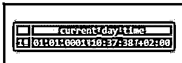
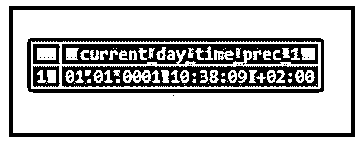
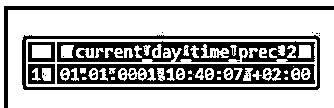
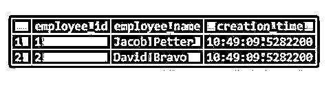

# PostgreSQL 当前时间

> 原文：<https://www.educba.com/postgresql-current_time/>

## PostgreSQL CURRENT_TIME 简介

PostgreSQL 提供了各种操作时间值的函数。它是用来获取当前时间的其中之一。它返回一天中的当前时间值以及被调用时所在的时区。即使 CURRENT_TIME()是一个函数，但是在使用 CURRENT_TIME()函数时，如果我们没有指定 precision 参数，就没有必要定义括号()。PostgreSQL CURRENT_TIME()函数返回的时间格式是' HH:MM:SS。“美国+TZ”。我们可以在 PostgreSQL 8.4、PostgreSQL 9.0、PostgreSQL 9.1、PostgreSQL 9.2、PostgreSQL 9.3 和 PostgreSQL 9.4 等版本中使用 PostgreSQL CURRENT_TIME()函数。

**语法:**

<small>Hadoop、数据科学、统计学&其他</small>

下面给出了语法:

`current_time( [ precision ] )`

**说明:**

*   **精度:**可选参数。定义的值用作小数秒精度。如果没有定义精度，那么 PostgreSQL CURRENT_TIME()函数将返回当天的当前时间，并具有完全可用的精度。

### PostgreSQL CURRENT_TIME()函数在 PostgreSQL 中是如何工作的？

*   它用于获取时区的当前时间。
*   PostgreSQL CURRENT_TIME()函数返回的时间格式是' HH:MM:SS。“美国+TZ”。
*   它将 precision 作为可选参数，用作小数秒精度。如果没有定义精度，那么 PostgreSQL CURRENT_TIME()函数将返回当天的当前时间，并具有完全可用的精度。

**举例:**

考虑以下内容，它将返回以' HH:MM: SS 表示的当前时间。“美国+TZ”格式。

**代码:**

`SELECT current_time AS current_day_time;`

**输出:**

### PostgreSQL CURRENT_TIME 示例

下面给出了定义精度和不定义精度的示例:

#### 示例#1

**代码:**

`SELECT current_time(1) AS current_day_time_prec_1;`

**输出:**

#### 实施例 2

**代码:**

`SELECT current_time(2) AS current_day_time_prec_2;`

**输出:**

#### 实施例 3

**代码:**

`SELECT current_time(3) AS current_day_time_prec_3;`

**输出:**

#### 实施例 4

我们也可以在表创建中使用 PostgreSQL CURRENT_TIME()函数。我们可以使用 PostgreSQL CURRENT_TIME()函数为该列赋予一个默认值。根据 PostgreSQL CURRENT_TIME()函数的执行时间，它将具有不同的时间值。

考虑下面的例子，我们将创建一个名为“Employee”的表，这个表将有一个数据类型为 time 的列“creation_time”。列“creation_time”的默认值将设置为当前时间，因为我们使用 PostgreSQL CURRENT_TIME()函数来设置默认值。

考虑下面的 CREATE TABLE 语句，它将创建一个名为“Employee”的表。

**代码:**

`CREATE TABLE Employee(
Employee_id serial PRIMARY KEY,
Employee_name varchar(255) NOT NULL,
creation_time TIME DEFAULT CURRENT_TIME
);`

现在，我们将使用 INSERT INTO 语句在 Employee 表中插入一行，如下所示:

**代码:**

`INSERT INTO Employee(Employee_name)
VALUES('Jacob Petter');`

在上面的 INSERT INTO 语句中，我们没有指定创建时间；因此，PostgreSQL 将默认值设置为当前时间。

使用下面的 SQL 语句和一个快照来说明 Employee 表的结果。

**代码:**

`SELECT * FROM Employee;`

**输出:**

现在，我们将使用 INSERT INTO 语句再次向 Employee 表中插入一行，如下所示:

**代码:**

`INSERT INTO Employee(Employee_name)
VALUES('David Bravo');`

使用下面的 SQL 语句和一个快照来说明 Employee 表的结果。

**代码:**

`SELECT * FROM Employee;`

**输出:**

***

*** 

根据 SQL 查询的执行时间，Employee 表将在“creation_time”列中插入不同的时间值。如果有人在上午加入一家公司，有人在下午加入，我们执行上面给出的 insert into SQL 语句，加入将按照 SQL 查询执行时间进行。

### 推荐文章

这是一个 PostgreSQL CURRENT_TIME 的指南。这里我们讨论 PostgreSQL CURRENT_TIME()函数在 PostgreSQL 中是如何工作的，并给出了相应的例子。您也可以看看以下文章，了解更多信息–

1.  [PostgreSQL 更新连接](https://www.educba.com/postgresql-update-join/)
2.  [PostgreSQL 变量](https://www.educba.com/postgresql-variables/)
3.  [PostgreSQL 完全外部连接](https://www.educba.com/postgresql-full-outer-join/)
4.  [PostgreSQL While 循环](https://www.educba.com/postgresql-while-loop/)