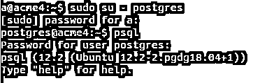
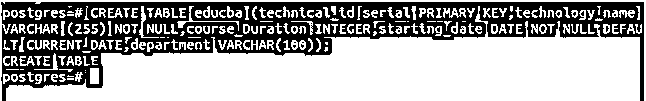
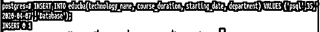
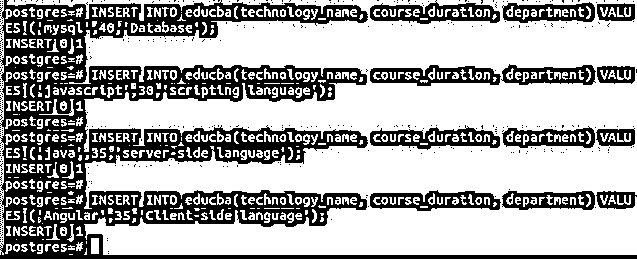
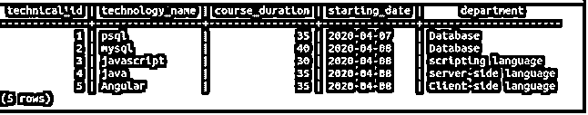
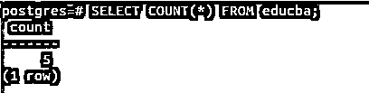
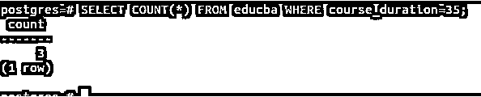
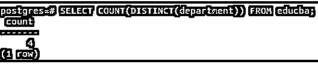
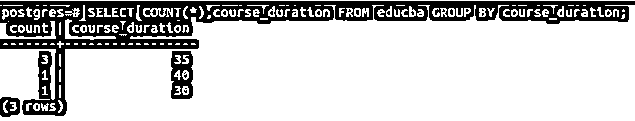
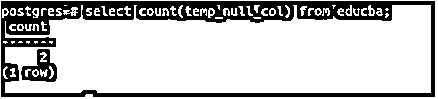

# Postgresql 计数

> 原文：<https://www.educba.com/postgresql-count/>

## Postgresql 计数简介

PostgreSQL 数据库中有许多聚合函数。用于查找行数的聚合函数之一是 count()聚合函数。该函数根据查询语句和子句计算总行数。当它用于特定列时，只考虑非空值。在本文中，我们将借助示例来了解 COUNT()函数如何处理*，非空值的特定列，DISTINCT 关键字，GROUP BY 子句和 HAVING 子句。我们将通过学习 COUNT()函数的语法来开始研究和理解它的工作原理。在本主题中，我们将学习 Postgresql 计数。

**语法**

<small>Hadoop、数据科学、统计学&其他</small>

`SELECT COUNT (* | [DISTINCT] ALL | columnName)
FROM tableName
[WHERE conditionalStatements];`

可以传递给 count 函数的参数可以是*表示结果集中要计数的所有行，也可以是前面带有 distinct 或 all 关键字的列名。默认情况下，当在特定的 columnName 中提到时，它是 ALL 关键字。当使用 distinct 关键字时，结果集中会考虑唯一值列。表名是从中检索结果和查找行数的表的名称。conditions 语句是希望在 where 子句中应用的条件，是可选的。

### Postgresql 计数示例

让我们首先连接到我们的 PostgreSQL 数据库，并使用以下语句打开 psql 终端命令提示符

`sudo su – postgres
psql`

如果出现提示，请输入密码。

上述查询将导致对 Postgres 命令提示符的访问，如下所示

现在让我们创建一个表并在其中插入值。

`CREATE TABLE educba (technical_id serial PRIMARY KEY,technology_name VARCHAR (255) NOT NULL,course_Duration INTEGER,starting_date DATE NOT NULL DEFAULT CURRENT_DATE,department VARCHAR(100));`

在我们的 psql 终端命令提示符下运行上面的查询将会产生以下输出

让我们在 educba 表中插入值，而不要在插入时提及 starting_date 列的值。

`INSERT INTO educba(technology_name, course_duration, starting_date, department) VALUES ('psql',35,'2020-04-07','Database');`

这将产生以下输出–

让我们插入更多条目——

`INSERT     INTO      educba(technology_name,     course_duration,     department)     VALUES ('mysql',40,'Database');`

`INSERT     INTO      educba(technology_name,     course_duration,     department)     VALUES ('javascript',30,'scripting language');`

`INSERT INTO educba(technology_name, course_duration, department) VALUES ('java',35,'server- side language');`

`INSERT     INTO      educba(technology_name,     course_duration,     department)     VALUES ('Angular',35,'Client-side language');`

这会产生以下输出–

现在，让我们通过发出以下 SELECT 命令来检查表 educba 的内容

`SELECT * FROM educba;`

这给出了以下输出–

让我们使用 count()函数检索 educba 表的行数。查询语句如下所示

`SELECT COUNT(*) FROM educba;`

这会产生以下输出–

现在，让我们使用下面的查询语句计算 35 天的 course_duration 的行数

`SELECT COUNT(*) FROM educba WHERE course_duration=35;`

这会产生以下输出结果–

因为有三行 psql、java 和 angular 作为 technology_name，课程持续时间为 35 天，所以我们得到的行数为 3。

#### 使用独特的关键字

每当您想要获得特定列字段的唯一值行计数时，可以在 SELECT 子句中使用 DISTINCT 关键字。例如，假设我们想要检索

educba 表中使用了多少个部门，然后我们可以使用以下查询语句在 SELECT 子句中提到 DISTINCT(department)

`SELECT COUNT(DISTINCT(department)) FROM educba;`

这会产生以下输出-

#### 使用 GROUP BY 子句

现在，让我们检索根据 course_duration 分组的行数。以下是查询语句，将用于获取根据 course_duration 列分组的记录计数

`SELECT COUNT(*),course_duration FROM educba GROUP BY course_duration;`

这些输出如下所示

由于三项技术的持续时间为 35 天，一项技术的持续时间分别为 40 天和 30 天，因此上述输出是正确的。但是我们不知道哪些技术被考虑在内。为此，我们可以使用 GROUP_CONCAT()函数。

#### 使用字符串聚集函数

上面的查询只是检索了 educba 表中使用的按 course_duration 分组的技术计数。如果我们需要这些技术的列表，那么我们可以使用 string_agg()函数以如下方式获得这些技术的逗号分隔列表

`SELECT  COUNT(technology_name)  as  technology_count,  course_duration   as duration_in_days ,string_agg(technology_name,',') as list_of_technologies FROM educba GROUP BY course_duration;`

上述查询语句的输出如下

#### 正在检索列计数

首先，让我们向 educba 表中添加一个名为 temp_null_col 的新列，它将包含默认的 null 值。alter table 命令如下所示

`alter table educba add column temp_null_col varchar default null;`

为了验证 educba 的记录，我们将发出以下命令

`SELECT * from educba;`

其输出如下所示

`update educba set temp_null_col='temp' where department='Database';`

其输出如下所示

`SELECT * from educba;`

这会产生以下输出–

现在，让我们使用下面的查询来获得列 temp_null_col 的计数

`select count(temp_null_col) from educba;`

其输出如下所示

可以看出，在对列 temp_null_col 的行数进行计数时，只考虑非空值，因此输出计数为 2。

### 结论

我们可以在 PostgreSQL 中使用 COUNT()聚合函数来获得特定查询语句的行数。在内部，首先触发查询以获取包含所有满足条件的行的结果集，并对检索到的结果集的行数进行计数以输出计数值。COUNT()函数还可以用于帮助检索非空值的列计数的列。

它还可以与 GROUP BY 子句一起使用，以获得分组结果的计数。可以通过在 SELECT 子句中使用 DISTINCT()函数来获取唯一值计数。我们可以使用 string_agg()函数来获取 count 参数的列以外的列的列值列表，以获取该计数中考虑的值的列表。

### 推荐文章

这是一个 Postgresql 计数指南。这里我们讨论 Postgresql Count 的查询示例，并使用语句打开 psql 终端命令提示符。您也可以看看以下文章，了解更多信息–

1.  [PostgreSQL 唯一约束](https://www.educba.com/postgresql-unique-constraint/)
2.  [PostgreSQL 管理](https://www.educba.com/postgresql-administration/)
3.  [PostgreSQL 时间戳](https://www.educba.com/postgresql-timestamp/)
4.  [PostgreSQL 模式](https://www.educba.com/postgresql-schema/)