# PostgreSQL 日期时间

> 原文：<https://www.educba.com/postgresql-datetime/>

## PostgreSQL 日期时间简介

在每个数据库中，一些数据类型有助于存储和操作与日期和时间相关的值，或者同时存储和操作与日期和时间相关的值。在 PostgreSQL 中，我们也有 6 种不同的数据类型来存储和操作数据库中的日期和时间。许多函数帮助我们根据用例需求和目的，正确有效地检索和管理它们。在本文中，我们将了解数据类型和语法，以及 PostgreSQL 中一些最常用的数据和时间相关函数的示例，并讨论时间戳和时区。在本主题中，我们将学习 PostgreSQL Datetime。

### 用于存储日期和时间的数据类型

| **数据类型** | **存储容量** | **描述** |
| 时间戳 | 8 字节 | 用来一起存储日期和时间 |
| timestamptz | 8 字节 | 用于存储日期和时间以及时区因素 |
| 间隔 | 12 字节 | 用于存储时间间隔数据库 |
| 日期 | 4 字节 | 仅在数据库中存储日期值 |
| 时间 | 8 字节 | 它仅用于在数据库中存储时间值 |
| timez | 12 字节 | 时间可以与区域考虑一起存储在数据库中 |

时间戳允许我们存储日期和时间。对于 timestamptz 数据类型值，还会考虑时区，并且该值以 UTC 格式存储。每当我们试图在 timestamptz 数据类型值中存储任何值时，它都会自动转换为相应的 UTC 值，然后将其 UTC 值存储在数据库表中。每当尝试获取该值时，PostgreSQL 数据库服务器都会从表中检索 UTC 值，然后将该值转换为适当的时区集，该时区集通常在数据库服务器中设置或由用户设置，即当前数据库连接的时区。时间和 timetz 的存储也是如此。

<small>Hadoop、数据科学、统计学&其他</small>

### 功能

有许多函数可用于日期和时间操作。

| **功能名称** | **描述** |
| 年龄(时间戳[，时间戳]) | 以获得特定时间戳和当前时间戳之间的差异，或者年、月和日形式的两个时间戳之间的差异。 |
| 当前日期 | 它用于根据数据库的时区和设置获取当前日期。 |
| 当前时间 | 它用于根据数据库的时区和设置获取当前日期。 |
| 日期 _ 部分(字段，来源) | 它用于从日期中获取特定的值，例如，一年或一个月，或者来自源时间戳或时间间隔的任何字段值。 |
| 提取(来自源的字段) | 它类似于 date_part，用于从给定的时间戳或时间间隔(无论指定哪个源)中检索特定字段的值。 |
| ISFINITE(日期&#124;时间戳&#124;时间间隔) | 它用于测试所提供的值(可以是时间戳、间隔或日期)是有限的还是无限的。 |
| 对齐(间隔) | 它用于检索年、月、日和时间格式的数据，并调整时间间隔。 |

### PostgreSQL 日期时间的示例

为了更清楚地理解工作，让我们考虑一个例子。我们将准备一个包含两列的表，一列包含时间戳，另一列包含 timestamptz。检查当前时区，在上表中插入一条记录并检查其值。然后更改数据库服务器的时区并检查输出。让我们首先列出所有可用的数据库，然后使用\list 和\c educational_platform 切换到名为 educational_platform 的数据库。

`\list`

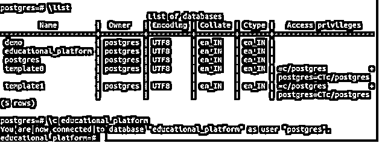

让我们在\dt 命令的帮助下检查其中的所有表，然后按照下面的方式创建一个名为 establish_timestamp 的表。

`CREATE TABLE establish_timestamp (timestampCol TIMESTAMP, timestamptzC0l TIMESTAMPTZ);`

让我们在 SHOW TIMEZONE 命令的帮助下检查当前时区。

`SHOW TIMEZONE;`

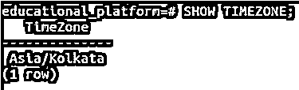

可以看到，当前时区是亚洲/加尔各答。要获得当前时间戳，我们可以使用命令 SELECT NOW()，它给出如下输出。

`SELECT NOW();`

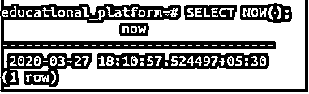

现在让我们在表 establish_timestamp 中插入一条记录，使用

`INSERT INTO establish_timestamp (timestampCol, timestamptzCol) VALUES('2020-03-27 18:10:57','2020-03-27 18:10:57');`

并在命令的帮助下检查值是否被插入

`SELECT * FROM establish_timestamp;`

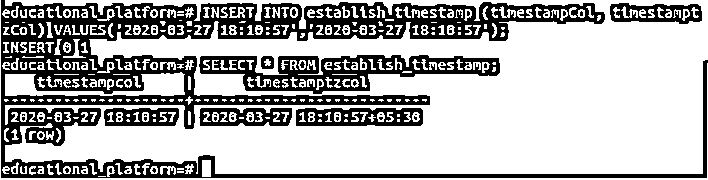

让我们使用命令将时区更改为美国/纽约

`SET timezone = 'America/New_York';`

并通过命令验证当前时区

`SHOW TIMEZONE;`

从输出中可以看出，我们的时区更改成功。现在是时候从我们的表 establish_timestamp 中检索值，并使用命令查看这两列显示了什么

`SELECT * FROM establish_timestamp;`

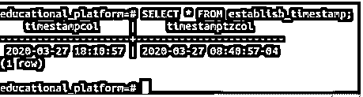

很容易看出，两列显示不同的值。timestamptzcol 列根据美国的时区显示更改后的值，而 timestampcol 显示 Kolkata 的时区值，该值在存储时没有变化。不要忘记重置时区；)!

### 与日期和时间相关的函数

我们将首先尝试使用以下查询语句，使用 CURRENT_DATE 和 CURRENT_TIME 函数检索当前日期和时间

`SELECT  CURRENT_DATE;`

这导致了

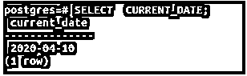

`SELECT CURRENT_TIME;`

这给出了输出——

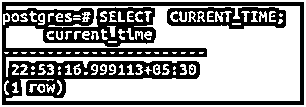

考虑一个特定的日期，例如，“1996-01-26”是某人的出生日期。我们必须找出那个人的年龄。然后我们将使用下面的查询语句来查找相同的内容。

`SELECT AGE('1996-01-26');`

其输出如下所示

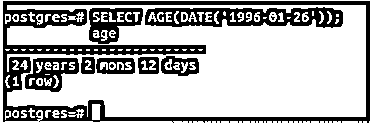

所以那个人 24 岁 2 个月零 12 天。

让我们来看看这个人在 2019 年 6 月 1 日(即 2019-06-01)的年龄。然后，我们可以使用下面的查询语句找出结果

`SELECT AGE('2019-06-01','1996-01-26');`

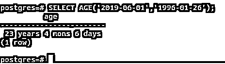

因此，如果出生日期是 1996 年 1 月 26 日，那么他/她在 2019 年 6 月 1 日是 23 岁 4 个月零 6 天。请注意，第一个参数应该始终是最近日期的较大值，第二个参数应该是较早的较小值。如果没有提到，那么结果将是否定的。让我们通过滑动第一个和第二个参数来确认这种情况

`SELECT AGE('1996-01-26', '2019-06-01');`

其输出如下所示

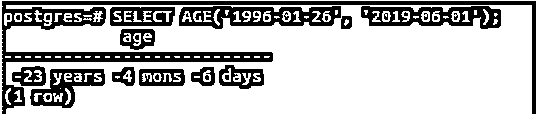

让我们使用以下查询语句，使用 date_part()函数来查找时间戳中的月份

`SELECT date_part('month', TIMESTAMP '2020-04-10 20:38:40');`

这会产生以下输出–

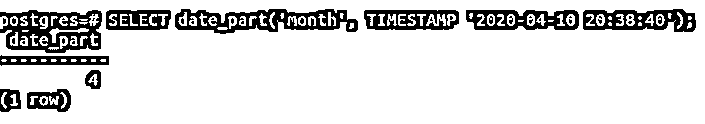

让我们检索相同时间戳的世纪

`SELECT EXTRACT(CENTURY FROM TIMESTAMP '2020-04-10 20:38:40');`

其输出如下所示

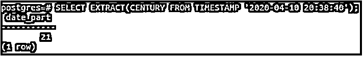

所以时间戳属于 21 世纪。

让我们使用 is finite()函数来测试上面使用的时间戳是否是有限的

`SELECT isfinite(date '2020-04-10 20:38:40');`

这导致了

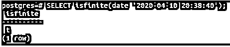

t 代表真实。因此时间戳包含有限的值。

让我们以年、月、日和时间格式来证明 85 小时的合理性。

`SELECT justify_hours(interval '85 hours');`

这导致了–

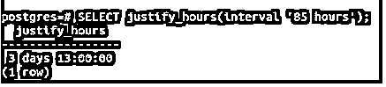

因此，85 小时相当于 3 天 13 小时。

### 结论

PostgreSQL 为我们提供了强大的时态数据类型和函数，在处理数据库中的日期、时间和时间戳时，可以轻松有效地使用这些数据类型和函数来减少我们的工作量。我们应该试着经常使用它们。

### 推荐文章

这是 PostgreSQL Datetime 的指南。这里我们讨论 PostgreSQL Datetime 的例子以及与日期和时间相关的函数。您也可以看看以下文章，了解更多信息–

1.  [PostgreSQL JSON](https://www.educba.com/postgresql-json/)
2.  [PostgreSQL 时间戳](https://www.educba.com/postgresql-timestamp/)
3.  [PostgreSQL 限制](https://www.educba.com/postgresql-limit/)
4.  [PostgreSQL IN 运算符](https://www.educba.com/postgresql-in-operator/)