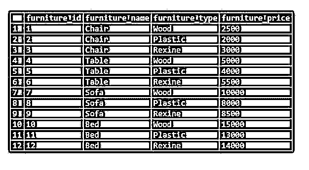
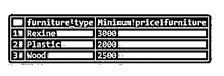

# PostgreSQL 最小值()

> 原文：<https://www.educba.com/postgresql-min/>

## PostgreSQL MIN()函数介绍

PostgreSQL 支持各种聚合函数。PostgreSQL MIN 函数就是其中之一，用于返回记录值集中的最小值。我们可以使用 PostgreSQL MIN 函数来查找表中特定列的最小值。我们只需要将列名传递给 SELECT SQL 语句中指定的 PostgreSQL MIN 函数。我们可以传递给 PostgreSQL MIN 函数的列的数据类型可以是字符串、数字或任何其他可以比较的数据类型。我们可以将 PostgreSQL MIN 函数与各种子句以及其他聚合函数一起使用。

**语法:**

<small>Hadoop、数据科学、统计学&其他</small>

`MIN (* | [DISTINCT] ALL | column_name)`

**说明:**

*   ***:** 显示所有的行。
*   **列名:**指定列的名称。
*   **DISTINCT:** 用来表示唯一性，是可选子句。
*   **ALL:** 指定默认条款，可选。

### PostgreSQL MIN()函数是如何工作的？

*   PostgreSQL MIN 函数用于查找表中特定列的最小值，它将列名作为参数。
*   我们可以传递给 PostgreSQL MIN 函数的列的数据类型可以是字符串、数字或任何其他可以比较的数据类型。
*   我们可以将 PostgreSQL MIN 函数与各种子句以及其他聚合函数一起使用。

### PostgreSQL MIN()函数示例

为了理解示例，让我们创建一个名为“furniture”的表:

`CREATE table furniture
(
furniture_id SERIAL PRIMARY KEY,
furniture_name VARCHAR (256) NOT null,
furniture_type VARCHAR (256) NOT null,
furniture_price int NULL
);`

现在，在家具表中插入一些数据，以便执行 SQL 语句。

`INSERT INTO furniture (furniture_name,furniture_type,furniture_price)
VALUES
('Chair','Wood',2500),
('Chair','Plastic',2000),
('Chair','Rexine',3000),
('Table','Wood',5000),
('Table','Plastic',4000),
('Table','Rexine',5500),
('Sofa','Wood',10000),
('Sofa','Plastic',8000),
('Sofa','Rexine',8500),
('Bed','Wood',15000),
('Bed','Plastic',13000),
('Bed','Rexine',14000);`

借助下面的快照和 SELECT 语句说明上面语句的结果。

`SELECT * FROM furniture;`

#### 示例 1–PostgreSQL MIN()函数作为一个级别

考虑下面的例子，它将显示如何从名为“furniture”的表中获得最低价格的家具。

我们可以通过以下不同方式编写 SQL 语句来实现这一点:

`SELECT MIN(furniture_price) "Minimum price furniture"
FROM furniture;`

使用下面的快照说明上述语句的结果:

`SELECT MIN(DISTINCT furniture_price) "Minimum price furniture"
FROM furniture;`

使用下面的快照说明上述语句的结果:

`SELECT MIN(ALL furniture_price) "Minimum price furniture"
FROM furniture;`

使用下面的快照说明上述语句的结果:

#### 示例 2–带有 MIN()函数的 WHERE 子句

考虑下面的例子，它将显示如何从名为‘furniture’的表中获得最低价格的家具，其中家具的名称是 Chair。

`SELECT MIN(furniture_price) "Minimum price furniture"
FROM furniture6
WHERE furniture_name='Chair';`

使用下面的快照说明上述语句的结果:

#### 示例 3–使用 MIN()函数进行分组

考虑以下示例，从家具表中获取每种家具类型的最低家具价格。

`SELECT furniture_type, MIN(furniture_price) "Minimum price furniture"
FROM furniture
GROUP BY furniture_type;`

使用下面的快照说明上述语句的结果:

#### 示例# 4–具有 MIN()函数的 HAVING 子句

考虑以下示例，获取家具表中最低价格为 2500 且低于 13000 的每种家具类型的最低价格。

`SELECT furniture_type, MIN(furniture_price) "Minimum price furniture"
FROM furniture
WHERE furniture_price < 13000
GROUP BY furniture_type
HAVING MIN(furniture_price) >= 2500;`

使用下面的快照说明上述语句的结果:

#### 示例 5–使用 MIN()函数进行分组和排序

考虑以下示例，获取最低家具价格为 2500 且低于 13000 的家具，并且每种家具类型的最低家具价格按降序排列。

`SELECT furniture_type, MIN(furniture_price) "Minimum price furniture"
FROM furniture
WHERE furniture_price < 13000
GROUP BY furniture_type
HAVING MIN(furniture_price) >= 2500
ORDER BY MIN(furniture_price) DESC;`

使用下面的快照说明上述语句的结果:

### 推荐文章

这是 PostgreSQL MIN()的指南。在这里，我们讨论 PostgreSQL MIN()的介绍及其与不同查询示例的配合，以便更好地理解。您也可以看看以下文章，了解更多信息–

1.  [PostgreSQL 变量](https://www.educba.com/postgresql-variables/)
2.  [PostgreSQL 分组依据](https://www.educba.com/postgresql-group-by/)
3.  [PostgreSQL Trunc()](https://www.educba.com/postgresql-trunc/)
4.  [PostgreSQL 集群](https://www.educba.com/postgresql-cluster/)