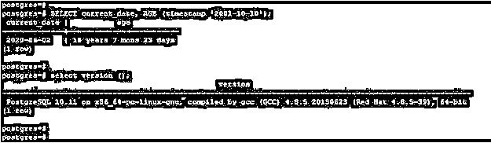
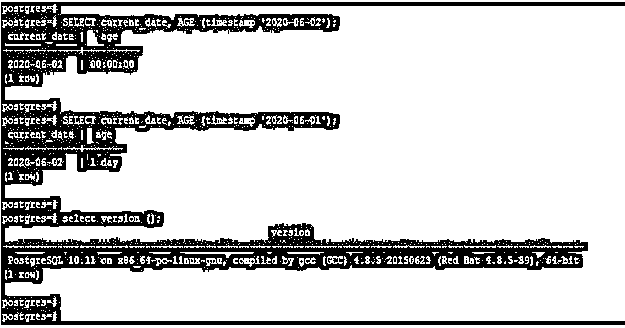
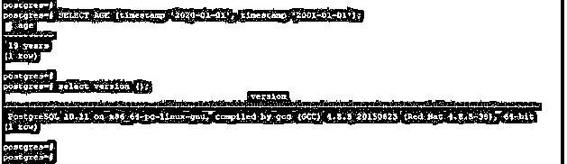
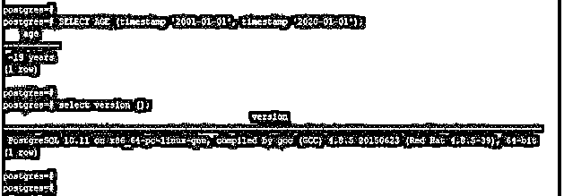
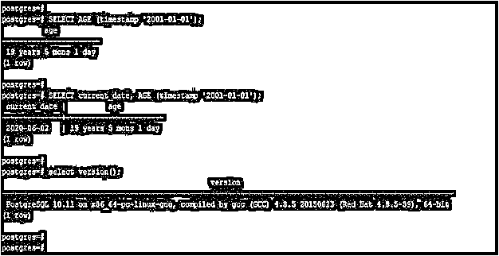

# PostgreSQL 年龄()

> 原文：<https://www.educba.com/postgresql-age/>

## PostgreSQL age()函数简介

PostgreSQL age()函数用于计算两个日期之间的年龄，它将返回两个不同日期之间的年数、天数和月数。PostgreSQL 中的 Age 函数将接受两个参数作为日期时间戳，并返回两个不同日期之间的计算差值。PostgreSQL 中的 age 函数根据 age 函数使用的参数来执行两种不同的计算。年龄函数在 PostgreSQL 中是非常重要和有用的，用于减去参数并产生以月和年为单位的符号结果。

### 句法

下面是 PostgreSQL 中 age 函数的语法:

<small>Hadoop、数据科学、统计学&其他</small>

`age (timestamp, timestamp)`

**或**

`age(date1, date2)`

**或**

`age (timestamp)`

#### 因素

下面是 PostgreSQL 中 age 函数的参数描述语法:

**Age:** 这是 PostgreSQL 中用来返回区间类型的函数。age 函数基本上接受双参数来返回结果。PostgreSQL 中的 Age 函数将接受时间戳值作为其输入参数。

**时间戳:**PostgreSQL age 函数中的时间戳被定义为接受时间戳参数。我们使用了两个时间戳和年龄函数，两个参数用于从第一个参数中减去第二个参数。

**日期 1 和日期 2:** 这与我们在 PostgreSQL 的 age 函数中使用的时间戳相同。它将与年龄功能中的时间戳工作相同。我们可以用第一次约会作为当前日期。

### PostgreSQL age()函数是如何工作的？

下面是 PostgreSQL 中 age 函数的工作原理:

我们在 PostgreSQL 中使用 age 函数返回年、月和日，作为两个时间戳的结果。为了在 PostgreSQL 中使用 age 函数，我们需要传递两个参数。第一个参数是时间戳或当前日期，第二个参数是时间戳。我们还使用当前日期作为第一个参数中的第一个时间戳。下面的例子显示了我们使用当前日期作为 PostgreSQL 中 age 函数的第一个参数。如果我们想返回人的当前年龄，那么我们使用当前日期作为 age 函数的第一个参数。

**代码:**

`SELECT current_date, AGE (timestamp ‘2001-10-10’);`

**输出:**

**解释:**在上面的例子中，我们已经考虑了人的年龄是 2001 年 10 月 10 日。此外，我们还从当前日期中减去了这个年龄。减去人的年龄后是 18 岁 7 个月零 23 天。基本上年龄功能是使用当前系统时间来计算年龄。如果我们需要计算不同时间的年龄，那么我们需要用年龄函数传递两个参数。PostgreSQL age 函数将执行两种不同的计算，这取决于我们用 age 函数传递了哪个参数。我们提供了两个日期时间戳，我们还在第一个参数中提供了一个当前时间戳。

PostgreSQL 中的 Age 函数将以如下格式返回结果:

**XXXX(年):XX(月)-xx(日):**定义为第一个结果是年，第二个结果是月，第三个结果是日。

**xx(月):xx(日):**定义为第一个结果是月，第二个结果是日。

**xx (Day):** 使用 age 函数只返回天数作为结果。

PostgreSQL 中 age 函数的返回类型是区间。PostgreSQL 中的 Age 函数用于 8.4 到 12 的 PostgreSQL 版本。我们在业务应用程序中使用年龄函数，在这些应用程序中，我们已经计算了人员的年龄、员工的服务年限，并且我们必须计算年数、月数和天数。年龄函数主要用于需要计算学生或员工年龄的 web 应用程序中。年龄函数从当天午夜开始计算结果。它会从第二天午夜开始更新。假设我们需要使用年龄函数计算当前日期和昨天日期之间的差值。它将从午夜(12:00 时钟)开始更新年龄。年龄函数将以 24 小时制计算一天。

以下示例显示年龄函数将从午夜 12:00 时钟返回结果:

**代码:**

`SELECT current_date, AGE (timestamp '2020-06-02');
SELECT current_date, AGE (timestamp '2020-06-01');`

**输出:**

**解释:**在上面的第一个例子中，我们将今天的日期与当前日期函数一起使用，那么年龄函数将返回零天的结果。在第二个示例中，我们使用了昨天的日期，在将昨天的日期与当前日期一起使用后，它将返回一天的结果。

### 实现 PostgreSQL age()的示例

下面是提到的例子:

#### 例 1。对年龄函数使用两个时间戳值

在下面的例子中，我们用年龄函数传递了两个日期值。在第一个时间戳中，我们将传递时间戳值设为“2020-01-01”，在第二个时间戳中，我们将传递时间戳值设为“2001-01-01”。

**代码:**

`SELECT AGE (timestamp '2020-01-01', timestamp '2001-01-01');`

**输出:**

#### 例 2。对年龄函数使用两个时间戳值

(使用小于第二个日期的第一个日期)

在下面的例子中，我们用年龄函数传递两个日期值。在第一个时间戳中，我们将传递时间戳值设为“2001-01-01”，在第二个时间戳中，我们将传递时间戳值设为“2020-01-01”。

**代码:**

`SELECT AGE (timestamp '2001-01-01', timestamp '2020-01-01');`

**输出:**

#### 例 3。对年龄函数使用两个当前日期值

在下面的例子中，我们在第一个参数中使用当前日期，在第二个参数中使用数据“2001-01-01”。

**代码:**

#### 两个当前日期

`SELECT AGE (timestamp '2001-01-01');
SELECT current_date, AGE (timestamp '2001-01-01');`

**输出:**

### 推荐文章

这是一个 PostgreSQL 时代的指南()。这里我们讨论一个 PostgreSQL age()的介绍，语法，它如何与查询例子一起工作。您也可以浏览我们的其他相关文章，了解更多信息——

1.  [PostgreSQL CTE](https://www.educba.com/postgresql-cte/)
2.  [PostgreSQL 变量](https://www.educba.com/postgresql-variables/)
3.  [PostgreSQL Like](https://www.educba.com/postgresql-like/)
4.  [PostgreSQL 回合](https://www.educba.com/postgresql-round/)