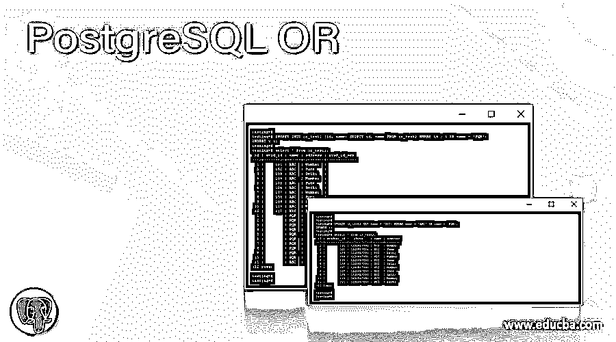
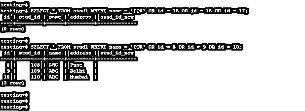
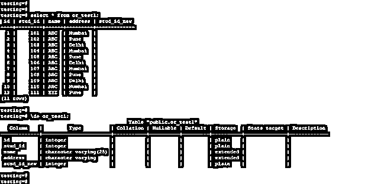
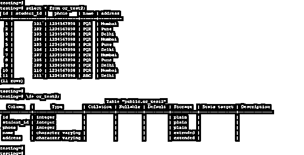
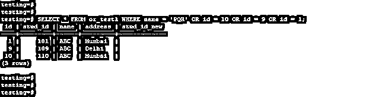
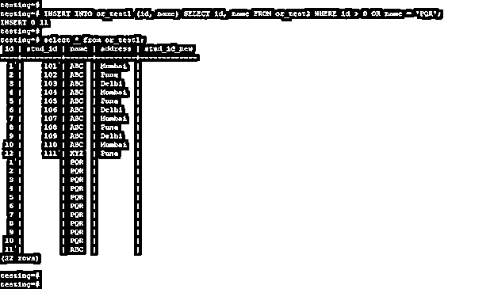
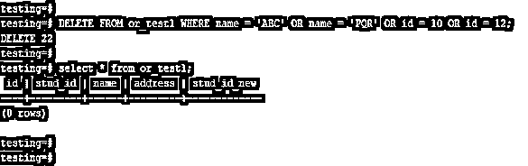
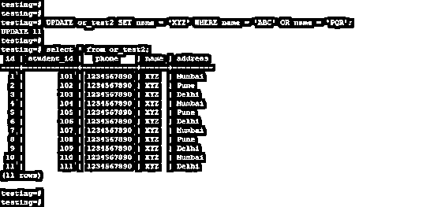

# PostgreSQL 或

> 原文：<https://www.educba.com/postgresql-or/>

## PostgreSQL 或条件的定义

PostgreSQL OR condition 用于在单个查询中测试一个或多个条件，在使用 OR 条件检查记录后，它将返回满足哪个条件的结果。我们可以在 insert、update、delete 和 select 语句中使用 OR 条件，OR 条件用于 PostgreSQL 中 select、update、delete 和 insert 查询的所有语句。

**语法:**

<small>Hadoop、数据科学、统计学&其他</small>

下面是 OR 条件的语法。

*   **OR 条件使用 select 语句**

`Select name_of_column1, name_of_column2, name_of_column3, …, name_of_columnN, from name_of_table where [condition] OR [condition1;`

`Select name_of_column1, name_of_column2, name_of_column3, …, name_of_columnN, from name_of_table where [condition] OR [condition1], OR [condition2], OR [condition3], …, OR [conditionN];`

*   **OR 条件通过使用 insert 语句**

`Insert into name_of_table (name_of_column1, name_of_column2, name_of_column3, …, name_of_columnN) Select name_of_column1, name_of_column2, name_of_column3, …, name_of_columnN, from name_of_tablewhere [condition] OR [condition1], OR [condition2], OR [condition3], …, OR [conditionN];`

*   **OR 条件通过使用更新语句**

`Update name_of_table SET [update condition using column name] where [condition] OR [condition1], OR [condition2], OR [condition3], …, OR [conditionN];`

*   **OR 条件通过使用 delete 语句**

`Delete from name_of_table where [condition] OR [condition1], OR [condition2], OR [condition3], …, OR [conditionN];`

**下面是 OR 条件的参数描述语法。**

*   **Select–**该语句用于使用 OR 条件从表中检索行。
*   **Update–**该语句用于使用 OR 条件更新表中的行。
*   **Insert–**该语句用于使用 OR 条件将行插入到表中。
*   **Delete–**该语句用于使用 OR 条件从表中删除行。
*   **列名–**这被定义为我们使用 OR 条件执行插入、选择、更新和删除操作的列名。
*   **表的名称–**这被定义为我们使用 PostgreSQL 中的 OR 条件执行插入、选择、更新和删除操作的列所在的表的名称。
*   **Where condition—**该条件用于从表格中选择指定的条件值。在 PostgreSQL 中使用 OR 条件时，条件非常重要。
*   **OR 条件—**OR 条件在 PostgreSQL 中非常有用，可以在一个查询中使用多个条件。

### PostgreSQL 中 OR 条件是如何工作的？

*   下面是 PostgreSQL 中 OR 条件的工作原理。
*   基本上，我们在 PostgreSQL 中使用 OR 条件，通过使用单个和多个条件从表中选择唯一的数据。
*   我们还将 OR 条件与 insert、update 和 delete 语句结合使用，使用单个和多个条件来选择唯一数据。
*   PostgreSQL IN 条件优于 OR 条件，因为 IN 条件的查询性能优于 OR 条件。
*   当我们使用 OR 条件检索数据时，它将扫描表中的所有行，因此 OR 条件的性能将不如 PostgreSQL 中的 IN 条件。
*   PostgreSQL 中的 or 条件将允许我们测试两个或多个条件，我们可以通过使用两个或多个条件来测试 OR 条件。
*   我们必须满足任何人的条件才能在 PostgreSQL 中使用 OR 条件。下面的例子表明，我们需要满足任何人的条件，才能使用 OR 条件从表中检索行。

`SELECT * FROM stud1 WHERE name = 'PQR' OR id = 15 OR id = 15 OR id = 17;`

`SELECT * FROM stud1 WHERE name = 'PQR' OR id = 8 OR id = 9 OR id = 10;`

*   在上面的第一个示例中，我们在 where 条件中使用了名称“PQR ”,在 OR 条件中使用了 id“15、16 和 17 ”,这些数据不符合条件，因此将返回空集。
*   在第二个示例中，我们在 where 条件中使用了名称 PQR，在 OR 条件中使用了 id 8、9 和 10，它将满足 OR 条件，因此将从表中返回 3 行。

### 例子

*   下面是 PostgreSQL 中 OR 条件的一个示例。我们已经用 or_test1 和 or_test2 表描述了 PostgreSQL 中 or 条件的一个例子。
*   下面是 or_test1 的数据和表格描述表。

`select * from or_test1;
\d+ or_test1;`

*   下面是 or_test2 的数据和表格描述表。

`select * from or_test2;
\d+ or_test2;`

#### 1.使用 select 语句的单个 OR 条件

*   下面的示例显示了使用 select 语句的单个 OR 条件。

`SELECT * FROM or_test1 WHERE name = 'PQR' OR id = 10;`

#### 2.使用 select 语句的多个 OR 条件

*   以下示例显示了使用 select 语句的多个 OR 条件。

`SELECT * FROM or_test1 WHERE name = 'PQR' OR id = 10 OR id = 9 OR id = 1;`

#### 3.使用 insert 语句的 OR 条件

*   以下示例显示了使用 insert 语句的 OR 条件。

`INSERT INTO or_test1 (id, name) SELECT id, name FROM or_test2 WHERE id > 0 OR name = 'PQR';
select * from or_test1;`

#### 4.使用 delete 语句的 OR 条件

*   以下示例显示了使用 delete 语句的 OR 条件。

`DELETE FROM or_test1 WHERE name = 'ABC' OR name = 'PQR' OR id = 10 OR id = 12;
select * from or_test1;`

#### 5.使用 update 语句的 OR 条件

*   以下示例显示了使用 update 语句的 OR 条件。

`UPDATE or_test2 SET name = 'XYZ' WHERE name = 'ABC' OR name = 'PQR';
select * from or_test2;`

### 推荐文章

这是一个 PostgreSQL 或。这里我们讨论一下 PostgreSQL 中 OR 条件是如何工作的？和示例。您也可以看看以下文章，了解更多信息–

1.  [PostgreSQL 缓存](https://www.educba.com/postgresql-caching/)
2.  [Postgresql 计数](https://www.educba.com/postgresql-count/)
3.  [PostgreSQL OID](https://www.educba.com/postgresql-oid/)
4.  [PostgreSQL 浮点型](https://www.educba.com/postgresql-float/)