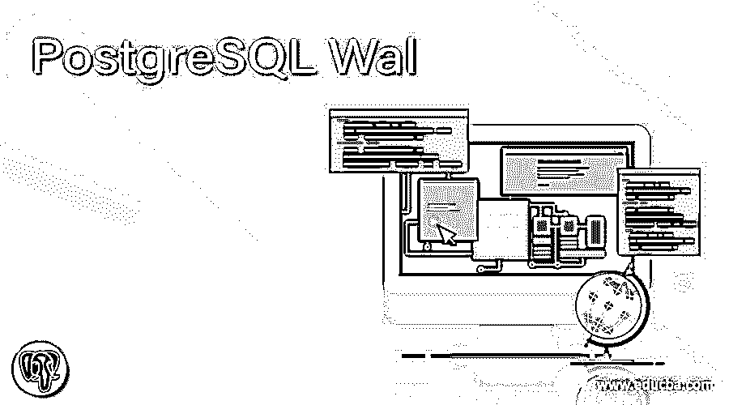
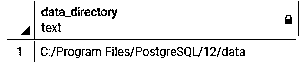

# PostgreSQL Wal

> 原文：<https://www.educba.com/postgresql-wal/>

## PostgreSQL Wal 的定义

PostgreSQL 为用户进行备份、继续备份和从备份中及时恢复提供了便利。这是 PostgreSQL 工具的主要任务，但是我们如何执行这个操作。这个问题的答案是，我们使用 PostgreSQL WAL，它可以在保存数据时最大限度地减少磁盘 I/O。WAL 的意思是预写日志。今天的所有数据库系统都使用 WAL 来提供持久的原子事务。当我们在数据库上执行写操作时，WAL 以顺序的方式将事务存储到日志文件中。WAL 对于在特定时间段内维护服务器上的数据库修改非常有用，在此之后，它会被自动丢弃。WAL 的主要优点是，它是数据库的复制。

**语法:**

<small>Hadoop、数据科学、统计学&其他</small>

`wal_keep_segment`

**说明:**

在上面的语法中，我们使用 wal_keep_segment 来指定 pg_wal 目录中以前的日志文件段存储的最小数量。

`max_wal_size`

**说明:**

在上面的语法中，我们使用 max size 和 wal 来指定日志文件的最大大小，以增加 wal 限制。

### Wal 在 PostgreSQL 中是如何工作的？

下面我们来看看 WAL 在 PostgreSQL 中是如何工作的。

当我们在数据库中做一些更改时，WAL 文件将数据库的更改保存到 pg_wal 目录中。pg_wal 目录在 PostgreSQL 版本 10 中使用，在以前的版本中，我们将该目录称为 pg_xlog。我们可以在 wal_keep_segments 的帮助下控制所有的 wal 文件，我们还可以使用 max_wal_size 来控制 WAL 文件的大小。当我们写入数据时，它们被添加到 WAL 日志文件的末尾，其位置由日志序列号决定。日志序列号在事务中是唯一标识的。日志序列号用于表示 WAL 中的位置，这意味着当数据被插入或写入时，我们可以借助日志序列号看到这种信息。pg_lsn 是用于返回日志序列号的数据类型。

### 我们如何配置 Wal？

PostgreSQL 中的 WAL 配置决定了数据库如何工作，对于配置 WAL，我们需要两个重要的系统，如检查点和后台写入程序。下面我们来看看 WAL 中使用的不同内存区域。

#### 1.共享缓冲区

在 PostgreSQL.conf 文件中，有一个我们称为共享缓冲区的参数。它们被称为共享缓冲区，因为所有后台服务器都访问共享缓冲区。共享缓冲区用于确定为缓存数据分配的内存量，这意味着共享缓冲区的主要优势是提高系统速度和快速访问。

#### 2.脏页

当我们将数据更新或修改到内存中时，数据会存储到脏页中。脏页不同于共享缓冲区，磁盘称为脏页。

#### 3.检查指针

检查点用于在预写日志文件中创建检查点。当系统崩溃或事务失败时，这些检查点用于恢复系统。检查点的主要任务是显示所有数据在每个检查点都已更新。checkpoint_segment 用于显示两个检查点之间的最大日志，checkpoint_timout 用于显示两个检查点之间的最大时间，两个检查点之间的默认时间是 5 分钟或 300 秒。

#### 4.背景作家

后台写入器是一个子系统，它被保存在检查点，当修改数据到磁盘时，它分担检查点的一些负载，卸载检查点。

### 例子

让我们讨论一下 PostgreSQL Wal 的例子。

#### 示例#1

假设用户需要知道 pg_wal 日志目录的路径，这时你可以使用下面的语句。

`show data_directory;`

**说明:**

借助上面的语句，我们可以看到 pg_wal 目录路径。通过使用下面的快照来说明上述公告的最终结果。

让我们通过不同的例子来理解 WAL 日志文件在 PostgreSQL 中的工作，如下所示。

#### 实施例 2

假设我们需要找出一个过去的日志文件的 Wal keep 段，那么此时我们使用如下语句。

`cat postgresql.conf|grep -i wal_keep_segment;`

**说明:**

在上面的语句中，我们使用 cat 命令查找 PostgreSQL.conf 文件，然后使用 grep 命令从 PostgreSQL.conf 文件中找出指定的段，这意味着我们使用带有 wal_keep 段的 grep 命令来了解过去的日志文件段。.通过使用下面的快照来说明上述公告的最终结果。

#### 实施例 3

假设用户需要找出 wal 文件的最大大小，那么此时我们可以使用如下语法。

`cat postgresql.conf|grep -i max_wal_size;`

**说明:**

在上面的语句中，我们使用 cat 命令从您的系统位置找到 postgresql.conf 文件，然后使用 grep 命令从 postgresql.conf 文件中找到特定值，这意味着在上面的语句中，我们使用带有 max_wal_size 的 grep 命令来了解日志文件的最大大小，以提高 wal 日志文件的性能。.通过使用下面的快照来说明上述公告的最终结果。

### WAL 存档

PostgreSQL 中 WAL 的主要目的是保护数据完整性。PostgreSQL 中主要有以下三种备份数据的方法。

**1。转储**

pg_dump 实用程序用于在 PostgreSQL 中导出数据库，并将内容转储到文件中。这个文件主要用于备份数据，转储文件是一致的，这意味着它们代表数据库的状态。

**2。文件级备份**

这是备份数据的第二种方法，与第一种方法相比速度更快。在这种方法中，我们直接从系统中复制文件并存储在另一个位置，并根据需要使用它们。

**3。存档**

这一点我们已经在 WAL 中讨论过了，PostgreSQL 中存档的主要目的是在我们使用检查点来恢复数据时，当系统崩溃或任何故障可能发生时，我们可以恢复数据。必须将 WAL archiving it 设置为用于备份的复制副本，并且我们通过使用指定的命令来激活归档模式。

### 结论

我们希望从这篇文章中你已经了解了 **PostgreSQL** **WAL** 。从上面的文章中，我们学习了基本语法 **PostgreSQL** **WAL** 。此外，我们还发现了如何在 PostgreSQL 中使用每种技术的不同示例来实施它们。从本文中，我们了解了如何在 PostgreSQL 中处理 **WAL** 。

### 推荐文章

这是一个 PostgreSQL Wal 的指南。这里我们讨论定义，语法，Wal 在 PostgreSQL 中是如何工作的？并分别举例说明。您也可以看看以下文章，了解更多信息–

1.  [PostgreSQL 文本搜索](https://www.educba.com/postgresql-text-search/)
2.  [PostgreSQL 分区](https://www.educba.com/postgresql-partition/)
3.  [PostgreSQL 缓存](https://www.educba.com/postgresql-caching/)
4.  [PostgreSQL 枚举](https://www.educba.com/postgresql-enum/)