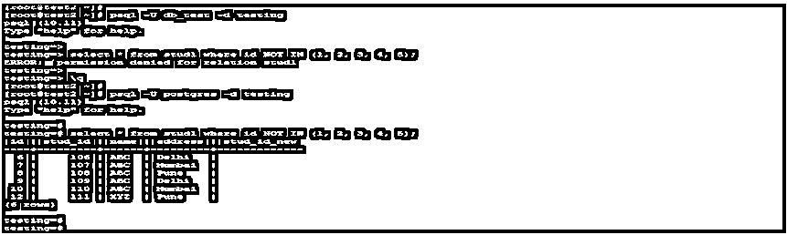
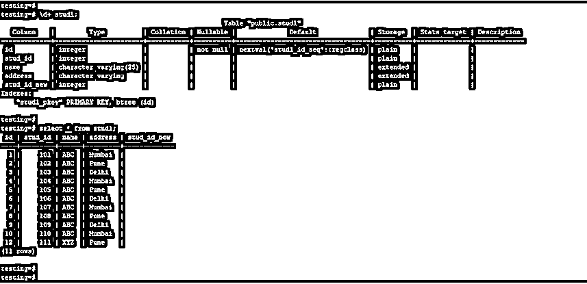
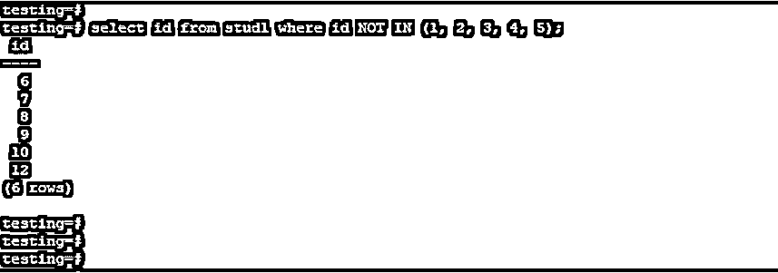
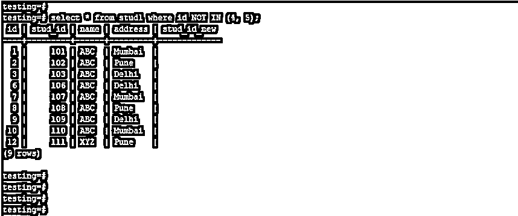

# PostgreSQL 不在

> 原文：<https://www.educba.com/postgresql-not-in/>

## PostgreSQL 的定义不在

PostgreSQL NOT IN condition 是 NOT 和 IN condition 的组合，PostgreSQL 中的 NOT IN condition 将返回在我们搜索的指定列中未找到的值。我们可以在 PostgreSQL 的子查询中使用 NOT IN 条件，我们可以找到排除在 select 查询中使用的值的结果。我们还使用了 NOT 操作符和 IN 条件从表中检索相同的结果。

**语法:**

<small>Hadoop、数据科学、统计学&其他</small>

下面是 PostgreSQL 中 NOT IN 运算符的语法。

`select column_name1, column_name2, column_name3, …, column_nameN from name_of_table Where column_name **NOT IN**(value1, value2, value3, …, valueN);`

**参数:**

下面是 PostgreSQL 中 NOT IN 运算符的参数描述语法。

*   **Select:** 我们在 PostgreSQL 中使用 NOT IN 条件时选择了一列或多列。使用 select 语句，我们必须使用 PostgreSQL 中的 NOT IN 条件来检索结果。
*   **From:** 该关键字用于选择表名，以便在 PostgreSQL 中使用 NOT IN 运算符。我们使用 from 关键字来指定 PostgreSQL 中的列名。
*   **表名:**我们可以使用 PostgreSQL 中的 NOT IN 条件来定义从中检索数据的表名。我们使用 NOT IN 条件使用任何表来检索数据。
*   **Where 条件:**该条件用于使用 PostgreSQL 中的 NOT IN 条件指定列条件。
*   **NOT IN:**PostgreSQL 中的这个条件定义为使用 PostgreSQL 中的 NOT IN 条件从表中检索值。
*   **值 1 到值 N:** 我们通过使用 NOT IN 条件从输出中排除了该值，以显示指定的结果。

### 如何在 PostgreSQL 中实现非条件工作？

*   下面是 PostgreSQL 中 NOT IN 条件的工作原理。我们必须使用 NOT IN 条件，基本上我们必须从输出中排除指定的值结果。
*   如果我们想从列输出中排除指定的值，那么我们在 PostgreSQL 中使用 NOT IN 条件。
*   如果假设我们必须从学生表中排除一些学生编号，那么我们在 PostgreSQL 中使用 NOT IN 条件。
*   要使用 PostgreSQL 中的 select 语句执行 NOT 条件，我们需要对表拥有 select 权限，或者我们需要拥有超级用户权限来执行 NOT IN 条件语句。
*   下面是 NOT IN condition with select 语句的示例。在 PostgreSQL 中，执行 NOT IN condition with select 语句需要表的 select 权限或超级用户权限。

`psql -U db_test -d testing
select * from stud1 where id NOT IN (1, 2, 3, 4, 5);
psql -U postgres -d testing
select * from stud1 where id NOT IN (1, 2, 3, 4, 5);`

*   在上面的第一个例子中，我们使用了用户 db_test，该用户没有 select student 表或超级用户的权限，因此在执行 select 语句时会出现错误。
*   在第二个示例中，我们使用用户名 Postgres 选择了 stud1 表中的行，使用该用户后，我们必须从 stud1 表中选择数据。
*   NOT IN condition 主要用于通过从列中排除指定的值来从表中检索数据。
*   我们还可以在 PostgreSQL 中使用 NOT IN 条件和 and 运算符。我们还可以通过使用不等于和 and 运算符来编写 NOT IN 查询。
*   使用 not equal 和 and 运算符返回的输出与 PostgreSQL 中 NOT IN 条件返回的输出相同。

### 不在中的 PostgreSQL 示例

*   下面是 PostgreSQL 中 NOT IN 条件的一个示例。我们已经用 stud1 表描述了 PostgreSQL 中 NOT IN 条件的例子。
*   下面是 stud1 表的表格和数据描述。

`\d+ stud1;
select * from stud1;`

**1。选择单列**不符合条件

*   在下面的示例中，我们使用了一个包含 NOT in 条件的单列。我们从 stud1 表中选择了 id 列。

`select id from stud1 where id NOT IN (1, 2, 3, 4, 5);`

**2。通过选择所有列**不符合条件

*   在下面的例子中，我们使用了 NOT in 条件下的所有列。我们已经选择了 stud1 表中的所有列。

`select * from stud1 where id NOT IN (4, 5);`

**3。使用不等于和 and 运算符**的 NOT IN 条件

*   在下面的示例中，我们通过使用不等于和 and 运算符使用了 NOT IN 条件。我们已经选择了 stud1 表中的所有列。

`select * from stud1 where id <> 12 AND id <> 10 AND id <> 10;`

### 优势

一些优点是:

*   以下是 PostgreSQL 中 NOT IN 条件的优点。
*   NOT IN 条件是从表中排除特定值。
*   我们可以使用等于和 and 运算符来使用 NOT IN 条件。
*   我们可以选择单个或多个不符合条件的列。
*   我们也可以在子查询中使用 NOT IN 条件。

### 推荐文章

这是 PostgreSQL 的指南，不在。在这里，我们还将讨论 not in 条件在 postgresql 中的定义和工作原理。以及不同的示例及其代码实现。您也可以看看以下文章，了解更多信息–

1.  [PostgreSQL 日期时间](https://www.educba.com/postgresql-datetime/)
2.  [PostgreSQL 日志查询](https://www.educba.com/postgresql-log-queries/)
3.  [PostgreSQL 墙](https://www.educba.com/postgresql-wal/)
4.  [PostgreSQL 比较字符串](https://www.educba.com/postgresql-compare-strings/)