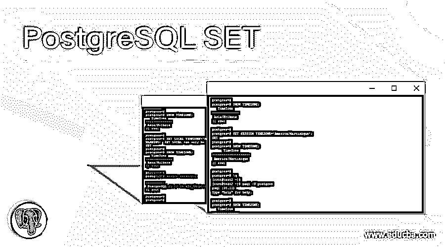
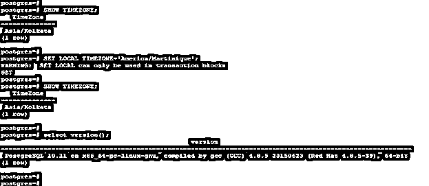
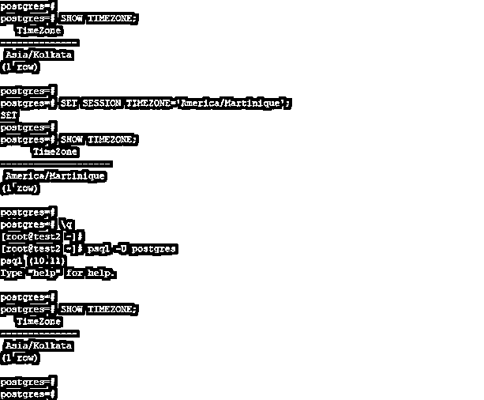
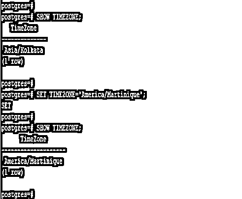
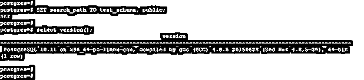
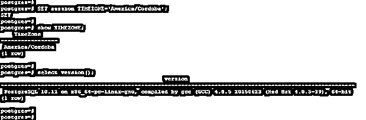
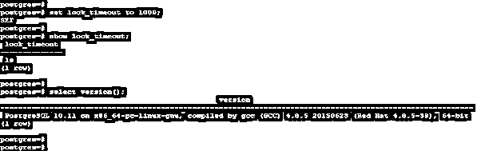
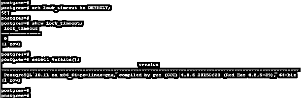

# PostgreSQL 集合

> 原文：<https://www.educba.com/postgresql-set/>

## PostgreSQL 集合的定义

PostgreSQL SET 命令用于更改来自数据库服务器的运行时配置参数，我们在运行时使用 PostgreSQL 中的 SET 命令更改了多个参数。使用 set 命令，我们可以在运行时更改参数值，无需重启数据库服务即可使这些参数生效。我们可以设置参数值只有当前会话，我们已经连接，其他用户不会影响这些参数。当我们使用 set 命令设置任何参数时，稍后运行的事务被中止。当我们回滚事务时，set 命令的效果被禁用。

**语法:**

<small>Hadoop、数据科学、统计学&其他</small>

下面是 PostgreSQL 中 set 命令的语法。

*   SET [ LOCAL | SESSION(在会话或本地级别设置参数)] configuration_parameter_name(我们为会话或本地级别设置的配置参数名称){ TO | = } { value(参数的值。)|默认}
*   SET [ LOCAL | SESSION(在会话或本地级别设置参数)]时区{ timezone(我们设置的时区值)| LOCAL | DEFAULT }

**下面是 PostgreSQL 中 set 命令的参数描述语法。**

*   **Set-**这是 PostgreSQL 中的命令，用于在会话或本地级别设置参数。在 PostgreSQL 中设置参数值只会影响当前的参数会话。该命令是 PostgreSQL 中使用的运行时配置参数。
*   **Local–**Local 定义为使用 Local 的 set 命令只对我们正在运行的当前事务有效。commit 或 rollback 之后它将不再生效，我们需要再次设置 is。
*   **会话–**会话被定义为使用会话级别的 set 命令，它只对我们正在运行的当前会话有效。
*   **配置参数名称–**这是我们在 PostgreSQL 中使用 set 命令设置的参数名称。
*   **Value–**这是我们使用 PostgreSQL 中的 set 命令设置的参数的新值。
*   **时区—**set 命令中的时区参数定义为当前交易或当前会话的设置时区。
*   **默认—**定义为设置当前交易或会话的默认时区。默认时区是服务器当前时区。

### PostgreSQL 中如何设置工作？

下面是 PostgreSQL 中 set 命令的工作方式。

*   Set 是 PostgreSQL 的元数据命令，用于在 PostgreSQL 中将参数值设置为会话级或本地级。
*   Set 命令在 PostgreSQL 中更为重要和有用，它为用户设置当前事务或会话的参数。
*   我们可以将连接用户的值设置为本地和会话级别。如果我们将参数值设置为 local，那么这个参数的效果只是我们在数据库服务器上运行的当前事务。
*   以下示例显示，在使用本地级别设置参数值后，仅在当前事务运行前有效。

`SHOW TIMEZONE;
SET LOCAL TIMEZONE='America/Martinique';
SHOW TIMEZONE;\`

*   上面的例子表明，如果我们在本地级别设置时区值，它只会对我们在服务器上运行的当前事务产生影响。
*   如果我们将参数值设置为会话级，则此参数的影响仅是我们在数据库服务器上运行的当前会话。
*   下面的例子表明，在使用会话级设置参数值之后，它只在当前会话运行之前有效。

`SHOW TIMEZONE;
SET SESSION TIMEZONE='America/Martinique';
SHOW TIMEZONE;`

*   上面的例子表明，如果我们在会话级别设置时区值，它只会对我们在服务器上运行的当前会话产生影响。
*   默认情况下，set timezone 在会话级别设置。下面的例子说明了设置参数值的默认级别如下。

`SHOW TIMEZONE;
SET TIMEZONE='America/Martinique';
SHOW TIMEZONE;`

*   在上面的例子中，我们没有使用任何级别来设置参数值。我们使用默认级别来设置 PostgreSQL 中的参数值。
*   我们还可以使用 PostgreSQL 中的 set 命令设置整数的时区值。
*   在 PostgreSQL 中，set 命令的名称不需要区分大小写。我们可以用它作为 set 或 SET。在 PostgreSQL 中使用 set 命令时，无需使用区分大小写的字母。
*   通过使用 set_config 函数，我们可以使用 set 命令的相同功能。我们也可以通过更新 pg_settings 的系统视图获得相同的结果。

### 例子

下面是 PostgreSQL 中 set 命令的一个示例。

#### 示例# 1–使用 Set 命令设置模式搜索路径

下面的例子说明了在 PostgreSQL 中设置公共模式的搜索路径。

*   我们已经将公共模式名的搜索路径设置为 test_schma。

`SET search_path TO test_schema, public;`

#### 例 2-**使用 Set 命令**设置时区

以下示例显示了如何使用 PostgreSQL 中的 set 命令设置时区。

*   我们已经将时区设置为“美洲/科尔多瓦”作为会话级别。

`SET session TIMEZONE='America/Cordoba';
show TIMEZONE;`

#### 示例# 3–使用 Set 命令设置参数值

以下示例显示了如何使用 PostgreSQL 中的 set 命令在会话级别更改参数值。

*   在下面的示例中，我们将 lock_timeout 参数值更改为 1000 毫秒。

`set lock_timeout to 1000;
show lock_timeout;`

#### 示例# 4–使用 Set 命令将参数值设置为默认值

以下示例显示了使用 PostgreSQL 中的 set 命令在会话级别更改默认参数值。

*   在下面的例子中，我们已经将 lock_timeout 参数的值更改为默认值。

`set lock_timeout TO DEFAULT;
show lock_timeout;`

### 结论

PostgreSQL 中的 Set 命令基本上是用来改变参数值的。我们可以在本地和会话级别更改参数值。如果我们在会话级设置参数值，那么参数的作用域只在会话级有效。local 的作用域仅对单个事务有效。

### 推荐文章

这是一个 PostgreSQL 集合的指南。这里我们讨论一下入门，PostgreSQL 中 SET 是如何工作的？分别举例说明。您也可以看看以下文章，了解更多信息–

1.  [PostgreSQL 描述表](https://www.educba.com/postgresql-describe-table/)
2.  [PostgreSQL 缓存](https://www.educba.com/postgresql-caching/)
3.  [PostgreSQL 或](https://www.educba.com/postgresql-or/)
4.  [PostgreSQL 枚举](https://www.educba.com/postgresql-enum/)