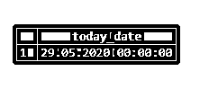
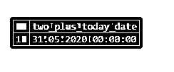
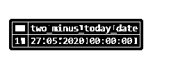
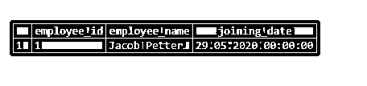

# PostgreSQL 当前日期

> 原文：<https://www.educba.com/postgresql-current-date/>

## PostgreSQL 当前日期的定义

我们可以通过使用 PostgreSQL current_date 函数来获取当前日期。PostgreSQL current_date 函数不接受任何变量或参数。即使 PostgreSQL current_date 是一个函数，但不要求在 PostgreSQL current_date 函数后添加括号()。PostgreSQL current_date 函数将返回“YYYY-MM-DD”格式的当前日期。我们可以对 PostgreSQL 版本使用 PostgreSQL current_date 函数，如 PostgreSQL 8.4、PostgreSQL 9.0、PostgreSQL 9.1、PostgreSQL 9.2、PostgreSQL 9.3 和 PostgreSQL 9.4 等。根据 PostgreSQL current_date 函数的执行日期，PostgreSQL current_date 函数将具有不同的日期。

### PostgreSQL Current_date 函数是如何工作的？

众所周知，PostgreSQL Current_date 函数返回“YYYY-MM-DD”格式的当前日期，这意味着，

<small>Hadoop、数据科学、统计学&其他</small>

*   YYYY 定义了四位数的年份。
*   MM 定义了两位数的月份，
*   DD 用两位数定义日期

为了理解 PostgreSQL Current_date 函数的工作原理，让我们考虑以下 PostgreSQL current_date 函数的示例。

1.  考虑以下将以“YYYY-MM-DD”格式返回当前日期的情况。

`SELECT current_date AS today_date;`

使用下面的快照说明上述语句的结果:

在上面的例子中，我们将得到如下工作的格式:

*   YYYY 定义了四位数的年份“2020”，
*   MM 定义的月份是两位数“05”，
*   DD 用两位数“29”来定义日期

2.  我们可以对当前日期执行加法或减法等算术运算，考虑下面的示例来理解带有加法或减法的 PostgreSQL current_date 函数。

`SELECT current_date + 2 AS two_plus_today_date;`

使用下面的快照说明上述语句的结果:

在上面的例子中，我们将得到如下工作的格式:

*   YYYY 定义了四位数的年份“2020”，
*   MM 定义的月份是两位数“05”，
*   DD 用两位数“31”来定义日期

`SELECT current_date - 2 AS two_minus_today_date;`

使用以下快照说明上述语句的结果:

在上面的例子中，我们将得到如下工作的格式:

*   YYYY 定义了四位数的年份“2020”，
*   MM 定义的月份是两位数“05”，
*   DD 用两位数“27”来定义日期

在上面的示例中，我们可以看到 PostgreSQL current_date 函数通过加上或减去等于(-)或(+)符号后面提到的数字的天数来返回当前日期。

3.  我们也可以在表创建中使用 PostgreSQL current_date 函数。我们可以使用 PostgreSQL current_date 函数为该列赋予默认值。根据 PostgreSQL current_date 函数的执行日期，PostgreSQL current_date 函数将具有不同的日期。

考虑下面的示例，我们将创建一个名为“Employee”的表，该表将包含数据类型为 date 的列“joining_date”。列“joining_date”将具有设置为当前日期的默认值，因为我们使用 PostgreSQL current_date 函数来设置默认值，并且这是 PostgreSQL current_date 函数的结果。

考虑下面的 CREATE TABLE 语句，它将创建一个名为“Employee”的表。

`CREATE TABLE Employee(
Employee_id serial PRIMARY KEY,
Employee_name varchar(255) NOT NULL,
joining_date DATE DEFAULT CURRENT_DATE
);`

现在，我们将使用 INSERT INTO 语句在 Employee 表中插入一行，如下所示:

`INSERT INTO Employee(Employee_name)
VALUES('Jacob Petter');`

在上面的 INSERT INTO 语句中，我们没有指定加入日期，因此 PostgreSQL 将默认值设置为当前日期。

使用下面的 SQL 语句和一个快照来说明 Employee 表的结果。

`SELECT * FROM Employee;`

在上述加入日期示例中，我们使用了 CURRENT_DATE 格式，如下所示:

*   YYYY 定义了四位数的年份“2020”，
*   MM 定义的月份是两位数“05”，
*   DD 用两位数“29”来定义日期

根据 SQL 查询的执行日期，Employee 表的“joining_date”列中会插入不同的日期。例如，如果某人明天加入一家公司，我们如上所述在 SQL 语句中执行 insert，那么加入的日期就是明天。

### 结论 PostgreSQL 当前日期

我们希望通过上面的文章，您已经理解了如何使用 PostgreSQL 当前日期以及 PostgreSQL 当前日期是如何工作的。另外，我们还添加了几个 PostgreSQL PostgreSQL 当前日期的例子来详细了解它。

### 推荐文章

这是一个 PostgreSQL 当前日期的指南。在这里，我们还将讨论 PostgreSQL Current_date 函数的描述、语法、参数和工作原理。和不同的例子，及其代码实现。您也可以看看以下文章，了解更多信息–

1.  [PostgreSQL 链接](https://www.educba.com/postgresql-link/)
2.  [PostgreSQL 集合](https://www.educba.com/postgresql-set/)
3.  [PostgreSQL 整数](https://www.educba.com/postgresql-integer/)
4.  [PostgreSQL 字符变化](https://www.educba.com/postgresql-character-varying/)