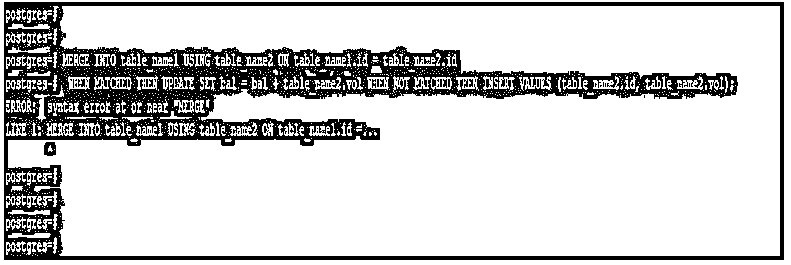
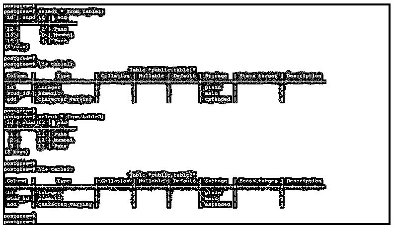
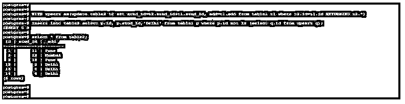
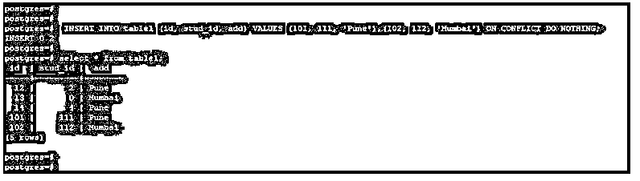
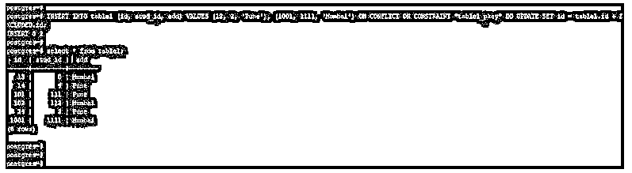

# PostgreSQL 合并

> 原文：<https://www.educba.com/postgresql-merge/>

## PostgreSQL 合并简介

PostgreSQL Merge 用于合并两个表，要实现合并表，我们需要对表使用唯一索引，重复记录检查很容易执行。没有唯一索引也可以合并表，但是在 PostgreSQL 中合并两个表之前，我们需要锁定表。合并两个表是非常重要和有用。Merge 与 PostgreSQL 中的 upsert 命令相关，upsert 命令是从 PostgreSQL 版本 9.5 引入的，在 PostgreSQL 中没有类似 merge 的命令。我们通过使用 insert on conflict 来实现合并。

**语法:**

<small>Hadoop、数据科学、统计学&其他</small>

下面给出了语法:

1.使用 upsert 合并表格。

`WITH upsert as (update name_of_tableset condition from name_of_table d where condition
insert into name_of_table select name_of_column1, name_of_column2, .., name_of_columnN from name_of_table where condition;`

2.使用 insert on conflict do update 合并表。

`INSERT INTO name_of_table (name_of_column1, name_of_column2, .., name_of_columnN) VALUES (value1, value2, …, valueN)ON CONFLICT (name_of_column)DO UPDATE set condition;`

3.使用 insert on conflict 合并表什么也不做。

`INSERT INTO name_of_table (name_of_column1, name_of_column2, .., name_of_columnN) VALUES (value1, value2, …, valueN)ON CONFLICT (name_of_column)DO NOTHING;`

下面是 PostgreSQL 中 merge 的参数描述语法:

*   **With upsert:** 基本上，合并命令在 PostgreSQL 中不可用，无法使用我们在 PostgreSQL 中与 upsert 和 insert on conflict 命令一起使用的合并命令。
*   **Update:** 我们在 PostgreSQL 中使用带有 upsert 和 insert on conflict 语句的 Update 语句来更新行并合并到表中。
*   **表名:**这被定义为用于合并两个表的表名，我们通过使用 PostgreSQL 中的 insert 和 update 语句来使用这两个表。
*   **列名:**我们已经使用了列名将值插入到列中，我们还在 PostgreSQL 中使用了 insert column with on conflict 语句。
*   **冲突时插入:**基本上，合并命令在 PostgreSQL 中不可用，无法使用我们与冲突时插入和 upsert 命令一起使用的合并命令。
*   **Set condition:** 在 PostgreSQL 中更新表中的行时，我们使用带有 upsert 语句的 Set condition。
*   **Where 条件:**在合并表时，我们在 insert on conflict 和 upsert 语句时使用 Where 条件。
*   **Select:** 该语句用于从另一个表中选择数据，选择后我们将相同的数据合并到该表中。
*   **Value1 到 valueN:** 这被定义为我们在将数据插入表格时使用列的值。

### PostgreSQL 中的 Merge 命令是如何工作的？

*   upsert 语句的功能是从 PostgreSQL 版本 9.5 中添加的。从 PostgreSQL 版本 9.5 中，我们使用 upsert 子句来合并 PostgreSQL 中的两个表。在 9.5 之前，merge 或 upsert 命令不可用。
*   Merge 命令不可用，使用该命令时将显示 merge 关键字的语法错误。
*   以下示例显示了合并命令在 PostgreSQL 中不可用，它将显示在 PostgreSQL 中使用时的错误。
*   在下面的例子中，我们使用了两个表名，即 table_name1 和 table_name2，以便使用 merge 命令进行合并。
*   但是它会给出错误，因为合并命令在 PostgreSQL 中不可用。

**代码:**

`MERGE INTO table_name1 USING table_name2 ON table_name1.id = table_name2.id WHEN MATCHED THEN UPDATE SET bal = bal + table_name2.vol WHEN NOT MATCHED THEN INSERT VALUES (table_name2.id, table_name2.vol);`

**输出:**

*   PostgreSQL 中的 Upsert 包含对表的普通插入，但它将在插入时包含 on conflict 约束。
*   与 insert 语句冲突时，指示语句中没有重复的字段。
*   Merge 主要用于合并两个表。我们可以将 merge 与 upsert 语句互换使用。
*   oracle、Teradata、db2、MSSQL、firebird、cubrid 和 vectorwise 等数据库将支持 merge SQL 语句的标准语法。
*   从 PostgreSQL 版本 9.1 开始，我们已经将公用表表达式语句用于大型查询。
*   每个辅助语句都被定义为公共表表达式。我们使用 CTE 来合并使用 upsert 语句的表。

### PostgreSQL 合并示例

下面是提到的例子:

我们使用表 1 和表 2 来描述 PostgreSQL 中的合并示例。

下面是 table1 和 table2 表的表格和数据说明。

**代码:**

`select * from table1;
\d+ table1;
select * from table2;
\d+ table2;`

**输出:**

#### 示例#1

使用 upsert 语句进行合并。

*   下面的例子显示了使用 upsert 语句进行合并。
*   我们使用了表 1 和表 2 来合并数据。

**代码:**

`WITH upsert as(update table2 t2 set stud_id=t2.stud_id+t1.stud_id, add=t1.add from table1 t1 where t2.id=t1.id RETURNING t2.*)
insert into table2 select p.id, p.stud_id,'Delhi' from table1 p where p.id not in (select q.id from upsert q);
select * from table2;`

**输出:**

#### 实施例 2

使用 insert on conflict 进行合并。

*   下面的例子表明，通过使用插入冲突进行合并什么也不做。

**代码:**

`INSERT INTO table1 (id, stud_id, add) VALUES (101, 111, 'Pune'),(102, 112, 'Mumbai') ON CONFLICT DO NOTHING;
select * from table1;`

**输出:**

#### 实施例 3

使用 insert on conflict do update 进行合并。

*   下面的例子说明了通过使用插入冲突合并做更新。
*   我们还对 id 列使用了合并操作。

**代码:**

`INSERT INTO table1 (id, stud_id, add) VALUES (13, 0, 'Mumbai'), (1001, 1111, 'Mumbai') ON CONFLICT ON CONSTRAINT "table1_pkey" DO UPDATE SET id = table1.id + EXCLUDED.id;
select * from table1;`

**输出:**

### 推荐文章

这是一个 PostgreSQL 合并的指南。这里我们讨论一下入门，PostgreSQL 中的 merge 命令是如何工作的？和示例。您也可以看看以下文章，了解更多信息–

1.  [PostgreSQL 引发异常](https://www.educba.com/postgresql-raise-exception/)
2.  [PostgreSQL MOD()](https://www.educba.com/postgresql-mod/)
3.  [PostgreSQL 文本](https://www.educba.com/postgresql-text/)
4.  [PostgreSQL TO_DATE()](https://www.educba.com/postgresql-to_date/)