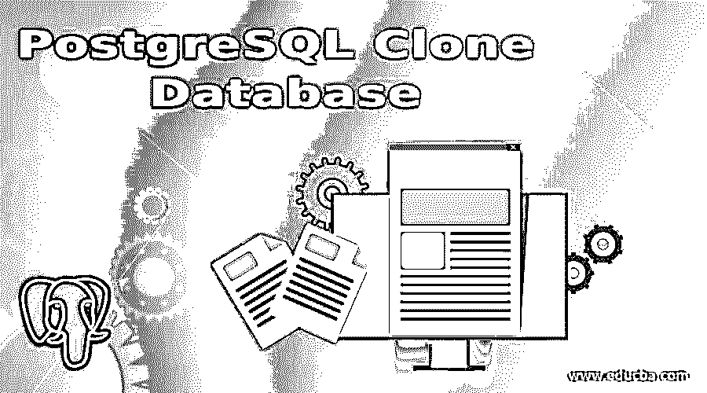
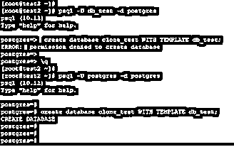
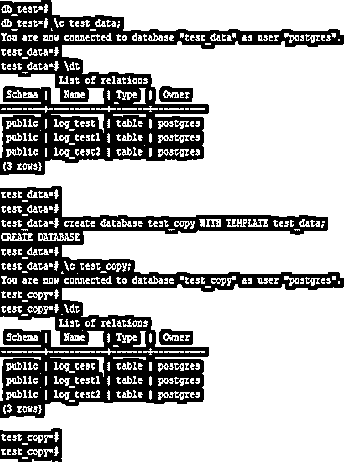
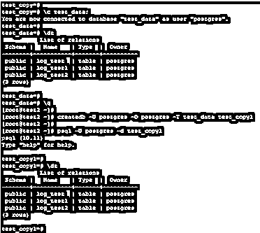
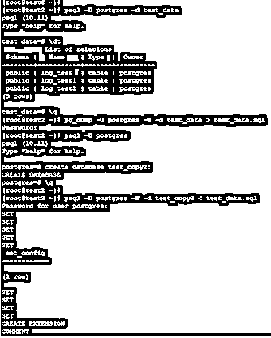
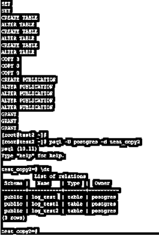

# PostgreSQL 克隆数据库

> 原文：<https://www.educba.com/postgresql-clone-database/>

## PostgreSQL 克隆数据库简介

PostgreSQL 克隆数据库定义为利用现有数据库创建新数据库；我们可以使用 PostgreSQL 中现有的数据库创建一个新的数据库。我们可以使用 create database 命令创建一个克隆；此外，我们可以使用 createdb 命令创建数据库的克隆。我们还通过使用 pg_dump 命令创建现有数据库的转储，创建了现有数据库的克隆；我们可以使用 pg_dump 创建现有数据库的备份，并在另一个数据库上恢复它。

### 克隆数据库的语法

以下是 PostgreSQL 中克隆数据库的语法:

<small>Hadoop、数据科学、统计学&其他</small>

**1。使用创建数据库命令**克隆数据库

`create database new_database_name (Name of new database which we have cloning from another database) WITH TEMPLATE old_database_name (Create new database by using old database template.);`

**2。使用 Createdb 命令**克隆数据库

`create db –O name_of_user –T old_database_name (Create new database by using old database template.) new_database_name (Name of new database which we have cloning from another database);`

**3。使用 pg_dump 命令**克隆数据库

`pg_dump –U name_of_user –W user_password –d name_of_database >backup_file_name.sql (Name of backup file which database we have cloning.)`

`psql –U name_of_user –W user_password –d (new database name) < backup_file_name.sql`

#### 因素

下面是参数描述语法:

**1。创建数据库:**创建数据库命令用于在 PostgreSQL 中创建新的数据库。我们已经使用 PostgreSQL 中的 create database 命令创建了数据库的克隆。

**2。新数据库名称:**这被定义为一个新的数据库名称，我们从这个数据库中克隆另一个数据库。

**3。旧数据库名称:**这被定义为旧数据库的名称，我们从这个名称克隆到新数据库。这是使用现有数据库克隆新数据库的一个重要且有用的参数。

**4。使用模板:**这被定义为使用已有的数据库模板创建一个数据库。我们可以使用 PostgreSQL 中现有的数据库创建一个新的数据库。

**5。Createdb:** 这被定义为使用 Createdb 命令创建一个新的数据库。我们已经使用 createdb 命令创建了一个新的数据库。

**6。用户名:**这被定义为使用现有数据库创建数据库克隆的用户名。

7 .**。Pg_dump:** 这被定义为使用 Pg_dump 命令创建数据库的转储。创建转储后，我们已经在另一个数据库中恢复了它。

**8。备份文件名:**这是我们使用 pg_dump 命令创建的备份文件名。

### 如何在 PostgreSQL 中克隆数据库？

下面是克隆数据库在 PostgreSQL 中的工作方式。我们已经使用 create database 命令和 pg_dump 命令创建了现有数据库的克隆。

*   要在 PostgreSQL 中执行 create database 和 createdb 命令(创建数据库的克隆)，我们需要拥有超级用户权限来执行该语句。
*   下面是一个创建数据库的例子。createdb 命令(创建数据库的克隆)需要超级用户权限来执行 createdb 命令(创建数据库的克隆)PostgreSQL。

**例 1**

**命令:**

`psql -U db_test -d postgres
create database clone_test WITH TEMPLATE db_test;`

**例 2**

**命令:**

`psql -U postgres -d postgres
create database clone_test WITH TEMPLATE db_test;`

**输出:**

**说明:**

*   在上面的第一个例子中，我们使用用户作为 db _ test 该用户没有超级用户权限，因此在执行 createdb(创建数据库的克隆)时会出现错误。
*   在第二个示例中，我们使用用户名 Postgres 创建了数据库的克隆；使用这个用户之后，我们已经创建了 db_test 数据库的克隆。
*   如果我们必须在同一台服务器上复制相同的数据库用于测试，我们使用 create database 命令；使用这个命令，我们已经创建了数据库的克隆。
*   如果我们同时在其他服务器上有一个副本数据库，我们已经在 PostgreSQL 中使用了 pg_dump 命令。
*   我们还使用 createdb 命令在 PostgreSQL 的现有服务器上创建了一个数据库的克隆。

### 实现 PostgreSQL 克隆数据库的示例

以下是克隆的示例:

#### 示例 1–使用 Create Database 命令克隆数据库

我们已经使用 PostgreSQL 中的 create database 命令创建了现有数据库的克隆。下面是使用 create database 命令创建现有数据库克隆的示例。

我们使用 test_data 数据库创建了数据库名称 test_copy。

**命令:**

`\c test_data;
\dt
create database test_copy WITH TEMPLATE test_data;
\c test_copy;
\dt`

**输出:**

#### 示例 2–使用 Createdb 命令克隆数据库

我们已经使用 PostgreSQL 中的 createdb 命令创建了现有数据库的克隆。下面是使用 createdb 命令创建现有数据库的克隆的示例。

我们使用 test_data 数据库创建了一个名为 test_copy1 的数据库。

**命令:**

`\c test_data;
\dt
create db -U postgres -O postgres -T test_data test_copy1
psql -U postgres -d test_copy1
\dt`

**输出:**

#### 示例 3–使用 Createdb 命令克隆数据库

我们已经使用 PostgreSQL 中的 pg_dump 命令创建了现有数据库的克隆。下面是使用 pg_dump 命令创建现有数据库克隆的示例。

我们使用 test_data 数据库创建了一个名为 test_copy2 的数据库。

**命令:**

`psql -U postgres -d test_data
\dt
\q
pg_dump -U postgres -W -d test_data > test_data.sql
psql -U postgres
create database test_copy2;
psql -U postgres -W -d test_copy2 < test_data.sql`

**输出:**

**命令:**

`psql -U postgres -d test_copy2
\dt`

**输出:**

### 推荐文章

这是一个 PostgreSQL 克隆数据库的指南。在这里，我们讨论 PostgreSQL 克隆数据库及其参数的介绍，以及实际的例子和不同的子查询表达式。您也可以浏览我们推荐的文章，了解更多信息——

1.  [PostgreSQL 时间戳简介](https://www.educba.com/postgresql-timestamp/)
2.  [如何在 PostgreSQL 中通知 Works？](https://www.educba.com/postgresql-notify/)
3.  [PostgreSQL JSON(示例)](https://www.educba.com/postgresql-json/)
4.  [PostgreSQL 时间戳简介](https://www.educba.com/postgresql-timestamp/)