# PostgreSQL 显示数据库

> 原文：<https://www.educba.com/postgresql-show-databases/>

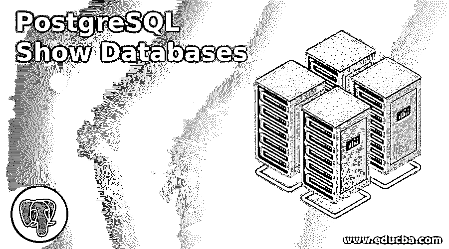

## PostgreSQL Show 数据库简介

PostgreSQL 提供了显示数据库命令。show database 命令用于查看服务器上有多少数据库，该命令适用于命令行工具 psql 以及 pgadmin4 中的查询工具，这是管理员最常见的任务。PostgreSQL，其中单个 progres(默认为数据库)能够存储多个数据库，每个数据库存储一组文件。PostgreSQL 为用户提供了不同类型的功能，如创建数据库、删除数据库和显示数据库等。

Psql 提供了连接服务器和对服务器执行不同查询的工具。MySQL 使用 show databases 命令来显示数据库，但是 show database 语句不能直接在 PostgreSQL 中工作，它提供了一些不同的元命令来显示数据库和不同的查询语句。

<small>Hadoop、数据科学、统计学&其他</small>

### PostgreSQL 显示数据库的语法

下面给出了语法:

`\l or \list`

**说明:**

*   在上面的语法中，其中\l 用于列出来自服务器的所有数据库列表和同一个数据库列表，我们可以通过使用另一个语法 **\** 得到 list。
*   这两种语法的功能是相同的。这是一个元命令，我们直接在终端上执行。

`select datname from pg_database;`

**说明:**

*   在上面的语法中，datname 用于显示 pg *_* 数据库中的可用数据库，默认情况下，它用于存储所有数据库。

### PostgreSQL 中的 Show Databases 语句是如何工作的？

在去看如何显示数据库语句是如何工作的之前，我们需要如下一些先决条件:

*   首先，您必须在系统上安装 PostgreSQL。
*   使用以下命令检查 PostgreSQL 是否正常工作。如果状态为活动，则意味着 PostgreSQL 安装成功。

**代码:**

`service postgresql status`

*   另外，安装 psql 命令行 PostgreSQL 接口。
*   用户可以使用多个数据库，但是在客户机和服务器之间建立连接后，就可以访问这些数据库。
*   在 show database 命令的帮助下，用户通过使用 like 运算符对数据库执行不同的操作。

如下所示显示数据库语句:

**代码:**

`\l`

这是 Meta 命令，它用于 PostgreSQL 数据库的数据库列表。

**输出:**

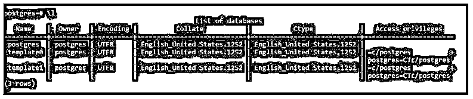

在上面的屏幕快照中，它列出了服务器上存在的所有数据库。

**代码:**

`\list`

这也是元命令，\List 的功能与\l 相同。

**输出:**

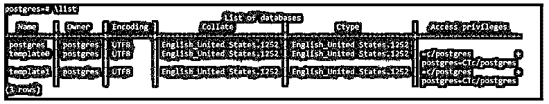

我们使用下面的语句创建数据库。

**代码:**

`create  database  test;`

**输出:**

然后使用\list Meta 命令查看数据库。

**代码:**

`\list`

**输出:**

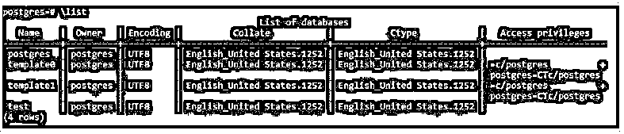

我们还可以使用 PostgreSQL 查询来显示数据库:

#### 示例#1

首先，我们创建一个名为 demo 的数据库。

**代码:**

`create  database   demo;`

**输出:**

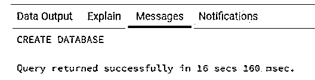

在我们执行如下显示数据库查询之后:

**代码:**

`select    datname     from    pg_database;`

**输出:**

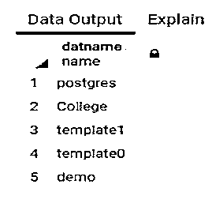

在上面的快照中，创建的数据库演示显示在第五个数字中。

数据库的另一个例子是，在创建一个新的数据库之前，我们需要在使用下面的查询时查看服务器上有多少数据库可用。

**代码:**

`select    datname    from    pg_database;`

**输出:**

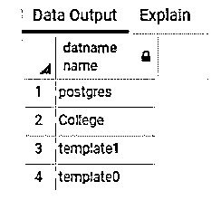

上面的快照显示了 3 个默认数据库，如 Postgres、template1、template0 和 college 是用户创建的数据库。

#### 实施例 2

PostgreSQl 提供了创建数据库的工具。

**代码:**

`create  database  demo1  with  owner =pg_monitor;`

在上面的语句中，我们使用 create a 语句创建了一个数据库，并使用所有者 pg_monitor 创建了一个 demo1 数据库。

**输出:**

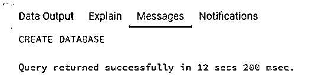

现在可以看到数据库列 demo1 已创建。

**代码:**

`select   datname  from   pg_database;`

**输出:**

**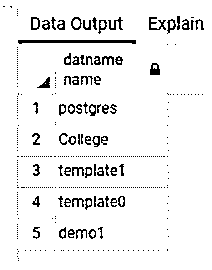

** 

#### 实施例 3

在 PostgreSQL 中，默认情况下数据库是 Postgres，但是不同的用户创建了许多数据库，我们只需要看到这些名称以 d 字符开头。PostgreSQL 提供了这样一种工具。

**代码:**

`Select   datname      from    pg_database
where      datname     like 'd%';`

**说明:**

*   在上面的语句中，我们使用 like 操作符找出名称以 d 开头的所有数据库。

**输出:**

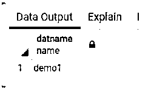

让我们看看另一种情况:假设我们需要一个名称以 e 结尾的数据库。

**代码:**

`select      datname       from   pg_database
where      datname     like '%e';`

在上面的语句中，datname 是数据库名，pg_database 默认为 PostgreSQL 的数据库，这里我们使用 like 运算符来表示数据库。

**输出:**

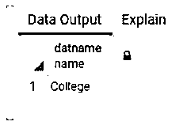

#### 实施例 4

假设在我们的服务器中存在数据库号，我们不希望看到这些数据库名称以 t 开头。

**代码:**

`select   datname     from      pg_database
where   datname   not like 't%';`

**说明:**

*   在上面的语句中，我们使用 not like 操作符来获得想要的结果。

**输出:**

上述语句执行前的结果如快照所示。

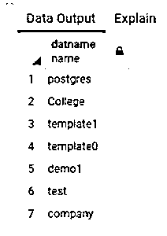

执行上述语句后的结果如快照所示。

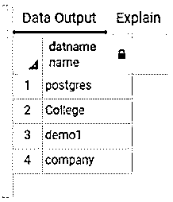

在上面的快照中，它丢弃了以 t 字符开头的数据库名称。

### 结论

从上面的文章中，我们看到了 show database 元命令，以及我们通过使用查询语句来实现 show database。在查询语句中，我们使用 like 操作符对数据库执行平滑搜索，这意味着根据我们的要求，我们执行 show database。最后是 PostgreSQL 中节省时间的过程。

### 推荐文章

这是一个 PostgreSQL 显示数据库的指南。这里我们讨论 PostgreSQL 中的介绍以及 show databases 语句是如何工作的？您也可以看看以下文章，了解更多信息–

1.  [PostgreSQL 最大值](https://www.educba.com/postgresql-max/)
2.  [PostgreSQL 引发异常](https://www.educba.com/postgresql-raise-exception/)
3.  [PostgreSQL 逻辑复制](https://www.educba.com/postgresql-logical-replication/)
4.  [PostgreSQL 格式化程序](https://www.educba.com/postgresql-formatter/)