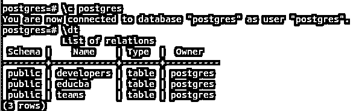
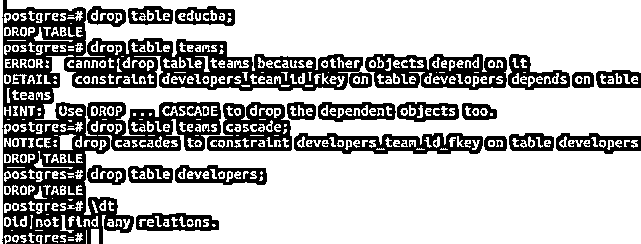
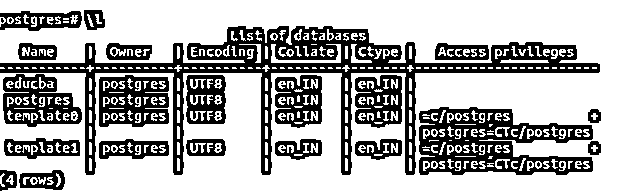
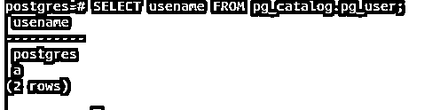
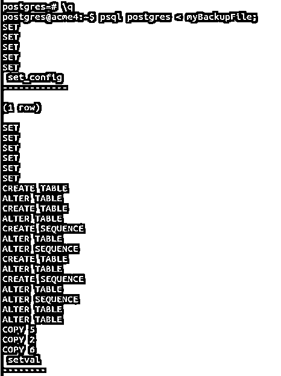
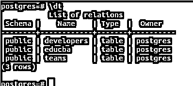
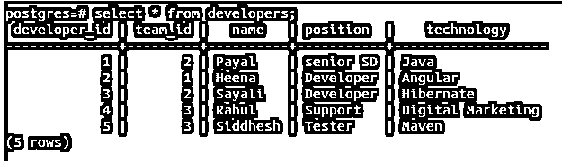

# Postgres 转储数据库

> 原文：<https://www.educba.com/postgres-dump-database/>

## Postgres 转储数据库简介

如果您在客户的生产环境中使用 PostgreSQL 数据库，那么您需要确保您的数据库始终正常工作，并且全天候可用。为了数据库的可用性，您必须经常备份您的客户端数据库。如果数据库损坏、崩溃或丢失，您应该能够恢复数据库中的数据。因此，PostgreSQL 为我们提供了一个使用 pg_dump 实用程序转储数据库的工具。这个实用程序的优点是它不是特定于服务器端版本的，甚至可以在具有不同体系结构的机器上工作。例如，如果您从 32 位体系结构的机器上转储数据库，然后在 64 位机器上使用它，那么它将正常工作。

您必须经常转储数据库，以使数据库的更新备份可用。每当恢复备份时，数据库将返回到使用 pg_dump 创建转储文件时的状态。使用 pg_dump 实用程序而不是文件级备份和归档的另一个优点是，它不特定于 PostgreSQL 服务器的版本。

<small>Hadoop、数据科学、统计学&其他</small>

此外，在 pg_sump 期间运行的数据库操作不会被锁定，而是在后台运行，除了一些与结构更改相关的操作(如 ALTER TABLE)被阻塞。如果您的数据库模式依赖于 oid(比如外键),那么您必须在 pg_dump 命令中指定 external -o。为此，您还需要转储 oid。

**语法:**

`pg_dump databaseName > outputFile`

*   **pg _ dump**–这是 PostgreSQL 中提供的实用程序，用于将数据库的当前状态存储到一个文件中，该文件包含在数据库服务器上运行的命令，这些命令将使用相同的命令重新创建数据库转储时的状态。它是一个客户端程序，需要通过 Linux 命令行提示符运行。
*   **databaseName**–这是您想要转储的数据库的名称。
*   **output file**–这是转储完成后需要创建的文件的名称。

pg_dump 进程只需要由超级用户登录来完成，因为它拥有读取所有数据库和表的权限。不过，您确实有远程转储数据库的工具。默认情况下，环境变量 PGHOST、PGPORT 和 PGUSER 被视为 localhost、5432 和用户名，默认情况下使用它们连接到与操作系统的用户名相同的数据库。

您可以在 pg_dump 命令中使用选项-h 表示主机，使用选项-p 表示端口来更改 PGHOST 和 PGPORT。要更改和覆盖 PGUSER 变量，可以在语句中使用-U 选项。所有这些都使用客户端身份验证机制来确认。

**例如**

`pg_dump postgres > myBackupFile
ls`

检查文件是否创建成功。让我们使用 ls 命令列出当前目录中的所有文件

现在，我们转储的备份文件已经准备好了，它的名称是 myBackupFile。

让我们通过使用\dt 命令检查 Postgres 数据库的所有表来查看它的内容。

`\c postgres
\dt`

因此，它包含三个表，我们将一个接一个地删除它们。通过使用这些命令

`drop table educba;
drop table teams cascade;
drop table developers;
\dt`

然后进一步检查它们是否都被\dt 命令删除了。

所以，现在我的数据库 Postgres 中不包含任何表。现在，我们将学习如何将数据恢复到数据库中。

### 恢复转储

现在，如果我们有备份文件，我们可以随时恢复数据库，以防数据库损坏或丢失。但是，在恢复之前，您需要考虑一些事情。您尝试还原的数据库应该在数据库服务器上。如果没有，那么您应该在命令的帮助下创建数据库

`createdb -T template0 Postgres`

在我们的情况下。由于数据库已经存在，可以使用命令\l 进行检查，这将导致数据库服务器跟进，因此我们现在不需要执行 createdb 命令。

`\l`

另一件事是确保您要恢复的数据库应该已经包含了对其拥有权限的所有用户。在我们的例子中，Postgres 用户是 Postgres 数据库的所有者。因此，或数据库服务器应该已经有一个名为 Postgres 的用户，否则在还原时会出现错误。您可以通过发出以下命令来检查这一点

`SELECT usename FROM pg_catalog.pg_user;`

这会导致以下结果

现在，由于 Postgres 数据库和 Postgres 用户已经存在于我的数据库服务器中。我可以使用以下命令来恢复数据库

`psql postgres < myBackupFile;`

因为恢复转储的语法是

`psql empty_database < backup_file`

其中，empty_database 是您要恢复的数据库，backup_file 是 pg_dump 命令生成的文件。

`psql postgres < myBackupFile;`

给出如下输出。

现在，如果我们使用命令\dt 检查 Postgres 数据库的内容，它会给出如下输出

此外，所有表的内容都被正确恢复——

`select * from developers;`

### 处理恢复错误

即使中间发生任何错误，PostgreSQL 也会继续还原数据库。它只在恢复完成的最后才告诉我们。在这种情况下，数据库恢复不完全。如果希望在出现错误时停止恢复过程，可以使用–

`psql --set ON_ERROR_STOP=on postgres < myBackupFile`

ON_ERROR_STOP 选项可帮助您在发生错误时停止还原过程。现在，如果您希望以事务性方式执行恢复，即要么应该恢复整个数据库，要么什么都不恢复，那么您可以使用-1 或-single-transaction 选项使其成为事务性过程。

`psql -1 postgres < myBackupFile`

要将当前数据库服务器中的所有数据库转储到一个文件中，可以使用 pg_dumpall 实用程序，并在恢复时提供默认数据库。

### 结论:Postgres 转储数据库

我们可以转储我们的数据库，以便在 PostgreSQL 中使用 pg_dump 从数据库中获得的数据出现任何问题时，可以在不久的将来使用备份来恢复数据库。

### 推荐文章

这是一个 Postgres 转储数据库的指南。这里我们讨论 Postgres 转储数据库的介绍、语法、参数以及代码实现的例子。您也可以看看以下文章，了解更多信息–

1.  [PostgreSQL 链接](https://www.educba.com/postgresql-link/)
2.  [PostgreSQL 查询优化](https://www.educba.com/postgresql-query-optimization/)
3.  [PostgreSQL 索引类型](https://www.educba.com/postgresql-index-types/)
4.  [PostgreSQL 角色](https://www.educba.com/postgresql-roles/)