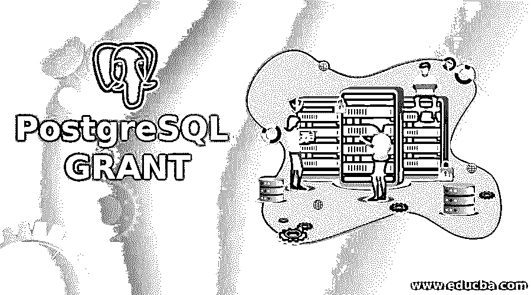
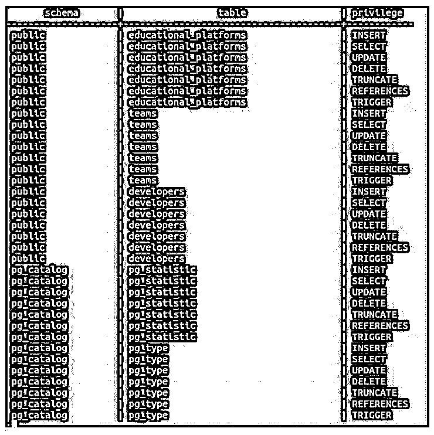
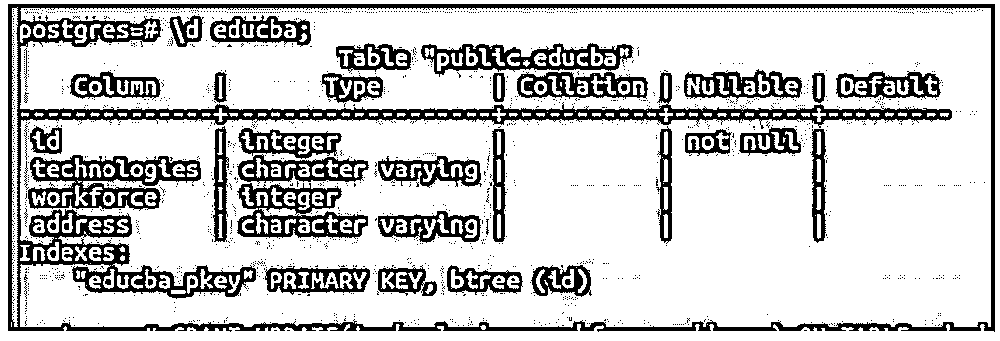
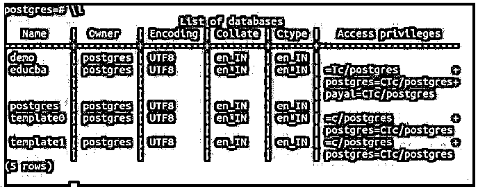
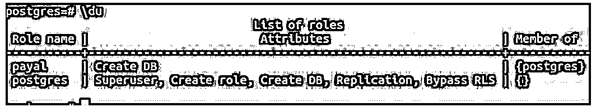

# PostgreSQL 授权

> 原文：<https://www.educba.com/postgresql-grant/>

## PostgreSQL GRANT 简介

在 PostgreSQL 中，每当您想要为某个数据库对象分配特权时，就可以使用 GRANT query 语句。GRANT query 还为我们提供了另一种工具，将成员资格授予特定的角色。每当创建新用户时，它都拥有数据库对象的默认权限。GRANT 命令会覆盖这些访问权限。数据库对象包括表、表上的列、存储过程、函数、序列、数据库服务器、外来数据包装器、视图、模式、外来服务器、表空间和过程语言。通过使用 PostgreSQL 授权，可以允许这些数据库对象中的任何一个访问特定的角色。

### PostgreSQL 授权示例

下面是一些例子:

<small>Hadoop、数据科学、统计学&其他</small>

#### 示例#1

我们可以使用 CREATE USER 命令创建一个新用户，并通过触发特定被授权者的 select 查询，从 information_schema 中的 table_privileges 表中检查用户的权限。

让我们通过触发\du 元命令来检查我的数据库服务器中的用户列表。

**代码:**

`\du`

**输出:**

我们有两个名为 Payal 和 Postgres 的用户。Postgres 是 PostgreSQL 数据库中的默认用户，它是超级用户，拥有所有特权，而我出于演示目的创建的 Payal 用户没有任何特权。

我们可以通过执行以下查询来检查这一点。

**代码:**

`SELECT  table_schema as schema, table_name as table, privilege_type as privilege
FROM   information_schema.table_privileges
WHERE  grantee = 'postgres';`

**输出:**

为 Payal 用户触发上述命令。

**代码:**

`SELECT  table_schema as schema, table_name as table, privilege_type as privilege
FROM   information_schema.table_privileges
WHERE  grantee = 'payal';`

**输出:**

现在，我们将通过为名为 Payal 的用户分配不同的数据库对象特权来逐一查看 grant 查询语法和示例。

#### 实施例 2

授予表权限。

**语法:**

`GRANT { { SELECT | INSERT | UPDATE | DELETE | TRUNCATE | REFERENCES | TRIGGER }
[,...] | ALL [ PRIVILEGES ] }
ON { [ TABLE ] name_of_table [, ...] | ALL TABLES IN SCHEMA name_of_schema [, ...] }
TO { [ GROUP ] name_of_role | PUBLIC } [, ...] [ WITH GRANT OPTION ]`

上述将特定表名的特权授予特定用户的语法将 name_of_table 作为您要授予特权的表名，name_of_schema 是该表所属的模式名，name_of_role 是用户名，在我们的示例中是 Payal。

让我们通过触发\dt 命令来检查 Postgres 数据库中的表列表。

现在，我们必须将 insert 权限授予团队表上的 Payal 用户。

**代码:**

`GRANT INSERT ON TABLE teams TO payal;`

**输出:**

现在，在启动特权检查的 select 命令之后。

**代码:**

`SELECT  table_schema as schema, table_name as table, privilege_type as privilege
FROM   information_schema.table_privileges
WHERE  grantee = 'payal';`

**输出:**

因此，表团队中的 Payal 用户被授予了 insert 权限。

#### 实施例 3

授予表列权限。

**语法:**

`GRANT { { SELECT | INSERT | UPDATE | REFERENCES } ( column [, ...] )
[,...] | ALL [ PRIVILEGES ] ( column [, ...] ) }
ON [ TABLE ] name_of_table [, ...] TO { [ GROUP ] name_of_role | PUBLIC } [, ...] [ WITH GRANT OPTION ]`

现在，我们将授予 educba 表中某些列的更新权限。让我们用\d educba 来描述 educba 表；元命令。

**代码:**

`\d educba;`

**输出:**

现在，我们将使用 grant query 语句的格式 2，通过以下查询为 educba 表的某些列分配 update 权限。

**代码:**

`GRANT UPDATE(technologies, workforce, address) ON TABLE educba TO payal;`

**输出:**

#### 实施例 4

授予序列特权。

**语法:**

`GRANT { { USAGE | SELECT | UPDATE }
[,...] | ALL [ PRIVILEGES ] }
ON { SEQUENCE name_of_sequence [, ...] | ALL SEQUENCES IN SCHEMA name_of_schema [, ...] }
TO { [ GROUP ] name_of_role | PUBLIC } [, ...] [ WITH GRANT OPTION ]`

为了将所有序列上的所有特权授予 Payal 用户，我们将使用授权查询的格式 3。

**代码:**

`GRANT ALL ON ALL SEQUENCES IN SCHEMA public TO payal;`

**输出:**

#### 实施例 5

授予数据库权限。

**语法:**

`GRANT { { CREATE | CONNECT | TEMPORARY | TEMP } [,...] | ALL [ PRIVILEGES ] }
ON DATABASE name_of_database [, ...] TO { [ GROUP ] name_of_role | PUBLIC } [, ...] [ WITH GRANT OPTION ]`

让我们使用\l 命令检查所有数据库。

**代码:**

`\l`

**输出:**

为了将 educba 数据库上的所有权限授予 Payal 用户，我们将使用下面的查询语句。

**代码:**

`GRANT ALL ON DATABASE educba TO payal;`

**输出:**

#### 实施例 6

授予函数特权。

**语法:**

`GRANT { EXECUTE | ALL [ PRIVILEGES ] }
ON { FUNCTION name_of_function ( [ [ argmode ] [ arg_name ] arg_type [, ...] ] ) [, ...] | ALL FUNCTIONS IN SCHEMA name_of_schema [, ...] }
TO { [ GROUP ] name_of_role | PUBLIC } [, ...] [ WITH GRANT OPTION ]`

让我们创建一个函数。

**代码:**

`CREATE OR REPLACE FUNCTION iseligible(int) RETURNS void AS $$
DECLARE
age int:=$1;
BEGIN
IF age > 18 THEN RAISE NOTICE 'You are eligible to vote as your age is %!', age;
END IF;
END;
$$ LANGUAGE plpgsql;`

现在，对于将所有特权授予 Payal user on 是一个合格的()函数，我们可以使用下面的查询语句。

**代码:**

`GRANT ALL ON FUNCTION iseligible TO payal;`

**输出:**

#### 实施例 7

授予模式特权。

**语法:**

`GRANT { { CREATE | USAGE } [,...] | ALL [ PRIVILEGES ] }
ON SCHEMA name_of_schema [, ...] TO { [ GROUP ] name_of_role | PUBLIC } [, ...] [ WITH GRANT OPTION ]`

要将公共模式上的所有权限授予 Payal 用户，我们可以使用下面的查询语句。

**代码:**

`GRANT ALL ON SCHEMA public TO payal;`

**输出:**

#### 实施例 8

授予会员特权。

我们可以使用下面的授权格式将某个角色、用户的成员资格授予其他角色或用户。

**语法:**

`GRANT name_of_role [, ...] TO name_of_role [, ...] [ WITH ADMIN OPTION ]`

要将 Postgres 角色授予 payal，我们可以使用下面的查询语句。

**代码:**

`GRANT postgres TO payal;`

**输出:**

现在让我们检查\du 命令的输出。

**代码:**

`\du`

**输出:**

payal 用户现在是 Postgres 的成员。

### 推荐文章

这是一个 PostgreSQL 格兰特指南。这里我们讨论 PostgreSQL GRANT 的介绍以及例子。我们可以通过使用 Postgres 中的 grant 命令并为用户分配成员资格来授予特权并使数据库对象可访问。您也可以看看以下文章，了解更多信息–

1.  [PostgreSQL RANK()](https://www.educba.com/postgresql-rank/)
2.  [在 PostgreSQL 中强制转换](https://www.educba.com/cast-in-postgresql/)
3.  [PostgreSQL JSON](https://www.educba.com/postgresql-json/)
4.  [PostgreSQL 通知](https://www.educba.com/postgresql-notify/)
5.  [PostgreSQL 回合|示例](https://www.educba.com/postgresql-round/)