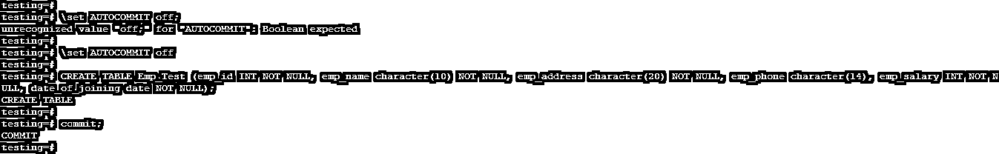
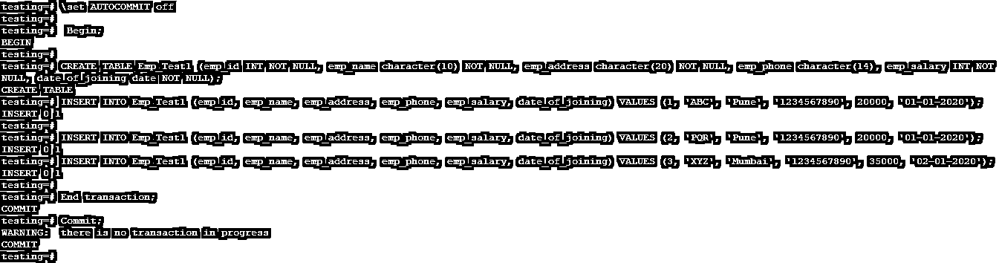

# PostgreSQL 提交

> 原文：<https://www.educba.com/postgresql-commit/>

## PostgreSQL 提交的定义

PostgreSQL commit 用于保存用户对数据库所做的事务更改。PostgreSQL 中 commit 的默认值是 ON，这意味着我们不需要执行 commit 语句来保存事务；它会自动将交易保存到数据库中。如果我们设置 auto-commit 为 off，那么我们需要写 commit 来将事务保存到数据库中。提交用于将事务更改保存到数据库中。提交在 PostgreSQL 中非常重要，它可以保存用户所做的任何更改。

**语法:**

<small>Hadoop、数据科学、统计学&其他</small>

下面是 PostgreSQL 中提交的语法，如下所示。

`COMMIT [ WORK (Optional keywords in commit) | TRANSACTION (Optional keywords in commit) ]`

事务使用 begin 和 end 语句提交。

`Begin
Statement1 …., Statement N
End transaction;`

**参数:**

*   **提交:**提交在 PostgreSQL 中用于保存用户在数据库中所做的任何更改。在 PostgreSQL 中，提交对于保存更改非常重要。
*   **Work:** Work 是提交中的可选关键字。我们可以将其用作“提交工作”，这意味着我们将工作保存到数据库中。
*   **Transaction:** Transaction 是提交中的可选关键字。我们可以将其用作“提交事务”，这意味着我们将事务保存到数据库中。
*   **Begin:** Begin 在 PostgreSQL 中用于启动事务。在开始一个事务后，我们结束这个事务，然后将这个事务提交到数据库中。
*   **语句 1 到语句 N:** 这是用于将结果保存到数据库中的语句。我们可以一次使用多个语句。
*   **结束事务:**结束事务语句用于结束当前正在运行的事务。执行结束事务后，用户所做的更改会自动保存到数据库中。

### 如何在 PostgreSQL 中提交作品？

*   默认情况下，PostgreSQL 中的自动提交是打开的下图显示了 PostgreSQL 中的自动提交事务是打开的。
*   我们必须使用“\echo :autocommit”命令来检查默认值。

**输出:**

*   我们通过在会话级别使用以下命令打开了自动提交，如下所示。

`testing=#  \set AUTOCOMMIT on
testing=#  \echo :AUTOCOMMIT;`

**输出:**

*   我们在会话级使用以下命令关闭了自动提交，如下所示。

`testing=#  \set AUTOCOMMIT OFF
testing=#  \echo :AUTOCOMMIT;`

**输出:**

*   我们还可以在 PostgreSQL 中使用 begin 和 end 语句提交事务。Begin 和 end 语句也用于提交事务。
*   提交用于保存单个事务提交，也用于一次保存多个事务。
*   假设我们使用开始和结束事务命令。在这种情况下，提交将显示一条警告消息“没有正在进行的事务”，因为该事务已经保存到数据库中。目前，没有要提交或保存到数据库的事务。
*   PostgreSQL 中的 Commit 对于一次将单个或多个事务保存到数据库中非常重要。
*   如果我们在 PostgreSQL 中设置 auto commit 为 ON，我们不需要在每个语句中都编写 commit 语句。它会在每次交易后自动提交交易。它会自动将交易保存到数据库中。
*   如果我们将 auto commit 设置为 off，那么我们需要在执行一次或多次事务后执行 commit 语句，将事务保存到数据库中。

### 在 PostgreSQL 中实现提交的示例

我们给出了多个事务提交和单个事务提交的例子。

#### 1.单一事务提交

*   在下面的例子中，我们以单个事务提交为例。
*   我们必须创建一个 emp_test 表，在创建一个表之后，我们通过使用 commit 将事务保存到数据库中。
*   下面是单个事务提交的例子。

##### 例子

`testing=# \set AUTOCOMMIT off
testing=# CREATE TABLE Emp_Test (emp_id INT NOT NULL, emp_name character(10) NOT NULL, emp_address character(20) NOT NULL, emp_phone character(14), emp_salary INT NOT NULL, date_of_joining date NOT NULL);
testing=# commit;`

**输出:**

*   在 PostgreSQL 中，默认情况下，自动提交是每个事务中的一个，所以如果我们希望以后保存事务，我们需要将其关闭。
*   在上面的例子中，我们已经将 create table 事务保存到数据库中。

#### 2.多事务提交(使用 begin 和 end 语句)

*   在下面的例子中，我们举了一个多事务提交的例子。
*   我们必须创建一个 emp_test1 表；在创建一个表之后，我们在这个表中插入一些值，然后使用 end 语句将事务保存到数据库中。
*   下面是多个事务提交的例子。

##### 例子

`testing=# \set AUTOCOMMIT off
testing=#  Begin;
testing=# CREATE TABLE Emp_Test1 (emp_id INT NOT NULL, emp_name character(10) NOT NULL, emp_address character(20) NOT NULL, emp_phone character(14), emp_salary INT NOT NULL, date_of_joining date NOT NULL);
testing=# INSERT INTO Emp_Test1 (emp_id, emp_name, emp_address, emp_phone, emp_salary, date_of_joining) VALUES (1, 'ABC', 'Pune', '1234567890', 20000, '01-01-2020');
testing=# INSERT INTO Emp_Test1 (emp_id, emp_name, emp_address, emp_phone, emp_salary, date_of_joining) VALUES (2, 'PQR', 'Pune', '1234567890', 20000, '01-01-2020');
testing=# INSERT INTO Emp_Test1 (emp_id, emp_name, emp_address, emp_phone, emp_salary, date_of_joining) VALUES (3, 'XYZ', 'Mumbai', '1234567890', 35000, '02-01-2020');
testing=# End transaction;
testing=# Commit;`

**输出:**

*   我们还可以在 PostgreSQL 中使用 begin 和 end 语句提交事务。Begin 和 end 语句也用于提交事务。
*   上面的例子表明，我们已经在 PostgreSQL 中使用 begin 和 end 语句提交了多个事务。
*   结束事务后，如果我们执行 commit，它将显示一条警告消息“没有正在进行的事务”，因为该事务已经保存到数据库中，并且当前没有事务等待提交或保存到数据库中。

### 结论

PostgreSQL commit 用于将事务保存到数据库中。我们还可以使用 begin 和 end 语句将事务保存到数据库中。默认情况下，PostgreSQL 中的自动提交事务是打开的。提交在 PostgreSQL 中将事务保存到数据库中非常重要。

### 推荐文章

这是一个 PostgreSQL 提交指南。这里我们讨论 PostgreSQL commit 的定义和工作方式，以及不同的例子和代码实现。您也可以阅读以下文章，了解更多信息——

1.  [如何在 PostgreSQL 中创建数据库？](https://www.educba.com/postgresql-database/)
2.  [什么是 PostgreSQL DISTINCT？](https://www.educba.com/postgresql-distinct/)
3.  [如何修改 PostgreSQL 视图？](https://www.educba.com/postgresql-views/)
4.  [游标在 PostgreSQL 中的重要性](https://www.educba.com/cursors-in-postgresql/)
5.  [PostgreSQL 别名|如何工作？](https://www.educba.com/postgresql-alias/)
6.  [如何使用 PostgreSQL LIMIT？](https://www.educba.com/postgresql-limit/)