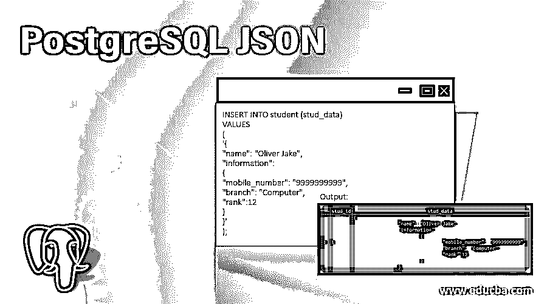
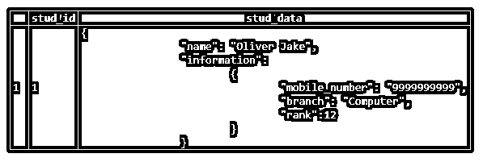
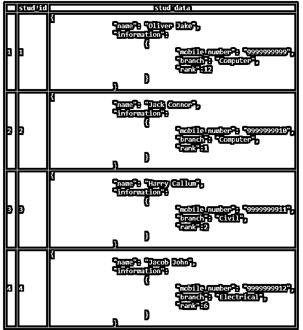
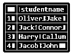
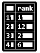
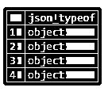
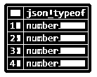

# PostgreSQL JSON

> 原文：<https://www.educba.com/postgresql-json/>

## PostgreSQL JSON 的定义

JSON 是 JavaScript 对象符号的缩写。JSON 在键值对中存储值；它是一种开放的标准格式。我们通常更喜欢用 JSON 在服务器之间和 web 应用程序中发送/接收或交换数据。JSON 中的数据是文本格式的，易于阅读。PostgreSQL 版引入了对原生 JSON 数据类型的支持。PostgreSQL 提供了各种方法和操作符来处理 JSON 数据。

**语法:**

<small>Hadoop、数据科学、统计学&其他</small>

`column_name json`***T4】***

 ***解释:**数据类型为 JSON 的列的名称。

### JSON 在 PostgreSQL 中是如何工作的？

*   在将数据添加到表中之前，我们需要确保给定的数据是有效的 JSON 格式。
*   如果 JSON 数据不正确，那么它将抛出一个错误。
*   PostgreSQL 提供了两个本地操作符来处理 JSON 数据。
*   **->操作符**以键的形式返回 JSON 数据。
*   **->->运算符:**以文本形式返回 JSON 数据。

### 如何插入 JSON 数据？

为了理解 JSON 数据的插入，让我们用下面的结构创建一个‘student’表。

学生表由两列组成:

*   **stud_id:** 该列是唯一标识学生的主键列。
*   **stud_data:** 以 JSON 形式存储学生信息的列。

让我们使用 CREATE TABLE 语句创建表:

`CREATE TABLE student (
stud_id serial NOT NULL PRIMARY KEY,
stud_data json NOT NULL
);`

现在我们将把数据插入 stud_data 列，它的类型是 JSON。在将 JSON 数据添加到表中之前，我们需要确保给定的数据是无效的 JSON 格式。现在，在下面的 insert 语句的帮助下插入 JSON 数据，这将在“student”表中添加一个新行。

`INSERT INTO student (stud_data)
VALUES
(
'{
"name": "Oliver Jake",
"information":
{
"mobile_number": "9999999999",
"branch": "Computer",
"rank":12
}
}'
);`

执行上述语句后，使用下面的快照和 SQL 语句说明 student 表的内容。

`select * from student;`

**输出:**

我们可以使用以下 insert 语句在表中插入多行:

`INSERT INTO student (stud_data)
VALUES
(
'{
"name": "Jack Connor",
"information":
{
"mobile_number": "9999999910",
"branch": "Computer",
"rank":1
}
}'
),
(
'{
"name": "Harry Callum",
"information":
{
"mobile_number": "9999999911",
"branch": "Civil",
"rank":2
}
}'
),
(
'{
"name": "Jacob John",
"information":
{
"mobile_number": "9999999912",
"branch": "Electrical",
"rank":6
}
}'
);` 

`select * from student;`

我们可以使用下面的快照和 SQL 语句从 student 表中获取数据。

**输出:**

### PostgreSQL JSON 示例

我们在上面的部分中创建了一个学生表；让我们用同样的方法来理解下面的例子。

#### 示例 1–以 JSON 密钥的形式获取所有学生

`SELECT
stud_data -> 'name' AS StudentName
FROM
student;`

**输出:**

#### 示例 2——以 JSON 文本的形式获取所有学生

`SELECT
stud_data ->> 'name' AS StudentName
FROM
student;`

**输出:**

#### 示例 3——使用操作符获取特定的 JSON 节点

`SELECT
stud_data -> 'information' ->> 'rank' as rank
FROM
student
ORDER BY
rank;`

**输出:**

#### 示例 4–在 WHERE 子句中使用 JSON 运算符

为了从结果集中过滤行，我们可以在 WHERE 子句中使用 JSON 操作符。考虑下面的例子，它通过使用下面的语句给出了分支是 Computer 的记录。

`SELECT
stud_data ->> 'name' AS StudentName
FROM
student
WHERE
stud_data -> 'information' ->> 'branch' = 'Computer'`

**输出:**

#### 示例 5–PostgreSQL JSON 函数

PostgreSQL 为我们提供了一些处理 JSON 数据的函数。

##### json_each 函数

通过使用 json_each()函数，我们可以将最外层的 json 对象扩展成一组键值对，如下所示:

`SELECT
json_each (stud_data)
FROM
student;`

我们可以使用 json_each_text()函数获得一组作为文本的键值对。

##### json 对象密钥函数

我们可以使用 json_object_keys()函数在最外层的 json 对象中获取一组键，如下所示:

`SELECT
json_object_keys (stud_data->'information')
FROM
student;`

**输出:**

##### json_typeof 函数

借助函数 json_typeof()，我们可以获得最外层 json 值的类型，作为一个字符串。JSON 值的类型可以是布尔值、数字 null、字符串、对象和数组。

我们可以使用以下语句获得信息的数据类型:

`SELECT
json_typeof (stud_data->'information')
FROM
student;`

**输出:**

我们可以使用以下语句获得嵌套信息 JSON 对象的数据类型 rank 字段:

`SELECT
json_typeof (stud_data->'information'->'rank')
FROM
student;`

**输出:**

### 在 PostgreSQL 中使用 JSON 的优势

在 PostgreSQL 中使用 JSON 的优势如下:

*   避免复杂的连接。
*   JSON 数据的解析更容易，执行速度更快。
*   兼容各种数据库管理系统。
*   Javascript 符号对象更快，非常容易阅读和理解。
*   JSON 对象中的数据由逗号分隔，这使得数据易于理解。
*   JSON 是轻量级的数据交换。

### 结论

我们希望从上面的文章中，您已经理解了如何使用 PostgreSQL JSON 数据类型，以及 PostgreSQL JSON 数据类型如何以键值对的形式存储数据。另外，我们还添加了一些 PostgreSQL JSON 的例子来详细理解它。

### 推荐文章

这是一个 PostgreSQL JSON 的指南。这里我们讨论 json 在 PostgreSQL 中的定义和工作方式，以及不同的例子和它的代码实现。您也可以看看以下文章，了解更多信息–

1.  [PostgreSQL 特性](https://www.educba.com/postgresql-features/)
2.  [PostgreSQL 版本](https://www.educba.com/postgresql-versions/)
3.  [PostgreSQL 数据类型](https://www.educba.com/postgresql-data-types/)
4.  [PostgreSQL 通知示例](https://www.educba.com/postgresql-notify/)*